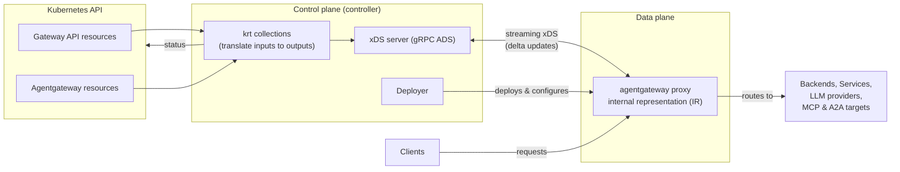

Learn about the components that make up agentgateway and how they work together to translate Kubernetes Gateway API resources into the runtime configuration that powers traffic management, security, and resiliency for your apps and agents.

In Kubernetes mode, agentgateway is a complete gateway that ships with its own control plane and data plane.

* The **control plane** is a Kubernetes controller that watches Gateway API and agentgateway resources, translates them into agentgateway's configuration model, and serves that configuration to proxies over xDS.
* The **data plane** is the agentgateway proxy: a high-performance HTTP, gRPC, MCP, A2A, and LLM proxy that applies the configuration it receives and routes traffic to your backends.

## Component architecture

The following diagram shows the components that make up the agentgateway control plane and data plane, and the path that configuration takes from the Kubernetes API to a running proxy.

1. You create or update Kubernetes Gateway API resources (such as Gateways, HTTPRoutes, and GRPCRoutes) and agentgateway resources (such as AgentgatewayBackend and AgentgatewayPolicy).
2. The control plane watches the cluster for these resources by using [krt](https://github.com/istio/istio/tree/master/pkg/kube/krt) collections. These collections translate the inputs into agentgateway's configuration resources, such as Binds, Listeners, Routes, Backends, and Policies, and resolve service and workload addresses for endpoint discovery. When a relevant resource changes, only the affected collections are recomputed.
3. The **xDS server** pulls the translated configuration from these collections and serves it to proxies over a streaming gRPC connection. The control plane also writes status back to the Kubernetes resources so that you can see whether your configuration was accepted.
4. The **deployer** automatically provisions and configures an agentgateway proxy deployment for each Gateway that uses the `agentgateway` GatewayClass, including the address and credentials that the proxy uses to reach the xDS server.
5. The agentgateway **proxy** in the data plane opens a streaming connection to the xDS server, receives configuration updates, and applies them to its in-memory internal representation.
6. Clients send requests to the address that the proxy is exposed on. The proxy uses its listener, route, backend, and policy configuration to make routing decisions and forward requests to the appropriate destination, whether that is a Kubernetes service, an LLM provider, an MCP tool server, or an A2A agent.

## Control plane

The control plane is a Kubernetes controller that turns your declarative Gateway API and agentgateway resources into proxy configuration. It is made up of the following components.

### krt collections

The heart of the control plane is a set of **krt collections**, a reactive collection library. The control plane watches the cluster for Kubernetes Gateway API resources (Gateways, HTTPRoutes, GRPCRoutes, TCPRoutes, and TLSRoutes), agentgateway custom resources (AgentgatewayBackends, AgentgatewayParameters, and AgentgatewayPolicies), and supporting resources (such as Services, ReferenceGrants, and Secrets), and organizes this state into collections. When any watched resource changes, only the collections that depend on it are recomputed, which keeps the control plane efficient even in large clusters.

The krt collections translate the inputs into agentgateway's configuration model. Agentgateway uses purpose-built resource types rather than Envoy types, with a design philosophy of keeping a near one-to-one mapping between the user-facing API, the configuration sent over xDS, and the proxy's internal representation. This mapping keeps the configuration easy to reason about and the control plane simple, because most translations are mechanical rather than complex joins.

The collections produce the following resources:

* **Binds**: A port binding that listeners attach to. Agentgateway creates one Bind per unique port across all listeners.
* **Listeners**: An individual gateway listener, including its hostname, protocol, and TLS settings, derived from a Gateway listener specification.
* **Routes**: Routing rules with match conditions, filters, and backend references, translated from HTTPRoute, GRPCRoute, TCPRoute, and TLSRoute resources.
* **Backends**: The destinations that traffic is routed to, translated from AgentgatewayBackend resources through a plugin system. Backend types include AI/LLM providers (such as OpenAI, Anthropic, Azure OpenAI, and Bedrock), MCP servers, and static and dynamic backends.
* **Policies**: Traffic, security, and transformation rules translated from AgentgatewayPolicy resources, such as header modification, redirects, URL rewrites, request mirroring, CORS, authentication, timeouts, retries, and CEL-based transformations.
* **Addresses**: Service and workload addresses used for endpoint discovery. These are global resources shared across all proxies.

Because the cardinality of agentgateway's resources mirrors the user-facing API, a change to one Gateway API resource produces a small, targeted update. For example, one HTTPRoute rule maps to one Route, and one Pod maps to one Workload, so editing a single field does not force the control plane to recompute and re-send unrelated configuration.

Policies are sent to the proxy with a reference to where they apply, rather than being flattened onto every route. The proxy resolves policy precedence and merging at request time.

### xDS server

The xDS server delivers the translated configuration to the proxies in the data plane. It uses the [xDS transport protocol](https://www.envoyproxy.io/docs/envoy/latest/api-docs/xds_protocol) over a streaming gRPC connection (Aggregated Discovery Service), but it serves agentgateway's own [purpose-built resource types](https://github.com/agentgateway/agentgateway/blob/main/crates/agentgateway/proto/resource.proto) instead of Envoy types.

Each proxy subscribes to the configuration that is scoped to its Gateway, plus the shared address resources used for service discovery. The server sends incremental (delta) updates, so when configuration changes, only the resources that changed are sent. Connections can be authenticated with Kubernetes service account tokens and secured with TLS.

### Deployer

The deployer manages the lifecycle of the proxy deployments. When you create a Gateway that uses the `agentgateway` GatewayClass, the deployer provisions and configures an agentgateway proxy for it. You can customize the generated deployment, such as the proxy image and logging settings, through the AgentgatewayParameters resource referenced by the GatewayClass.

### Status

As the collections process your resources, the control plane reports status back to the Kubernetes API for Gateways, listeners, and routes. Invalid or rejected configuration is surfaced in the resource status so that you can correct it, while the rest of your valid configuration continues to be served.

## Data plane

The data plane is the agentgateway proxy. It is a general-purpose HTTP and gRPC proxy with load balancing, timeouts, retries, TLS, rate limiting, authorization, and traffic policies, and it adds first-class support for AI and agent workloads:

* **LLM**: Routes to AI providers such as OpenAI, Anthropic, Azure OpenAI, and Bedrock, with a unified API across providers.
* **MCP**: Proxies Model Context Protocol traffic, including virtual MCP servers that aggregate multiple tool servers.
* **A2A**: Proxies agent-to-agent (A2A) traffic between agents.

The proxy maintains all of its configuration in an in-memory internal representation (IR). It receives configuration from the xDS server as incremental updates and applies them atomically, then uses that state to match incoming requests against listeners and routes, apply policies, and forward traffic to the selected backend.

### Configuration sources

Although Kubernetes mode delivers configuration over xDS, the proxy itself can be configured in three ways, all of which map to the same internal representation:

* **Static configuration**: Global process settings such as logging and ports, set once at startup through environment variables or a configuration file.
* **Local configuration**: A YAML or JSON file that defines the full feature set (backends, routes, and policies). The file is watched for changes and reloaded dynamically. This lets you run agentgateway as a standalone proxy without a control plane.
* **xDS configuration**: Dynamic configuration delivered by a control plane, such as the agentgateway control plane in Kubernetes mode.

For more details on the configuration model, see the [agentgateway repository](https://github.com/agentgateway/agentgateway/blob/main/architecture/configuration.md).
