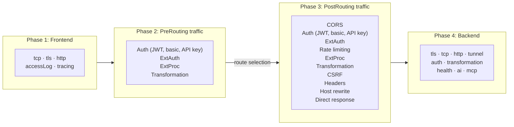

## Policy processing order {#processing-order}

Agentgateway processes each request through four phases in the following order. You cannot change the phase order, but you can control which filters run in each phase by configuring the appropriate policy sections.

1. **Frontend policies:** Control how the gateway accepts incoming connections, including TLS settings, TCP configuration, and access logging. Frontend policies apply at the gateway level before any routing decisions.
2. **PreRouting traffic policies:** Run before route selection. Only a subset of traffic filters is available in the [PreRouting phase](#prerouting).
3. **PostRouting traffic policies:** Run after route selection. [PostRouting](#postrouting) is the default phase for traffic policies and supports all traffic filters.
4. **Backend policies:** Run when the gateway connects to the destination backend, including backend TLS, authentication, and health checking.

Within each phase, agentgateway merges all applicable policies with a shallow field-level merge. If two policies configure different fields, both apply. For example, if one policy sets `transformation` and another sets `extAuth`, both filters run. If two policies configure the same field, the higher-precedence policy takes effect. For details, see [merge precedence]().

## Traffic filter execution order

Within the traffic phase (both PreRouting and PostRouting), filters execute in a fixed order. You cannot change this order.

### Supported PreRouting filters {#prerouting}

The PreRouting phase supports only the following filters, in order of execution.

To run a filter in the PreRouting phase, set `phase: PreRouting` on the traffic policy.


PreRouting policies can only target a Gateway or ListenerSet.


| Order | Filter | Field |
| :--: | -- | -- |
| 1 | JSON Web Token (JWT) authentication | `jwtAuthentication` |
| 2 | Basic authentication | `basicAuthentication` |
| 3 | API key authentication | `apiKeyAuthentication` |
| 4 | External authorization | `extAuth` |
| 5 | External processing | `extProc` |
| 6 | Transformation | `transformation` |

### Supported PostRouting filters {#postrouting}

The PostRouting phase supports only the following filters, in order of execution.

By default, filters run in the PostRouting phase. If you mix pre- and post-routing filters, you might want to explicitly configure the filter to run in the PreRouting phase by settting `phase: PostRouting` on the traffic policy.

PostRouting filters can target any of the supported targets for traffic policies (Gateway, HTTPRoute, GRPCRoute, or ListenerSet).

| Order | Filter | Field |
| :--: | -- | -- |
| 1 | Cross-Origin Resource Sharing (CORS) | `cors` |
| 2 | JSON Web Token (JWT) authentication | `jwtAuthentication` |
| 3 | Basic authentication | `basicAuthentication` |
| 4 | API key authentication | `apiKeyAuthentication` |
| 5 | External authorization | `extAuth` |
| 6 | Authorization | `authorization` |
| 7 | Rate limiting (local) | `rateLimit` |
| 8 | Rate limiting (remote) | `rateLimit` |
| 9 | External processing | `extProc` |
| 10 | Transformation | `transformation` |
| 11 | Cross-Site Request Forgery (CSRF) | `csrf` |
| 12 | Header modifiers | `headerModifiers` |
| 13 | Host rewrite | `hostRewrite` |
| 14 | Direct response | `directResponse` |

### Adjusting execution order with phases

You can use the PreRouting phase to run certain filters earlier in the request lifecycle. For example, to run external processing before rate limiting, configure an `extProc` policy with the PreRouting phase, and a separate `rateLimit` policy with the default PostRouting phase. External processing then runs during PreRouting (before route selection), and rate limiting runs during PostRouting (after route selection).
