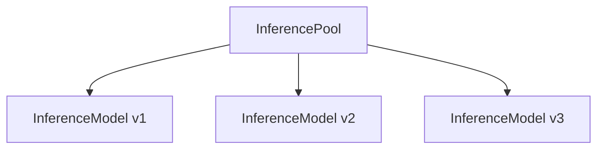

Use  with the Kubernetes Gateway API Inference Extension to route requests to AI inference workloads, such as Large Language Models (LLMs) that run in your Kubernetes environment.

This page covers Kubernetes Gateway API mode, where agentgateway routes to
`InferencePool` backends from Gateway API resources. If you want to run the
Endpoint Picker Extension (EPP) with agentgateway as a standalone sidecar proxy,
see the standalone request scheduler guide instead.

For more information, see the following resources.


  
  
  


## Before you begin

To use the Inference Extension with , [upgrade your Helm installation]() with the `inferenceExtension.enabled=true` value. 

```bash
helm upgrade -i -n    \
  --version $AGENTGATEWAY_VERSION \
  --set inferenceExtension.enabled=true \
  --reuse-values
```

## About {#about}

The Inference Extension extends the Gateway API with two key resources, an InferencePool and an InferenceModel, as shown in the following diagram.



The InferencePool groups together InferenceModels of LLM workloads into a routable backend resource that the Gateway API can route inference requests to. An InferenceModel represents not just a single LLM model, but a specific configuration that includes information such as the version and criticality. The InferencePool uses this information to ensure fair consumption of compute resources across competing LLM workloads and share routing decisions with the Gateway API.

###  with Inference Extension {#integration}

 integrates with the Inference Extension as a supported Gateway API provider. A Gateway can route requests to InferencePools, as shown in the following diagram.



The client sends an inference request to get a response from a local LLM workload. The Gateway receives the request and routes to the InferencePool as a backend. Then, the InferencePool selects a specific InferenceModel to route the request to, based on criteria such as the least-loaded model or highest criticality. The Gateway returns the response to the client.

## Set up Inference Extension {#setup}

Refer to the **Kgateway** tabs in the **Getting started** guide in the Inference Extension docs.


  


### Quickstart

In this quickstart, you deploy the following components.

- vLLM for model serving.
- A local model configuration. Qwen is used in this example.
- Kubernetes Gateway API Inference Extension.
-  with inference enabled.
- The llm-d InferencePool via Helm, configured for Qwen.

Steps:

1. Deploy the Qwen vLLM instance. The container image uses CPU instead of GPU, which makes for easier local or small cluster testing.

   ```yaml
   kubectl apply -f - <<EOF
   apiVersion: apps/v1
   kind: Deployment
   metadata:
     name: vllm-qwen25-15b-instruct
   spec:
     replicas: 1
     selector:
       matchLabels:
         app: vllm-qwen25-15b-instruct
     template:
       metadata:
         labels:
           app: vllm-qwen25-15b-instruct
       spec:
         containers:
           - name: vllm
             image: "vllm/vllm-openai-cpu:v0.18.0" # CPU image for local testing; pin tag to avoid drift
             imagePullPolicy: IfNotPresent
             command: ["python3", "-m", "vllm.entrypoints.openai.api_server"]
             args:
             - "--model"
             - "Qwen/Qwen2.5-1.5B-Instruct"
             - "--port"
             - "8000"
             env:
               - name: PORT
                 value: "8000"
               - name: VLLM_CPU_KVCACHE_SPACE
                 value: "4"
             ports:
               - containerPort: 8000
                 name: http
                 protocol: TCP
             livenessProbe:
               failureThreshold: 240
               httpGet:
                 path: /health
                 port: http
                 scheme: HTTP
               initialDelaySeconds: 180
               periodSeconds: 5
               successThreshold: 1
               timeoutSeconds: 1
             readinessProbe:
               failureThreshold: 600
               httpGet:
                 path: /health
                 port: http
                 scheme: HTTP
               initialDelaySeconds: 180
               periodSeconds: 5
               successThreshold: 1
               timeoutSeconds: 1
             resources:
                limits:
                  cpu: "11"
                  memory: "10Gi"
                requests:
                  cpu: "11"
                  memory: "10Gi"
             volumeMounts:
               - mountPath: /data
                 name: data
               - mountPath: /dev/shm
                 name: shm
         restartPolicy: Always
         schedulerName: default-scheduler
         terminationGracePeriodSeconds: 30
         volumes:
           - name: data
             emptyDir: {}
           - name: shm
             emptyDir:
               medium: Memory
   EOF
   ```

   Wait about 2-3 minutes for the Qwen model to download. Verify that the pod is running.

   ```bash
   kubectl get pods -w
   ```

2. Install the CRDs for the Kubernetes Gateway API Inference Extension.

   ```bash
   kubectl apply -f https://github.com/kubernetes-sigs/gateway-api-inference-extension/releases/download/v1.4.0/manifests.yaml
   ```

3. Install the Kubernetes Gateway API CRDs, , and the  CRDs.

   ```bash
   kubectl apply --server-side -f https://github.com/kubernetes-sigs/gateway-api/releases/download/v/standard-install.yaml
   ```

   ```bash
   helm upgrade -i --create-namespace \
     --namespace  \
     --version  \
      
   ```

   ```bash
   helm upgrade -i -n    \
     --version  \
     --set inferenceExtension.enabled=true
   ```

4. Deploy the InferencePool and the Endpoint Picker extension (EPP/llm-d) via Helm. The InferencePool acts as a logical grouping of AI model servers for load balancing and routing inference requests. The EPP provides intelligent selection among available model servers.

   
   The `GATEWAY_PROVIDER` is set to `none` because you install your own gateway provider, .
   

   ```bash
   export IGW_CHART_VERSION=v1.1.0
   export GATEWAY_PROVIDER=none

   helm install vllm-qwen25-15b-instruct \
     --set inferencePool.modelServers.matchLabels.app=vllm-qwen25-15b-instruct \
     --set provider.name=$GATEWAY_PROVIDER \
     --version $IGW_CHART_VERSION \
     oci://registry.k8s.io/gateway-api-inference-extension/charts/inferencepool
   ```

   Verify that the InferencePool is deployed.

   ```bash
   kubectl get inferencepool
   ```

5. Deploy a Gateway and HTTPRoute for inference routing. The HTTPRoute routes to the InferencePool that you created in the previous step. The `inferencePool.modelServers.matchLabels.app` selector matches any pod with the `vllm-qwen25-15b-instruct` label from step 1.

   ```yaml
   kubectl apply -f - <<EOF
   apiVersion: gateway.networking.k8s.io/v1
   kind: Gateway
   metadata:
     name: inference-gateway
   spec:
     gatewayClassName: 
     listeners:
     - name: http
       port: 80
       protocol: HTTP
   ---
   apiVersion: gateway.networking.k8s.io/v1
   kind: HTTPRoute
   metadata:
     name: llm-route
   spec:
     parentRefs:
     - group: gateway.networking.k8s.io
       kind: Gateway
       name: inference-gateway
     rules:
     - backendRefs:
       - group: inference.networking.k8s.io
         kind: InferencePool
         name: vllm-qwen25-15b-instruct
       matches:
       - path:
           type: PathPrefix
           value: /
       timeouts:
         request: 300s
   EOF
   ```

6. Verify the end-to-end flow. A request flows through the following path.

   ```mermaid
   graph LR
       Client -->|curl| Gateway
       Gateway -->|path prefix /| HTTPRoute
       HTTPRoute --> InferencePool
       InferencePool -->|selects model server| vLLM["vLLM pod"]
       vLLM -->|response| Client
   ```

   Send a test request to the inference gateway.

   ```bash
   IP=$(kubectl get gateway/inference-gateway -o jsonpath='{.status.addresses[0].value}')
   PORT=80

   curl -i ${IP}:${PORT}/v1/completions -H 'Content-Type: application/json' -d '{
     "model": "Qwen/Qwen2.5-1.5B-Instruct",
     "prompt": "What is the warmest city in the USA?",
     "max_tokens": 100,
     "temperature": 0.5
   }'
   ```

   Example output:

   ```
   HTTP/1.1 200 OK
   date: Sat, 11 April 2026 19:54:07 GMT
   server: uvicorn
   content-type: application/json
   transfer-encoding: chunked

   {"choices":[{"finish_reason":"length","index":0,"text":" The warmest city in the United States is Phoenix, Arizona..."}],"model":"Qwen/Qwen2.5-1.5B-Instruct","object":"text_completion","usage":{"completion_tokens":100,"prompt_tokens":10,"total_tokens":110}}
   ```
