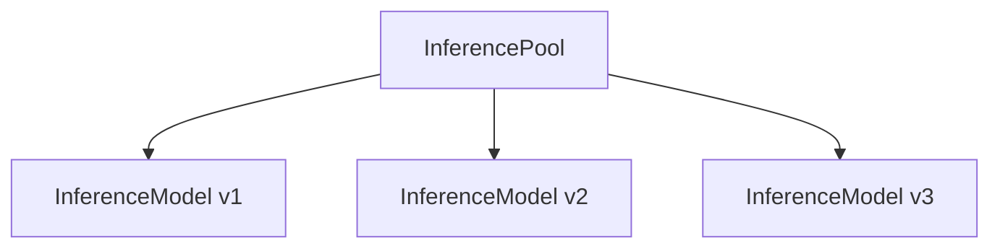

Use agentgateway proxies with the Kubernetes Gateway API Inference Extension project. This project extends the Gateway API so that you can route to AI inference workloads such as local Large Language Models (LLMs) that run in your Kubernetes environment.

For more information, see the following resources.


  
  


## Prerequisite

To use the Inference Extension with agentgateway, you will need to set the `inferenceExtension.enabled=true` value in the helm chart. For example, if you're installing agentgateway, it would look like the following:

```
helm upgrade -i -n agentgateway-system agentgateway oci://cr.agentgateway.dev/charts/agentgateway \
--version $AGENTGATEWAY_VERSION \
--set inferenceExtension.enabled=true
```

## About Inference Extension {#about}

The Inference Extension project extends the Gateway API with two key resources, an InferencePool and an InferenceModel, as shown in the following diagram.



The InferencePool groups together InferenceModels of LLM workloads into a routable backend resource that the Gateway API can route inference requests to. An InferenceModel represents not just a single LLM model, but a specific configuration including information such as the version and criticality. The InferencePool uses this information to ensure fair consumption of compute resources across competing LLM workloads and share routing decisions to the Gateway API.

###  with Inference Extension {#integration}

 integrates with the Inference Extension as a supported Gateway API provider. This way, a Gateway can route requests to InferencePools, as shown in the following diagram.



The Client sends an inference request to get a response from a local LLM workload. The Gateway receives the request and routes to the InferencePool as a backend. Then, the InferencePool selects a specific InferenceModel to route the request to, based on criteria such as the least-loaded model or highest criticality. The Gateway can then return the response to the Client.

## Setup steps {#setup}

Refer to the **Kgateway** tabs in the **Getting started** guide in the Inference Extension docs.


  


### Quickstart

This quickstart goes through deploying:
- vLLM (needed for Model serving)
- Local Model configuration (qwen is used in this example)
- Kubernetes Gateway API inference extension installed
- Agentgateway installed with inference enabled
- llmd/InferencePool installed via Helm specifically for the qwen configuration

1. Deploy the qwen `Deployment` object. This vLLM container image uses CPU instead of GPU, which makes for easier local/small cluster testing.
```
kubectl apply -f - <<EOF
apiVersion: apps/v1
kind: Deployment
metadata:
  name: vllm-qwen2.5-1.5b-instruct
spec:
  replicas: 1
  selector:
    matchLabels:
      app: vllm-qwen2.5-1.5b-instruct
  template:
    metadata:
      labels:
        app: vllm-qwen2.5-1.5b-instruct
    spec:
      containers:
        - name: vllm
          image: "vllm/vllm-openai-cpu:v0.18.0" # official vLLM CPU image from Docker Hub; pin a concrete tag to avoid drift from latest
          imagePullPolicy: IfNotPresent
          command: ["python3", "-m", "vllm.entrypoints.openai.api_server"]
          args:
          - "--model"
          - "Qwen/Qwen2.5-1.5B-Instruct"
          - "--port"
          - "8000"
          env:
            - name: PORT
              value: "8000"
            - name: VLLM_CPU_KVCACHE_SPACE
              value: "4"
          ports:
            - containerPort: 8000
              name: http
              protocol: TCP
          livenessProbe:
            failureThreshold: 240
            httpGet:
              path: /health
              port: http
              scheme: HTTP
            initialDelaySeconds: 180
            periodSeconds: 5
            successThreshold: 1
            timeoutSeconds: 1
          readinessProbe:
            failureThreshold: 600
            httpGet:
              path: /health
              port: http
              scheme: HTTP
            initialDelaySeconds: 180
            periodSeconds: 5
            successThreshold: 1
            timeoutSeconds: 1
          resources:
             limits:
               cpu: "11"
               memory: "10Gi"
             requests:
               cpu: "11"
               memory: "10Gi"
          volumeMounts:
            - mountPath: /data
              name: data
            - mountPath: /dev/shm
              name: shm
      restartPolicy: Always
      schedulerName: default-scheduler
      terminationGracePeriodSeconds: 30
      volumes:
        - name: data
          emptyDir: {}
        - name: shm
          emptyDir:
            medium: Memory
EOF
```

Give the vLLM Pods about 2-3 minutes for the local qwen Model to download. You can then confirm the Pod is running with the following command:
```
kubectl get pods -w
```

2. Install the CRDs for the Kubernetes Gateway API Inference extension.
```
kubectl apply -f https://github.com/kubernetes-sigs/gateway-api-inference-extension/releases/download/v1.4.0/manifests.yaml
```

3. Install Kubernetes Gateway API CRDs, agentgateway, and the agentgateway CRDs. In this case, you'll use agentgateway:
```
kubectl apply --server-side -f https://github.com/kubernetes-sigs/gateway-api/releases/download/v1.5.0/standard-install.yaml
```

```
helm upgrade -i --create-namespace \
  --namespace agentgateway-system \
  --version v1.1.0 agentgateway-crds oci://cr.agentgateway.dev/charts/agentgateway-crds

helm upgrade -i -n agentgateway-system agentgateway oci://cr.agentgateway.dev/charts/agentgateway \
--version v1.1.0 \
--set inferenceExtension.enabled=true
```

4. Deploy the following Helm Chart which does the following:
- Installs an `InferencePool` resource/object that acts as a logical grouping of AI model servers for load balancing and routing inference requests.
- Installs the Endpoint-picker extension (epp/llm-d), which is an intelligent selection among available model servers for load balancing.

**Note:** The reason why `GATEWAY_PROVIDER` is set to `none` is because you're installing/using your own gateway provider (agentgatewy)

```
export IGW_CHART_VERSION=v1.1.0
export GATEWAY_PROVIDER=none

helm install vllm-qwen25-15b-instruct \
--set inferencePool.modelServers.matchLabels.app=vllm-qwen2.5-1.5b-instruct \
--set provider.name=$GATEWAY_PROVIDER \
--version $IGW_CHART_VERSION \
oci://registry.k8s.io/gateway-api-inference-extension/charts/inferencepool
```

If you run `kubectl get inferencepool`, you'll see that the Helm Chart deployed an `InferencePool`.

5. Deploy a `Gateway` and `HTTPRoute` object for Inference. This will route to the `InferencePool` that was created in the previous step via the Helm Chart. Thie (`inferencePool.modelServers.matchLabels.app) part matches any app running the `vllm-qwen2.5-1.5b-instruct` label, which was deployed in step 1 (the `Deployment` object)
```
kubectl apply -f - <<EOF
apiVersion: gateway.networking.k8s.io/v1
kind: Gateway
metadata:
  name: inference-gateway
spec:
  gatewayClassName: agentgateway
  listeners:
  - name: http
    port: 80
    protocol: HTTP
---
apiVersion: gateway.networking.k8s.io/v1
kind: HTTPRoute
metadata:
  name: llm-route
spec:
  parentRefs:
  - group: gateway.networking.k8s.io
    kind: Gateway
    name: inference-gateway
  rules:
  - backendRefs:
    - group: inference.networking.k8s.io
      kind: InferencePool
      name: vllm-qwen25-15b-instruct
    matches:
    - path:
        type: PathPrefix
        value: /
    timeouts:
      request: 300s
EOF
```

6. Test and confirm, which confirms the following:
```

User/Curl Request
    ↓
Gateway (port 80) ← External entry point
    ↓
HTTPRoute ← Routes based on path prefix "/"
    ↓
InferencePool ← Selects available model server
    ↓
vLLM Pod (port 8000) ← Runs the actual model inference
    ↓
Response back through the stack
```

```
IP=$(kubectl get gateway/inference-gateway -o jsonpath='{.status.addresses[0].value}')
PORT=80

curl -i ${IP}:${PORT}/v1/completions -H 'Content-Type: application/json' -d '{
"model": "Qwen/Qwen2.5-1.5B-Instruct",
"prompt": "What is the warmest city in the USA?",
"max_tokens": 100,
"temperature": 0.5
}'
```

You should see an output similar to the below:
```
HTTP/1.1 200 OK
date: Sat, 11 April 2026 19:54:07 GMT
server: uvicorn
content-type: application/json
x-went-into-resp-headers: true
transfer-encoding: chunked

{"choices":[{"finish_reason":"length","index":0,"logprobs":null,"prompt_logprobs":null,"prompt_token_ids":null,"stop_reason":null,"text":" The warmest city in the United States is Phoenix, Arizona. It has an average high temperature of 85 degrees Fahrenheit (29 degrees Celsius) and a low of 60 degrees Fahrenheit (15 degrees Celsius). However, it's important to note that temperatures can vary greatly depending on location within the city, so it's always best to check local weather forecasts for specific areas before planning any outdoor activities. Additionally, Phoenix experiences extreme heat during summer months, with temperatures often exceeding 1","token_ids":null}],"created":1763322848,"id":"cmpl-2e381ca7-62ae-4479-ae64-fdd18f005a1e","kv_transfer_params":null,"model":"Qwen/Qwen2.5-1.5B-Instruct","object":"text_completion","service_tier":null,"system_fingerprint":null,"usage":{"completion_tokens":100,"prompt_tokens":10,"prompt_tokens_details":null,"total_tokens":110}}% 
```