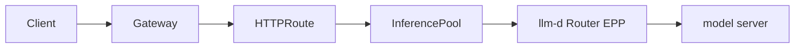

Use  with the Kubernetes Gateway
API Inference Extension to route requests to Large Language Model (LLM)
workloads in your Kubernetes environment.

The Gateway API Inference Extension defines the `InferencePool` API and the
protocol between gateways and endpoint pickers. The
[llm-d Router](https://github.com/llm-d/llm-d-router) provides a
production-oriented Endpoint Picker (EPP) implementation. agentgateway routes
to the `InferencePool`, the llm-d Router selects a model server from the pool,
and agentgateway routes to that model server endpoint.

For more information, see the following resources.


  
  
  
  


## About {#about}

An `InferencePool` groups model server pods into a routable Gateway API
backend. Its `endpointPickerRef` identifies the llm-d Router EPP that selects a
pod for each request.

 implements the
gateway side of the Inference Extension protocol. The following diagram shows
the request flow.


```mermaid
graph LR
    Client --> Gateway
    Gateway --> HTTPRoute
    HTTPRoute --> InferencePool
    InferencePool --> EPP["llm-d Router EPP"]
    EPP --> ModelServer["model server"]
```

The EPP returns its selected endpoint to agentgateway. Agentgateway then sends
the request to that model server and returns the response to the client.

## Quickstart {#setup}

In this quickstart, you deploy a simulated model server, the Gateway API
Inference Extension CRDs, agentgateway, and the llm-d Router in Gateway mode.

1. Deploy the Qwen3 model server simulator. The
   [llm-d-inference-sim](https://github.com/llm-d/llm-d-inference-sim)
   container mimics a vLLM model server without downloading model weights or
   requiring GPUs.

   ```yaml
   kubectl apply -f - <<EOF
   apiVersion: apps/v1
   kind: Deployment
   metadata:
     name: vllm-qwen3-32b
     namespace: default
   spec:
     replicas: 3
     selector:
       matchLabels:
         app: vllm-qwen3-32b
     template:
       metadata:
         labels:
           app: vllm-qwen3-32b
           inference.networking.k8s.io/engine-type: vllm
       spec:
         containers:
           - name: vllm-sim
             image: ghcr.io/llm-d/llm-d-inference-sim:v0.8.2
             args:
               - --model
               - Qwen/Qwen3-32B
               - --port
               - "8000"
               - --max-loras
               - "2"
               - --lora-modules
               - '{"name": "food-review-1"}'
             env:
               - name: POD_NAME
                 valueFrom:
                   fieldRef:
                     fieldPath: metadata.name
               - name: NAMESPACE
                 valueFrom:
                   fieldRef:
                     fieldPath: metadata.namespace
             ports:
               - containerPort: 8000
                 name: http
                 protocol: TCP
             resources:
               requests:
                 cpu: 10m
   EOF
   ```

   Verify that the simulator deployment is available.

   ```bash
   kubectl wait --for=condition=available --timeout=120s \
     deployment/vllm-qwen3-32b
   ```

2. Install the Gateway API and Gateway API Inference Extension Custom
   Resource Definitions (CRDs).

   ```bash
   kubectl apply --server-side -f \
     https://github.com/kubernetes-sigs/gateway-api/releases/download/v/standard-install.yaml

   kubectl apply -f \
     https://github.com/kubernetes-sigs/gateway-api-inference-extension/releases/download/v1.5.0/manifests.yaml
   ```

3. Install agentgateway with Inference Extension support.

   ```bash
   helm upgrade -i --create-namespace \
     --namespace  \
     --version  \
      
   ```

   ```bash
   helm upgrade -i \
     --namespace  \
     --version  \
     --set inferenceExtension.enabled=true \
      
   ```

4. Create an agentgateway `Gateway`.

   ```yaml
   kubectl apply -f - <<EOF
   apiVersion: gateway.networking.k8s.io/v1
   kind: Gateway
   metadata:
     name: inference-gateway
     namespace: default
   spec:
     gatewayClassName: 
     listeners:
       - name: http
         port: 80
         protocol: HTTP
   EOF
   ```

   Verify that the Gateway is programmed.

   ```bash
   kubectl wait --for=condition=Programmed --timeout=120s \
     gateway/inference-gateway
   ```

5. Install the llm-d Router Gateway chart. The chart creates the
   `InferencePool`, the llm-d Router EPP deployment and service, and an
   `HTTPRoute` that attaches to the Gateway.

   ```bash
   export ROUTER_CHART_VERSION=v0.9.0

   helm upgrade -i vllm-qwen3-32b \
     oci://ghcr.io/llm-d/charts/llm-d-router-gateway \
     --version $ROUTER_CHART_VERSION \
     --set router.modelServers.matchLabels.app=vllm-qwen3-32b \
     --set router.epp.resources.requests.cpu=100m \
     --set router.epp.resources.requests.memory=128Mi \
     --set router.epp.resources.limits.memory=512Mi \
     --set provider.name=none \
     --set httpRoute.create=true \
     --set httpRoute.inferenceGatewayName=inference-gateway
   ```

   The `none` provider value prevents the chart from creating resources for a
   different gateway implementation. Agentgateway still processes the
   chart-created `HTTPRoute` and `InferencePool`.

   Verify the pool, EPP image, and route.

   ```bash
   kubectl get inferencepool vllm-qwen3-32b
   kubectl get deployment vllm-qwen3-32b-epp \
     -o jsonpath='{.spec.template.spec.containers[0].image}{"\n"}'
   kubectl get httproute vllm-qwen3-32b
   ```

   The deployment uses the released
   `ghcr.io/llm-d/llm-d-router-endpoint-picker:v0.9.0` image.

6. Send a request through agentgateway.

   ```bash
   kubectl port-forward service/inference-gateway 8080:80
   ```

   In a separate terminal, send the request.

   ```bash
   curl -i http://localhost:8080/v1/completions \
     -H 'Content-Type: application/json' \
     -d '{
       "model": "Qwen/Qwen3-32B",
       "prompt": "What is the warmest city in the USA?",
       "max_tokens": 100,
       "temperature": 0.5
     }'
   ```

   The response has an HTTP `200 OK` status.
