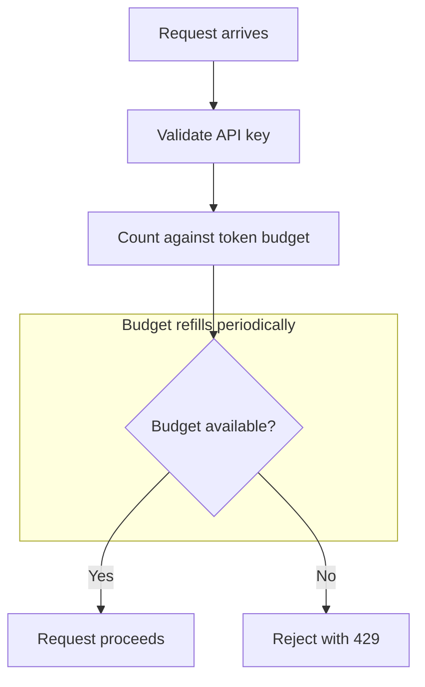

Advanced patterns for enforcing token budget limits per API key or user.

## About

Budget limits (also known as spend limits or quota management) help you control LLM costs by restricting how many tokens each user or API key can consume within a time window. This prevents runaway spending and ensures fair resource allocation across teams and applications.


This guide focuses on **advanced patterns** not covered in the virtual keys guide, such as per-route budgets, local rate limiting, and cost calculations.

## Before you begin

Complete the [Virtual key management]() guide to:
- Create API keys for users
- Configure API key authentication
- Set up token-based rate limiting
- Configure the rate limit server


This guide uses global rate limiting to enforce token budgets across multiple gateway instances. You need to deploy a rate limit server. For setup instructions, see the [global rate limiting section]() in the LLM rate limiting guide.



**Multiple policies**: When multiple  resources target the same Gateway or HTTPRoute with overlapping `backend.ai` fields, one policy silently overwrites the other based on creation order. Both policies will show `ACCEPTED/ATTACHED` status. To avoid conflicts, use separate policies for different configuration areas (such as one for authentication, one for rate limiting, one for prompt guards).


## How budget limits work

Budget limits enforce token consumption quotas using token bucket rate limiting. Each user or API key gets a virtual "budget" measured in tokens rather than requests.

Key concepts:
- **Token bucket**: A virtual bucket that holds a certain number of tokens (your budget)
- **Token consumption**: Each LLM request consumes tokens based on the input + output token count
- **Refill interval**: How often the bucket refills (e.g., daily, hourly)
- **Keying**: How to identify users (by header, JWT claim, or remote address)

When a request arrives:


```mermaid
flowchart TD
  A[Request arrives] --> B[Validate API key]
  B --> C[Count against token budget]
  C --> D{Budget available?}
  subgraph refill["Budget refills periodically"]
    D
  end
  D -->|Yes| E[Request proceeds]
  D -->|No| F[Reject with 429]
```

1.  validates the API key (if required)
2. The request is counted against the user's token budget
3. If the budget has tokens available, the request proceeds
4. If the budget is exhausted, the request is rejected with a 429 status code
5. The bucket refills at the configured interval


**Evaluation order**: Rate limiting is evaluated *before* prompt guards (content safety checks). This means that requests rejected by guardrails (403 Forbidden) still consume quota from the user's token budget. In contrast, authentication (JWT/OPA) is evaluated before rate limiting, so unauthenticated requests do not consume quota.



## Per-route budget limits

Apply different budgets to different routes, such as higher limits for production and lower limits for development.

1. Create separate  resources for each HTTPRoute instead of targeting the Gateway.

   ```yaml
   apiVersion: 
   kind: 
   metadata:
     name: prod-token-budget
     namespace: 
   spec:
     targetRefs:
       - group: gateway.networking.k8s.io
         kind: HTTPRoute
         name: openai-prod
     traffic:
       rateLimit:
         global:
           domain: token-budgets
           backendRef:
             kind: Service
             name: rate-limit-server
             namespace: 
             port: 8081
           descriptors:
             - entries:
                 - name: route
                   expression: '"prod"'
                 - name: user_id
                   expression: 'request.headers["x-user-id"]'
               unit: Tokens
   ```

2. Configure the rate limit server with nested descriptors for route-specific budgets.

   ```yaml
   domain: token-budgets
   descriptors:
     - key: route
       value: "prod"
       descriptors:
         - key: user_id
           rate_limit:
             unit: day
             requests_per_unit: 200000  # Higher limit for prod
     - key: route
       value: "dev"
       descriptors:
         - key: user_id
           rate_limit:
             unit: day
             requests_per_unit: 50000  # Lower limit for dev
   ```

## Local token budget limits

Use local rate limiting instead of global for simpler setups that don't require shared state across  instances.


**Limitations of local rate limiting:**
- The `tokens` field is request count, not LLM token count. With `tokens: 10000`, you get ~10,000 requests, regardless of how many LLM tokens each request consumes. For actual LLM-token-based budgets (e.g., limit users to 100K LLM tokens/day), use global rate limiting with `unit: Tokens` descriptors instead.
- Limits apply per  instance. If you have 3 instances and set a 100,000 token limit, each instance enforces 100,000 tokens, for a total of 300,000 tokens across all instances.
- Local rate limiting only supports `Seconds`, `Minutes`, and `Hours` units. For daily budgets, use global rate limiting instead, which supports day-based limits.


```yaml
apiVersion: 
kind: 
metadata:
  name: local-token-budget
  namespace: 
spec:
  targetRefs:
    - group: gateway.networking.k8s.io
      kind: Gateway
      name: agentgateway-proxy
  traffic:
    rateLimit:
      local:
        - tokens: 10000
          unit: Hours
```

## Monitor budget usage

Track how much of each user's budget has been consumed using Prometheus metrics.

1. Port-forward the agentgateway proxy metrics endpoint.
   ```sh
   kubectl port-forward deployment/agentgateway-proxy -n  15020
   ```

2. Query the token usage metric filtered by user.
   ```promql
   # Total tokens consumed by user over the last 24 hours
   sum by (user_id) (
     increase(agentgateway_gen_ai_client_token_usage_sum{gen_ai_token_type="input"}[24h]) +
     increase(agentgateway_gen_ai_client_token_usage_sum{gen_ai_token_type="output"}[24h])
   )

   # Percentage of daily budget used
   (sum by (user_id) (
     increase(agentgateway_gen_ai_client_token_usage_sum{gen_ai_token_type="input"}[24h]) +
     increase(agentgateway_gen_ai_client_token_usage_sum{gen_ai_token_type="output"}[24h])
   ) / 100000) * 100
   ```

3. Set up alerts when users approach their budget limits.

   ```yaml
   groups:
   - name: budget_alerts
     rules:
     - alert: BudgetNearlyExhausted
       expr: |
         (sum by (user_id) (
           rate(agentgateway_gen_ai_client_token_usage_sum{gen_ai_token_type="input"}[24h]) * 86400 +
           rate(agentgateway_gen_ai_client_token_usage_sum{gen_ai_token_type="output"}[24h]) * 86400
         ) / 100000) > 0.8
       for: 5m
       labels:
         severity: warning
       annotations:
         summary: "User {{ $labels.user_id }} has used over 80% of their daily token budget"
   ```

## Convert budget to cost

To convert token budgets to dollar amounts, multiply by your provider's pricing.

For example, with OpenAI GPT-4:
- Input tokens: $30 per 1M tokens
- Output tokens: $60 per 1M tokens

A 100,000 token budget (assuming 50/50 input/output mix):
```
cost = (50,000 / 1,000,000 × $30) + (50,000 / 1,000,000 × $60)
     = $1.50 + $3.00
     = $4.50 per day
```

For more information on cost calculation, see the [cost tracking guide]().

## Cleanup

For cleanup instructions, see the [Virtual key management]() guide.

## What's next

- [Virtual key management]() for complete API key and rate limiting setup
- [Track costs per request]() to monitor actual spending
- [Set up observability]() to view token usage metrics
- [Configure rate limiting]() for advanced rate limit patterns