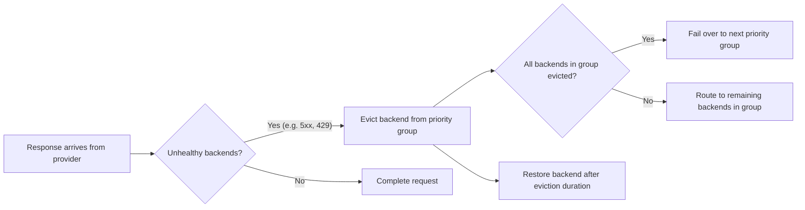

Prioritize the failover of requests across different models from an LLM provider.

## About failover {#about}

Use failover (automatic fallback) to keep services running by switching to a backup when the main system fails or becomes unavailable.

For , you can set up failover across models and LLM providers. When a provider becomes unhealthy (such as returning errors or getting rate-limited), the system automatically switches to a backup provider. This keeps the service running without interruptions.

Failover in  has two parts:

- **Priority groups** in the  define the failover order. Each group is a tier. Models within the same group are load balanced equally. When all models in a group are evicted, requests fail over to the next group.
- **A health policy** in an  defines what counts as an unhealthy response (such as 5xx errors or 429 rate limits) and how to evict unhealthy backends. Without a health policy, backends are not evicted and failover does not occur.

This approach increases the resiliency of your network environment by ensuring that apps that call LLMs can keep working without problems, even if one model has issues.

### Example flow

Failover works through backend eviction, as described in the following diagram.



1. A response arrives from a provider.
2. The `unhealthyCondition` CEL expression is evaluated. If `true`, the response is marked unhealthy.
3. If eviction thresholds are met (such as `consecutiveFailures`), the backend is evicted from its priority group for the configured `duration`.
4. When all backends in a priority group are evicted, the load balancer automatically routes to the next available group.
5. Evicted backends are restored after their eviction duration expires. The eviction duration uses multiplicative backoff on repeated evictions.

**Rate-limit handling:** When a 429 response includes a `Retry-After` header, agentgateway uses that duration as the eviction time (overriding the configured `duration`). However, 429 responses only trigger eviction if your `unhealthyCondition` includes them (for example, `response.code >= 500 || response.code == 429`).

### Failover vs. traffic splitting {#traffic-splitting}

Failover uses priority groups to automatically switch between backends when failures occur. 

For weight-based traffic distribution (A/B testing, traffic splitting, or canary deployments), see [Traffic splitting]().

## Before you begin

1. Set up an [agentgateway proxy]().
2. Set up [API access to each LLM provider]() that you want to use. The examples in this guide use OpenAI and Anthropic.


# Create an AgentgatewayBackend with 2 priority groups using httpbun as mock LLM.
# Group 1 (highest priority): single httpbun provider.
# Group 2 (fallback): second httpbun provider with a different name.
kubectl apply -f- <<EOF
apiVersion: agentgateway.dev/v1alpha1
kind: AgentgatewayBackend
metadata:
  name: model-failover
  namespace: agentgateway-system
spec:
  ai:
    groups:
      - providers:
          - name: primary-llm
            openai:
              model: gpt-4
            host: httpbun.default.svc.cluster.local
            port: 3090
            path: "/llm/chat/completions"
      - providers:
          - name: fallback-llm
            openai:
              model: gpt-4
            host: httpbun.default.svc.cluster.local
            port: 3090
            path: "/llm/chat/completions"
EOF



YAMLTest -f - <<'EOF'
- name: wait for model-failover backend to be accepted
  wait:
    target:
      kind: AgentgatewayBackend
      metadata:
        namespace: agentgateway-system
        name: model-failover
    jsonPath: "$.status.conditions[?(@.type=='Accepted')].status"
    jsonPathExpectation:
      comparator: equals
      value: "True"
    polling:
      timeoutSeconds: 60
      intervalSeconds: 2
EOF



# Create the HTTPRoute for the failover backend.
kubectl apply -f- <<EOF
apiVersion: gateway.networking.k8s.io/v1
kind: HTTPRoute
metadata:
  name: model-failover
  namespace: agentgateway-system
spec:
  parentRefs:
    - name: agentgateway-proxy
      namespace: agentgateway-system
  rules:
  - matches:
    - path:
        type: PathPrefix
        value: /model
    backendRefs:
    - name: model-failover
      namespace: agentgateway-system
      group: agentgateway.dev
      kind: AgentgatewayBackend
EOF



YAMLTest -f - <<'EOF'
- name: wait for model-failover HTTPRoute to be accepted
  wait:
    target:
      kind: HTTPRoute
      metadata:
        namespace: agentgateway-system
        name: model-failover
    jsonPath: "$.status.parents[0].conditions[?(@.type=='Accepted')].status"
    jsonPathExpectation:
      comparator: equals
      value: "True"
    polling:
      timeoutSeconds: 60
      intervalSeconds: 2
- name: wait for model-failover HTTPRoute refs to be resolved
  wait:
    target:
      kind: HTTPRoute
      metadata:
        namespace: agentgateway-system
        name: model-failover
    jsonPath: "$.status.parents[0].conditions[?(@.type=='ResolvedRefs')].status"
    jsonPathExpectation:
      comparator: equals
      value: "True"
    polling:
      timeoutSeconds: 60
      intervalSeconds: 2
EOF



# Create the AgentgatewayPolicy with health/eviction settings.
kubectl apply -f- <<EOF
apiVersion: agentgateway.dev/v1alpha1
kind: AgentgatewayPolicy
metadata:
  name: model-failover-health
  namespace: agentgateway-system
spec:
  targetRefs:
  - group: agentgateway.dev
    kind: AgentgatewayBackend
    name: model-failover
  backend:
    health:
      unhealthyCondition: "response.code >= 500 || response.code == 429"
      eviction:
        duration: 10s
        consecutiveFailures: 1
EOF



YAMLTest -f - <<'EOF'
- name: wait for model-failover-health policy to be accepted
  wait:
    target:
      kind: AgentgatewayPolicy
      metadata:
        namespace: agentgateway-system
        name: model-failover-health
    jsonPath: "$.status.ancestors[0].conditions[?(@.type=='Accepted')].status"
    jsonPathExpectation:
      comparator: equals
      value: "True"
    polling:
      timeoutSeconds: 120
      intervalSeconds: 2
EOF



# Get the gateway address and verify a request through the failover backend succeeds.
export INGRESS_GW_ADDRESS=$(kubectl get svc -n agentgateway-system agentgateway-proxy -o=jsonpath="{.status.loadBalancer.ingress[0]['hostname','ip']}")

YAMLTest -f - <<'EOF'
- name: verify request through failover backend succeeds
  http:
    url: "http://${INGRESS_GW_ADDRESS}/model"
    method: POST
    headers:
      Content-Type: application/json
    body: |
      {
        "messages": [{"role": "user", "content": "Hello"}]
      }
  source:
    type: local
  expect:
    statusCode: 200
    bodyJsonPath:
      - path: "$.usage.total_tokens"
        comparator: greaterThan
        value: 0
EOF



# Cleanup test resources
kubectl delete AgentgatewayBackend model-failover -n agentgateway-system --ignore-not-found
kubectl delete AgentgatewayPolicy model-failover-health -n agentgateway-system --ignore-not-found
kubectl delete httproute model-failover -n agentgateway-system --ignore-not-found


## Fail over to other models {#model-failover}

You can configure failover across multiple models and providers by using priority groups. Each priority group represents a set of providers that share the same priority level. Failover priority is determined by the order in which the priority groups are listed in the . The priority group that is listed first is assigned the highest priority.

Models within the same priority group are [load balanced]() using the Power of Two Choices (P2C) algorithm, which intelligently routes requests based on health, latency, and current load, not just simple round-robin. This pattern of P2C load balancing within a tier with failover across tiers provides superior performance compared to named strategies.

For weight-based traffic distribution within a priority group (such as 80/20 splits for A/B testing or canary rollouts), see [Traffic splitting]().

1. Create or update the  for your LLM providers.

   
   {}
   
   In this example, you configure separate priority groups for failover across multiple models from the same LLM provider, OpenAI. Each model is in its own priority group. The order of the groups determines the failover priority. If the first model is evicted, requests fail over to the second group, and so on.
   
   1. OpenAI `gpt-4.1` model (highest priority)
   2. OpenAI `gpt-5.1` model (fallback)
   3. OpenAI `gpt-3.5-turbo` model (lowest priority)


   ```yaml
   kubectl apply -f- <<EOF
   apiVersion: agentgateway.dev/v1alpha1
   kind: 
   metadata:
     name: model-failover
     namespace: 
   spec:
     ai:
       groups: 
         - providers: 
             - name: openai-gpt-41
               openai: 
                 model: gpt-4.1
               policies:
                 auth:
                   secretRef:
                     name: openai-secret
         - providers: 
             - name: openai-gpt-51
               openai: 
                 model: gpt-5.1
               policies:
                 auth:
                   secretRef:
                     name: openai-secret
         - providers: 
             - name: openai-gpt-3-5-turbo
               openai: 
                 model: gpt-3.5-turbo
               policies:
                 auth:
                   secretRef:
                     name: openai-secret
   EOF
   ```


   
   {}
   {}
   
   In this example, you configure failover across multiple providers with cost-based priority. The first priority group contains cheaper models. Responses are load-balanced across these models. In the event that both models are unavailable, requests fall back to the second priority group of more premium models.
   - Highest priority: Load balance across cheaper OpenAI `gpt-3.5-turbo` and Anthropic `claude-haiku-4-5-20251001` models.
   - Fallback: Load balance across more premium OpenAI `gpt-4.1` and Anthropic `claude-opus-4-6` models.

   Make sure that you configured both Anthropic and OpenAI providers.


   ```yaml
   kubectl apply -f- <<EOF
   apiVersion: agentgateway.dev/v1alpha1
   kind: 
   metadata:
     name: model-failover
     namespace: 
   spec:
     ai:
       groups: 
         - providers: 
             - name: openai-gpt-3.5-turbo
               openai: 
                 model: gpt-3.5-turbo
               policies:
                 auth:
                   secretRef:
                     name: openai-secret
             - name: claude-haiku
               anthropic:
                 model: claude-haiku-4-5-20251001
               policies:
                 auth:
                   secretRef:
                     name: anthropic-secret
         - providers: 
             - name: openai-gpt-4.1
               openai: 
                 model: gpt-4.1
               policies:
                 auth:
                   secretRef:
                     name: openai-secret
             - name: claude-opus
               anthropic:
                 model: claude-opus-4-6
               policies:
                 auth:
                   secretRef:
                     name: anthropic-secret
   EOF
   ```

   
   {}
   

2. Create an HTTPRoute resource that routes incoming traffic on the `/model` path to the  that you created in the previous step. In this example, the URLRewrite filter rewrites the path from `/model` to the path of the API in the LLM provider that you want to use, such as `/v1/chat/completions` for OpenAI.

  
   
   ```yaml
   kubectl apply -f- <<EOF
   apiVersion: gateway.networking.k8s.io/v1
   kind: HTTPRoute
   metadata:
     name: model-failover
     namespace: 
   spec:
     parentRefs:
       - name: agentgateway-proxy
         namespace: 
     rules:
     - matches:
       - path:
           type: PathPrefix
           value: /model
       backendRefs:
       - name: model-failover
         namespace: 
         group: agentgateway.dev
         kind: 
   EOF
   ```
   

3. Create an  with a health policy that targets the . The health policy defines which responses are considered unhealthy and how to evict backends. Without this policy, backends are not evicted and failover does not occur.

   The `unhealthyCondition` field is a [CEL expression](https://github.com/google/cel-spec) that evaluates each response. When the expression returns `true`, the response is treated as unhealthy. The `eviction` settings control when and how long an unhealthy backend is removed from its priority group.

   
   {}

   This configuration evicts backends on both server errors (5xx) and rate-limit responses (429). This way, when you get throttled by one LLM provider, agentgateway automatically fails over to another.

   ```yaml
   kubectl apply -f- <<EOF
   apiVersion: 
   kind: 
   metadata:
     name: model-failover-health
     namespace: 
   spec:
     targetRefs:
     - group: agentgateway.dev
       kind: 
       name: model-failover
     backend:
       health:
         unhealthyCondition: "response.code >= 500 || response.code == 429"
         eviction:
           duration: 10s
           consecutiveFailures: 1
   EOF
   ```

   {}
   {}

   This configuration evicts backends only on server errors (5xx) or connection failures. Rate-limited (429) responses lower the backend's health score but do not trigger eviction.

   ```yaml
   kubectl apply -f- <<EOF
   apiVersion: 
   kind: 
   metadata:
     name: model-failover-health
     namespace: 
   spec:
     targetRefs:
     - group: agentgateway.dev
       kind: 
       name: model-failover
     backend:
       health:
         unhealthyCondition: "response.code >= 500"
         eviction:
           duration: 10s
           consecutiveFailures: 3
   EOF
   ```

   {}
   

   

   | Setting | Description |
   | --- | --- |
   | `unhealthyCondition` | CEL expression evaluated for each response. `true` means unhealthy. The default (when unset) treats 5xx and connection failures as unhealthy but does not trigger eviction on its own. |
   | `eviction.duration` | Base time to remove an unhealthy backend from its priority group. Increases with multiplicative backoff on repeated evictions. When a 429 response includes `Retry-After`, that value is used instead. |
   | `eviction.consecutiveFailures` | Number of consecutive unhealthy responses required before evicting. When set to `1`, a single unhealthy response triggers eviction. |

4. Send a request to observe the failover. In your request, do not specify a model. Instead, the  automatically uses the model from the first priority group (highest priority).

   
   {}
   ```bash
   curl -v "$INGRESS_GW_ADDRESS/model" -H content-type:application/json -d '{
     "messages": [
       {
         "role": "user",
         "content": "What is kubernetes?"
       }
   ]}' | jq
   ```
   {}
   {}
   ```bash
   curl -v "localhost:8080/model" -H content-type:application/json -d '{
     "messages": [
       {
         "role": "user",
         "content": "What is kubernetes?"
       }
   ]}' | jq
   ```
   
   
   
   Example output:

   
   {}
   
   Note the response is from the `gpt-4.1` model, which is the first model in the priority order from the .

   ```json {linenos=table,hl_lines=[5],linenostart=1,filename="model-response.json"}
   {
     "id": "chatcmpl-BFQ8Lldo9kLC56S1DFVbIonOQll9t",
     "object": "chat.completion",
     "created": 1743015077,
     "model": "gpt-4.1-2025-04-14",
     "choices": [
       {
         "index": 0,
         "message": {
           "role": "assistant",
           "content": "Kubernetes is an open-source container orchestration platform designed to automate the deployment, scaling, and management of containerized applications. Originally developed by Google, it is now maintained by the Cloud Native Computing Foundation (CNCF).\n\nKubernetes provides a framework to run distributed systems resiliently. It manages containerized applications across a cluster of machines, offering features such as:\n\n1. **Automatic Bin Packing**: It can optimize resource usage by automatically placing containers based on their resource requirements and constraints while not sacrificing availability.\n\n2. **Self-Healing**: Restarts failed containers, replaces and reschedules containers when nodes die, and kills and reschedules containers that are unresponsive to user-defined health checks.\n\n3. **Horizontal Scaling**: Scales applications and resources up or down automatically, manually, or based on CPU usage.\n\n4. **Service Discovery and Load Balancing**: Exposes containers using DNS names or their own IP addresses and balances the load across them.\n\n5. **Automated Rollouts and Rollbacks**: Automatically manages updates to applications or configurations and can rollback changes if necessary.\n\n6. **Secret and Configuration Management**: Enables you to deploy and update secrets and application configuration without rebuilding your container images and without exposing secrets in your stack configuration and environment variables.\n\n7. **Storage Orchestration**: Allows you to automatically mount the storage system of your choice, whether from local storage, a public cloud provider, or a network storage system.\n\nBy providing these functionalities, Kubernetes enables developers to focus more on creating applications, while the platform handles the complexities of deployment and scaling. It has become a de facto standard for container orchestration, supporting a wide range of cloud platforms and minimizing dependencies on any specific infrastructure.",
           "refusal": null,
           "annotations": []
         },
         "logprobs": null,
         "finish_reason": "stop"
       }
     ],
     ...
   }
   ```
   
   {}
   {}
   
   Note the response is from the `claude-haiku-4-5-20251001` model. With the cost-based priority configuration, requests are load balanced across the cheaper models (OpenAI `gpt-3.5-turbo` and Anthropic `claude-haiku-4-5-20251001`) in the first priority group.

   ```json {linenos=table,hl_lines=[2],linenostart=1,filename="model-response.json"}
   {
     "model": "claude-haiku-4-5-20251001",
     "usage": {
       "prompt_tokens": 11,
       "completion_tokens": 299,
       "total_tokens": 310
     },
     "choices": [
       {
         "message": {
           "content": "Kubernetes (often abbreviated as K8s) is an open-source container orchestration platform designed to automate the deployment, scaling, and management of containerized applications. Here's a comprehensive overview:\n\nKey Features:\n1. Container Orchestration\n- Manages containerized applications\n- Handles deployment and scaling\n- Ensures high availability\n\n2. Core Components\n- Cluster: Group of machines (nodes)\n- Master Node: Controls the cluster\n- Worker Nodes: Run containerized applications\n- Pods: Smallest deployable units\n- Containers: Isolated application environments\n\n3. Main Capabilities\n- Automatic scaling\n- Self-healing\n- Load balancing\n- Rolling updates\n- Service discovery\n- Configuration management\n\n4. Key Concepts\n- Deployments: Define desired application state\n- Services: Network communication between components\n- Namespaces: Logical separation of resources\n- ConfigMaps: Configuration management\n- Secrets: Sensitive data management\n\n5. Benefits\n- Portability across different environments\n- Efficient resource utilization\n- Improved scalability\n- Enhanced reliability\n- Simplified management of complex applications\n\n6. Popular Use Cases\n- Microservices architecture\n- Cloud-native applications\n- Continuous deployment\n- Distributed systems\n\nKubernetes has become the standard for container orchestration in modern cloud-native application development.",
           "role": "assistant"
         },
         "index": 0,
         "finish_reason": "stop"
       }
     ],
     "id": "msg_016PLweC4jgJnpwH7V1tZaqj",
     "created": 1762790436,
     "object": "chat.completion"
   }
   ```
   
   {}
   

## Cleanup



```shell
kubectl delete  model-failover -n 
kubectl delete  model-failover-health -n 
kubectl delete httproute model-failover -n 
```

## Next

Explore other agentgateway features.

* Learn more about [load balancing strategies]() and the P2C algorithm.
* Pass in [functions]() to an LLM to request as a step towards agentic AI.
* Set up [prompt guards]() to block unwanted requests and mask sensitive data.
* [Enrich your prompts]() with system prompts to improve LLM outputs.
