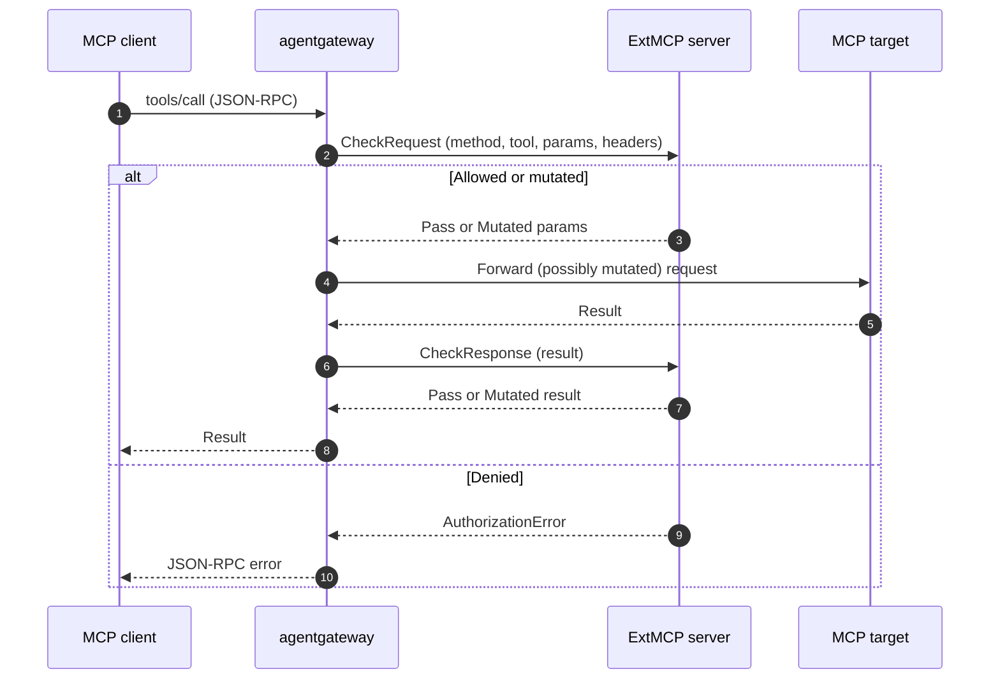

Use MCP guardrails (also called ExtMCP) to apply external authorization and external processing to Model Context Protocol (MCP) requests. An external gRPC policy server inspects, allows, mutates, or denies individual MCP method calls, such as `tools/call` and `tools/list`, using MCP request context instead of generic HTTP metadata.

## About MCP guardrails

 already supports [external authorization]() and [external processing (ExtProc)]() for HTTP traffic. Both call out to an external gRPC server so that you can centralize authorization and request or response mutation outside the proxy. However, these integrations operate on raw HTTP. To make a decision about an MCP tool call, the external server must reassemble the HTTP body, parse the JSON-RPC envelope, and handle MCP framing itself.

MCP guardrails solve this by calling out at the MCP method layer instead of the HTTP layer. The ExtMCP protocol is modeled on Envoy's ext_authz, but the external server receives a structured, MCP-native payload: the JSON-RPC method name, the target backend, the request or response parameters, and selected request headers. The server can then make a decision based on the actual tool, prompt, or resource being accessed, without re-implementing MCP semantics.

Common use cases include the following:

* Gate `tools/call` so that only approved tools run, based on the tool name, arguments, or caller identity.
* Filter `tools/list` responses so that clients see only the tools they are allowed to use.
* Rewrite request parameters or response results to redact sensitive data or inject context.
* Centralize MCP authorization logic in an external service that you already operate.

### Sequence diagram

You attach a guardrails policy to an MCP backend. The policy defines an ordered list of *processors*. Each processor points to a remote gRPC server and a `methods` map that opts specific JSON-RPC methods into a *phase*. When a client calls an opted-in method, agentgateway calls the remote server before forwarding the request, after receiving the response, or both.

The remote server returns one of three outcomes for each call:

* **Pass**: Allow the request or response unchanged.
* **Mutate**: Replace the JSON-RPC `params` (request phase) or `result` (response phase) before agentgateway forwards it.
* **Deny**: Reject the call with a JSON-RPC error that is returned to the client.

### Phases

The `methods` map controls when each method runs through a processor. Set a phase for each method that you want to send to the server.

| Phase | When the server is called |
|-------|---------------------------|
| `Off` | Never. The method bypasses this processor. |
| `Request` | Before the request reaches the MCP target. Use to gate or mutate the incoming call. |
| `Response` | After the MCP target returns a result. Use to filter or rewrite the response. |
| `Full` | Both the request and response phases. |

Method keys can be exact (`tools/call`), a prefix wildcard (`tools/*`), a suffix wildcard (`*/list`), or `*` for all methods. The most specific match wins. Methods that match no key, including unknown methods, bypass the processor.

### Failure modes

The `failureMode` setting controls what happens when the remote server is unreachable or returns an error.

* **failClosed** (default): Deny the request. Use when the policy server must approve every call.
* **failOpen**: Allow the request. Use when availability matters more than strict enforcement.

### Ordering and multiplexing

Keep the following behaviors in mind when you design a policy:

* Guardrails run *after* MCP authentication. If a processor mutates a request, agentgateway does not re-run authentication on the mutated request.
* Processors run in the order listed. The first processor to deny a request short-circuits the chain.
* Agentgateway passes tool names to the server in their original, un-prefixed form. When agentgateway multiplexes tools from several backends, it passes the backend name separately as metadata rather than in the tool name.
* For fanout methods such as `tools/list`, agentgateway calls the server once per backend.

### Error codes

When a processor denies a call, agentgateway returns a JSON-RPC error to the client. The server's authorization code maps to a JSON-RPC error code:

| ExtMCP code | JSON-RPC code |
|-------------|---------------|
| `PERMISSION_DENIED` | `-32001` |
| `RESOURCE_EXHAUSTED` | `-32003` |
| `INVALID` | Invalid request |
| `UNKNOWN` | Internal error |

The server can also return an explicit JSON-RPC error payload to override the default.
