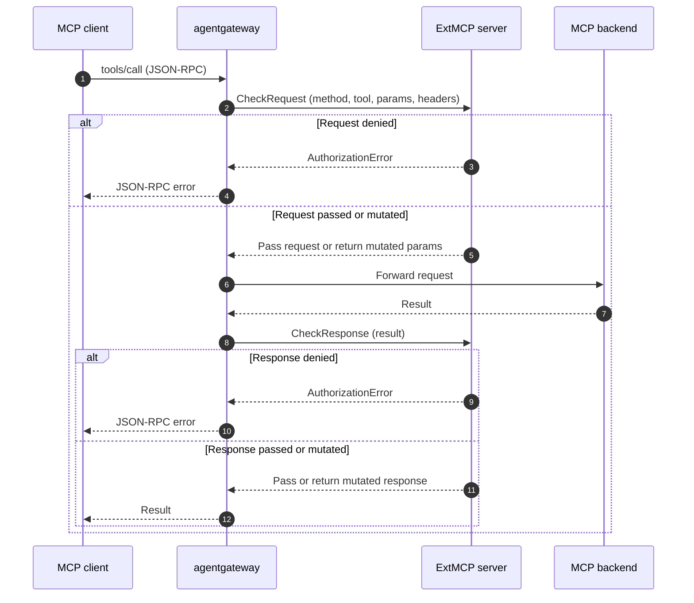

Use MCP guardrails (also called ExtMCP) to apply external authorization and external processing to Model Context Protocol (MCP) requests. An external gRPC policy server inspects, allows, mutates, or denies individual MCP method calls, such as `tools/call` and `tools/list`, by using the MCP request context instead of generic HTTP metadata.

## About MCP guardrails

 already supports [external authorization]()[external authorization]() and [external processing (ExtProc)]()[external processing (ExtProc)]() for HTTP traffic. Both call out to an external gRPC server so that you can centralize authorization and request or response mutation outside the proxy. However, these integrations operate on raw HTTP. To make a decision about an MCP tool call, the external server must reassemble the HTTP body, parse the JSON-RPC envelope, and handle MCP framing itself.

MCP guardrails solve this challenge by calling out at the MCP method layer instead of the HTTP layer. The ExtMCP protocol is modeled on Envoy's `ext_authz` filter, but the external server receives a structured, MCP-native payload, including the JSON-RPC method name, the target backend, the request or response parameters, and selected request headers. The server can then make a decision based on the actual tool, prompt, or resource that is being accessed, without re-implementing MCP semantics.

Common use cases include the following:

* Gate `tools/call` so that only approved tools run, based on the tool name, arguments, or caller identity.
* Filter `tools/list` responses so that clients see only the tools they are allowed to use.
* Rewrite request parameters or response results to redact sensitive data or inject context.
* Centralize MCP authorization logic in an external service that you already operate.

## How it works

When a client calls an MCP method that you opt in, agentgateway calls your ExtMCP server before it forwards the request, after it receives the response, or both. At each call, the server can pass the message through unchanged, return a mutated message, or deny the call with an error that agentgateway returns to the client as a JSON-RPC error.



The server returns one of three outcomes for each call:

* **Pass**: Allow the request or response unchanged.
* **Mutate**: Replace the JSON-RPC `params` (request phase) or `result` (response phase) before agentgateway forwards it.
* **Deny**: Reject the call with a JSON-RPC error that is returned to the client. The server can deny a call in either the request phase or the response phase.

## Configuration

You configure MCP guardrails as an ordered list of *processors*. A processor defines the actions to take for a particular set of MCP methods, and each processor is enforced by an ExtMCP server. You can chain multiple processors, where each one calls a different ExtMCP server that performs a specific manipulation, such as one server for authorization and another for content redaction.

The following example shows a guardrails policy with a single processor.


```yaml
apiVersion: agentgateway.dev/v1alpha1
kind: AgentgatewayPolicy
metadata:
  name: mcp-guardrails
spec:
  targetRefs:
    - group: agentgateway.dev
      kind: AgentgatewayBackend
      name: mcp-backend
  backend:
    mcp:
      guardrails:
        processors:
        - remote:
            backendRef:
              name: ext-mcp
              port: 4445
            failureMode: FailClosed
          methods:
            tools/call: Request
            tools/list: Response
```


```yaml
mcpGuardrails:
  processors:
  - kind: remote
    host: "localhost:9001"
    failureMode: failClosed
    methods:
      tools/call: request
      tools/list: response
```


For each processor, you define the following settings:

* **The ExtMCP server**: The `remote.backendRef``remote` reference, such as `host` points to the gRPC server that enforces the processor. The server must implement the [ExtMCP protocol](https://github.com/agentgateway/agentgateway/blob/main/crates/protos/proto/ext_mcp.proto).
* **The methods and phases**: The `methods` map selects which MCP methods run through the processor and in which phase. See [Methods](#methods) and [Phases](#phases).
* **The failure mode**: The `failureMode` setting controls what happens when the server is unreachable or returns an error. See [Failure modes](#failure-modes).

### Methods

The `methods` map keys are the JSON-RPC method names from the [MCP specification](https://modelcontextprotocol.io/specification), such as `tools/call`, `tools/list`, `prompts/get`, and `resources/read`. Each key maps to the phase in which agentgateway calls the processor for that method.

Method keys can be exact (`tools/call`), a prefix wildcard (`tools/*`), a suffix wildcard (`*/list`), or `*` for all methods. The most specific match wins. Methods that match no key, including unknown methods, bypass the processor.

### Phases

The phase controls when agentgateway calls the processor for a method. Set a phase for each method that you want to send to the server.

| Phase | When the server is called |
|-------|---------------------------|
| `Off` | Never. The method bypasses this processor. |
| `Request` | Before the request reaches the MCP backend. Use to gate or mutate the incoming call. |
| `Response` | After the MCP backend returns a result. Use to filter or rewrite the response. |
| `Full` | Both the request and response phases. |

### Failure modes

The `failureMode` setting controls what happens when the server is unreachable or returns an error.

* **failClosed** (default): Deny the request. Use when the policy server must approve every call.
* **failOpen**: Allow the request. Use when availability matters more than strict enforcement.

### Ordering and multiplexing

Keep the following behaviors in mind when you design a policy:

* Guardrails run *after* MCP authentication. If a processor mutates a request, agentgateway does not re-run authentication on the mutated request.
* Processors run in the order listed. The first processor to deny a request short-circuits the chain.
* Agentgateway passes tool names to the server in their original, un-prefixed form. When agentgateway multiplexes tools from several backends, it passes the backend name separately as metadata rather than in the tool name.
* For fanout methods such as `tools/list`, agentgateway calls the server once per backend.

### Error codes

When a processor denies a call, agentgateway returns a JSON-RPC error to the client. The server's authorization code maps to a JSON-RPC error code:

| ExtMCP code | JSON-RPC code |
|-------------|---------------|
| `PERMISSION_DENIED` | `-32001` |
| `RESOURCE_EXHAUSTED` | `-32003` |
| `INVALID` | Invalid request |
| `UNKNOWN` | Internal error |

The server can also return an explicit JSON-RPC error payload to override the default.
