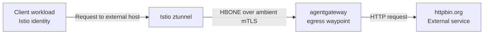

Route AI traffic from an Istio ambient mesh through agentgateway to external providers.

## About ambient mesh

Solo.io and Google collaborated to develop ambient mesh, a sidecarless architecture for the Istio service mesh. Ambient mesh uses node-level ztunnels to route and secure Layer 4 traffic with mTLS. For Layer 7 policy and routing, ztunnel forwards traffic to waypoint proxies over [HBONE](https://istio.io/latest/docs/ambient/architecture/hbone/).

To learn more, see the [Istio ambient overview](https://istio.io/latest/docs/ambient/overview/) and the [waypoint configuration guide](https://istio.io/latest/docs/ambient/usage/waypoint/).

## About this guide

In this guide, you configure an agentgateway-managed waypoint for ambient egress. A client workload
in an ambient mesh sends requests directly to an external host. Istio detects the destination through
a ServiceEntry and routes the request through the waypoint, where agentgateway applies routing rules.

In this guide, external means the destination is modeled as `MESH_EXTERNAL` in the ServiceEntry and is
outside your in-mesh service namespace and waypoint policy boundary.

To keep this demo free and repeatable, the external destination is [httpbin.org](https://httpbin.org/).
The route adds an `x-agw-waypoint: true` response header so you can verify that traffic passed through
agentgateway.



The client does not use the waypoint address. It calls the backend host directly, and Istio
transparently forwards matching egress traffic through the waypoint.

## Before you begin



## Step 1: Set up an ambient mesh



## Step 2: Run preflight checks

Verify your current context, required control planes, and available GatewayClasses.

```sh
kubectl config current-context
kubectl get gatewayclass -o custom-columns=NAME:.metadata.name,CONTROLLER:.spec.controllerName
kubectl -n istio-system get pods -l app=ztunnel
kubectl -n agentgateway-system get deploy,pods
```

Make sure an agentgateway-owned GatewayClass exists (commonly `agentgateway`).

## Step 3: Create namespaces and a test client

Create an ambient-enabled client namespace and a separate namespace for the egress waypoint.

> [!NOTE]
> Ambient-enabled means Istio configures ztunnel capture for workloads in the client namespace so outbound traffic is transparently intercepted and secured with mTLS, without sidecars.

```yaml
kubectl apply -f - <<EOF
apiVersion: v1
kind: Namespace
metadata:
  name: agents
  labels:
    istio.io/dataplane-mode: ambient
---
apiVersion: v1
kind: Namespace
metadata:
  name: agentgateway-egress
---
apiVersion: apps/v1
kind: Deployment
metadata:
  name: curl
  namespace: agents
spec:
  replicas: 1
  selector:
    matchLabels:
      app: curl
  template:
    metadata:
      labels:
        app: curl
    spec:
      containers:
      - name: curl
        image: curlimages/curl:8.10.1
        command: ["sleep", "infinity"]
EOF

kubectl -n agents rollout status deploy/curl
```

By default, leave the `agentgateway-egress` namespace unlabeled for ambient mode.
If you do label that namespace with `istio.io/dataplane-mode=ambient`, make sure the waypoint pods
opt out with `istio.io/dataplane-mode=none`; otherwise ztunnel capture can conflict with the
waypoint's HBONE listener on port `15008`.

## Step 4: Deploy an egress waypoint

Create AgentgatewayParameters for Istio integration and force the generated Service to `ClusterIP`.
Then deploy a waypoint Gateway with:

1. An HBONE listener on port `15008`.
2. An internal HTTP listener on port `80` for route attachment.

The internal listener is a routing attachment point, not a direct entry socket. Marking that
port as internal makes it routing-only (no generated Service port, container port, or direct
listener socket) while still giving you a clear, stable attachment point for `HTTPRoute` policy
and backend selection.
If you want namespace-level egress isolation for ambient clients, use the optional NetworkPolicy in
Step 6 to allow only DNS, Istio system, and waypoint-bound traffic.

```yaml
kubectl apply -f - <<EOF
apiVersion: agentgateway.dev/v1alpha1
kind: AgentgatewayParameters
metadata:
  name: agw-waypoint-params
  namespace: agentgateway-egress
spec:
  istio:
    enabled: true
  service:
    spec:
      type: ClusterIP
---
apiVersion: gateway.networking.k8s.io/v1
kind: Gateway
metadata:
  name: agw-waypoint
  namespace: agentgateway-egress
  labels:
    istio.io/waypoint-for: service
  annotations:
    agentgateway.dev/internal-ports: "80"
spec:
  gatewayClassName: agentgateway
  infrastructure:
    parametersRef:
      group: agentgateway.dev
      kind: AgentgatewayParameters
      name: agw-waypoint-params
  listeners:
  - name: mesh
    port: 15008
    protocol: HBONE
    allowedRoutes:
      namespaces:
        from: All
  - name: inner-http
    port: 80
    protocol: HTTP
    allowedRoutes:
      namespaces:
        from: All
EOF

kubectl -n agentgateway-egress wait --for=condition=Programmed gateway/agw-waypoint --timeout=2m
```

## Step 5: Bind the external destination and configure routing

Create:

1. A ServiceEntry for the external host.
2. An AgentgatewayBackend that targets the external host.
3. An HTTPRoute attached to the waypoint `inner-http` listener that adds a response header.

These resources serve different roles and are both required.
The ServiceEntry tells Istio that `httpbin.org` is an external destination (`MESH_EXTERNAL`) and
enables ambient waypoint steering for that host. The AgentgatewayBackend tells agentgateway where to
forward traffic after the route matches. Without the ServiceEntry, Istio might bypass waypoint-based
egress handling for the host. Without the AgentgatewayBackend, the route has no upstream target.
For ServiceEntry fields and behavior, see the [Istio ServiceEntry reference](https://istio.io/latest/docs/reference/config/networking/service-entry/).

```yaml
kubectl apply -f - <<EOF
apiVersion: networking.istio.io/v1
kind: ServiceEntry
metadata:
  name: httpbin-external
  namespace: agents
  labels:
    istio.io/use-waypoint: agw-waypoint
    istio.io/use-waypoint-namespace: agentgateway-egress
spec:
  hosts:
  - httpbin.org
  location: MESH_EXTERNAL
  resolution: DNS
  ports:
  - number: 80
    name: http
    protocol: HTTP
---
apiVersion: agentgateway.dev/v1alpha1
kind: AgentgatewayBackend
metadata:
  name: httpbin-backend
  namespace: agentgateway-egress
spec:
  static:
    host: httpbin.org
    port: 80
---
apiVersion: gateway.networking.k8s.io/v1
kind: HTTPRoute
metadata:
  name: httpbin-via-agw
  namespace: agentgateway-egress
spec:
  parentRefs:
  - name: agw-waypoint
    sectionName: inner-http
  hostnames:
  - httpbin.org
  rules:
  - matches:
    - path:
        type: PathPrefix
        value: /
    backendRefs:
    - group: agentgateway.dev
      kind: AgentgatewayBackend
      name: httpbin-backend
    filters:
    - type: ResponseHeaderModifier
      responseHeaderModifier:
        add:
        - name: x-agw-waypoint
          value: "true"
EOF

kubectl -n agentgateway-egress wait --for=jsonpath='{.status.parents[0].conditions[?(@.type=="Accepted")].status}'=True \
  httproute/httpbin-via-agw --timeout=2m
```

## Step 6: Optional: restrict egress from ambient clients with NetworkPolicy

To follow the Istio egress hardening pattern, apply an egress policy in the `agents` namespace.
This policy allows egress only to:

1. DNS in `kube-system` on port `53`.
2. `istio-system` components.
3. The waypoint namespace on HBONE port `15008`.

[Network policies](https://kubernetes.io/docs/concepts/services-networking/network-policies/) are enforced by your Kubernetes CNI plugin, so behavior can vary by cluster.
For ambient mode, this policy is applicable to source workloads in the client namespace; make sure
waypoint traffic (TCP `15008`) and DNS are explicitly allowed, or egress requests can fail.

```yaml
kubectl apply -f - <<EOF
apiVersion: networking.k8s.io/v1
kind: NetworkPolicy
metadata:
  name: allow-egress-to-istio-system-and-kube-dns
  namespace: agents
spec:
  podSelector: {}
  policyTypes:
  - Egress
  egress:
  - to:
    - namespaceSelector:
        matchLabels:
          kubernetes.io/metadata.name: kube-system
    ports:
    - protocol: UDP
      port: 53
    - protocol: TCP
      port: 53
  - to:
    - namespaceSelector:
        matchLabels:
          kubernetes.io/metadata.name: istio-system
  - to:
    - namespaceSelector:
        matchLabels:
          kubernetes.io/metadata.name: agentgateway-egress
    ports:
    - protocol: TCP
      port: 15008
EOF
```

## Step 7: Send a request directly to the backend host

From the ambient client, send a request to the external destination address.

```sh
kubectl -n agents exec deploy/curl -- curl -sSI http://httpbin.org/get
```

Verify these response properties:

1. HTTP status is `200`.
2. Header `x-agw-waypoint: true` is present.

Example output:

```console
HTTP/1.1 200 OK
access-control-allow-credentials: true
access-control-allow-origin: *
content-type: application/json; charset=utf-8
x-agw-waypoint: true
```

## Step 8: Verify ambient transport and waypoint attachment

1. Confirm that Istio sees waypoint pods for `agw-waypoint`.
   ```sh
   kubectl -n agentgateway-egress get pods \
     -l gateway.networking.k8s.io/gateway-name=agw-waypoint
   ```

2. Confirm ServiceEntry waypoint labels.
   ```sh
   kubectl -n agents get serviceentry httpbin-external -o yaml
   ```

3. Check ztunnel access logs and verify source and destination identities.
   ```sh
   kubectl -n istio-system logs -l app=ztunnel --since=5m | \
    grep 'src.namespace="agents"' | grep 'dst.service="httpbin.org"'
   ```

Optional: If Prometheus is installed in `istio-system`, query mTLS connection counters.

```sh
kubectl -n istio-system exec deploy/prometheus -- sh -c 'wget -qO- "http://localhost:9090/api/v1/query?query=sum(increase(istio_tcp_connections_opened_total%7Bsource_workload_namespace%3D%22agents%22%2Cdestination_workload_namespace%3D%22agentgateway-egress%22%2Cconnection_security_policy%3D%22mutual_tls%22%7D%5B5m%5D))"'
```

## Step 9: Use a real external provider

To adapt this demo for production egress from Istio-meshed agents, keep the same ambient pattern (client calls destination directly, Istio steers through the waypoint), then layer in these workflows.

Start with these baseline changes:

1. Update the ServiceEntry host and AgentgatewayBackend host/port.
2. Keep the client request pointed at the backend address, not the waypoint address.
3. Match the waypoint `inner-http` listener port and `agentgateway.dev/internal-ports` value to the destination port that you want to route.
4. Configure TLS and provider authentication for the upstream.

Then apply egress workflows that are especially useful for meshed agents:

1. Centralized credential injection for upstream AI providers, such as [OAuth token exchange](), [Cross App Access](), or [JWT signing]().
  This keeps provider credentials out of agent workloads and enforces one controlled identity path at egress.
2. Route-level authentication and authorization, such as [JWT authentication]() and [authorization policies]().
  This lets you decide which agents and users can call which external providers before traffic leaves the cluster.
3. AI safety and spend controls, such as [guardrails]() and [token-based rate limits]().
  This reduces prompt injection risk, blocks sensitive content patterns, and prevents runaway token spend.
4. Provider resilience and optimization, such as [load balancing](), [failover](), and [content routing]().
  This improves reliability and cost/performance by choosing the best model endpoint at request time.
5. Egress observability and audit trails, such as [LLM observability]().
  This gives you per-request visibility into tokens, cost, and policy outcomes for compliance and incident response.

## Cleanup



```sh
kubectl -n agents delete networkpolicy allow-egress-to-istio-system-and-kube-dns --ignore-not-found
kubectl -n agentgateway-egress delete httproute httpbin-via-agw --ignore-not-found
kubectl -n agentgateway-egress delete agentgatewaybackend httpbin-backend --ignore-not-found
kubectl -n agents delete serviceentry httpbin-external --ignore-not-found
kubectl -n agentgateway-egress delete gateway agw-waypoint --ignore-not-found
kubectl -n agentgateway-egress delete agentgatewayparameters agw-waypoint-params --ignore-not-found
kubectl -n agents delete deploy curl --ignore-not-found
kubectl delete namespace agents agentgateway-egress --ignore-not-found
```
