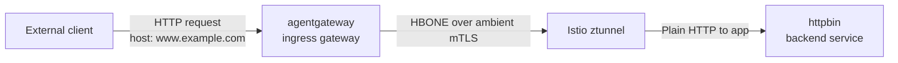

Serve external traffic to workloads in an Istio ambient mesh through agentgateway as the ingress gateway.

## About ambient mesh

Solo.io and Google collaborated to develop ambient mesh, a sidecarless architecture for the Istio service mesh. Ambient mesh uses node-level ztunnels to route and secure Layer 4 traffic with mTLS. For Layer 7 policy and routing, ztunnel forwards traffic to waypoint proxies over [HBONE](https://istio.io/latest/docs/ambient/architecture/hbone/).

To learn more, see the [Istio ambient overview](https://istio.io/latest/docs/ambient/overview/) and the [waypoint configuration guide](https://istio.io/latest/docs/ambient/usage/waypoint/).

## About this guide

In this guide, you configure agentgateway as the ingress gateway for an ambient mesh. An external client sends a request to agentgateway, which matches the request to an `HTTPRoute` and forwards it to an ambient-enabled backend. Because both the agentgateway proxy namespace and the backend namespace are ambient-enabled, ztunnel transparently secures the pod-to-pod traffic with mTLS over HBONE, without sidecars.

In this demo, the backend is an httpbin app in an ambient-enabled `httpbin` namespace.



External traffic terminates at the agentgateway ingress proxy on port `80`. From the proxy pod outward to the httpbin pod, ztunnel intercepts and secures the connection with mTLS on HBONE port `15008`.

## Before you begin



## Step 1: Set up an ambient mesh



## Step 2: Run preflight checks

Verify your current context, required control planes, and available GatewayClasses.

```sh
kubectl config current-context
kubectl get gatewayclass -o custom-columns=NAME:.metadata.name,CONTROLLER:.spec.controllerName
kubectl -n istio-system get pods -l app=ztunnel
kubectl -n agentgateway-system get deploy,pods
```

Make sure an agentgateway-owned GatewayClass exists (commonly `agentgateway`) and that a ztunnel pod is running on each node.

## Step 3: Ambient-enable the gateway and backend namespaces

For end-to-end ambient mTLS, both the namespace that runs the agentgateway ingress proxy and the namespace that runs the backend must be ambient-enabled. Label the `agentgateway-system` namespace, then create an ambient-enabled `httpbin` namespace and deploy httpbin plus a curl client for testing.

> [!NOTE]
> Ambient-enabled means Istio configures ztunnel capture for workloads in that namespace so traffic is transparently intercepted and secured with mTLS, without sidecars.

```sh
kubectl label ns agentgateway-system istio.io/dataplane-mode=ambient --overwrite
```

```yaml
kubectl apply -f - <<EOF
apiVersion: v1
kind: Namespace
metadata:
  name: httpbin
  labels:
    istio.io/dataplane-mode: ambient
---
apiVersion: v1
kind: ServiceAccount
metadata:
  name: httpbin
  namespace: httpbin
---
apiVersion: v1
kind: Service
metadata:
  name: httpbin
  namespace: httpbin
  labels:
    app: httpbin
spec:
  selector:
    app: httpbin
  ports:
  - name: http
    port: 8000
    targetPort: 8080
---
apiVersion: apps/v1
kind: Deployment
metadata:
  name: httpbin
  namespace: httpbin
spec:
  replicas: 1
  selector:
    matchLabels:
      app: httpbin
  template:
    metadata:
      labels:
        app: httpbin
    spec:
      serviceAccountName: httpbin
      containers:
      - name: httpbin
        image: docker.io/mccutchen/go-httpbin:v2.15.0
        ports:
        - containerPort: 8080
---
apiVersion: apps/v1
kind: Deployment
metadata:
  name: curl
  namespace: httpbin
spec:
  replicas: 1
  selector:
    matchLabels:
      app: curl
  template:
    metadata:
      labels:
        app: curl
    spec:
      containers:
      - name: curl
        image: curlimages/curl:8.10.1
        command: ["sleep", "infinity"]
EOF

kubectl -n httpbin rollout status deploy/httpbin
kubectl -n httpbin rollout status deploy/curl
```

Assigning httpbin its own ServiceAccount gives the backend a distinct SPIFFE identity (`spiffe://cluster.local/ns/httpbin/sa/httpbin`) that appears in ztunnel access logs in Step 6.

If the `agentgateway-system` namespace was already running before you added the ambient label, restart any existing gateway proxy pods so ztunnel captures them:

```sh
kubectl -n agentgateway-system delete pod -l gateway.networking.k8s.io/gateway-name=ambient-ingress --ignore-not-found
```

## Step 4: Deploy the ingress Gateway and HTTPRoute

Create a `Gateway` with `gatewayClassName: agentgateway` in the `agentgateway-system` namespace, and an `HTTPRoute` in the `httpbin` namespace that routes traffic to the httpbin Service.

```yaml
kubectl apply -f - <<EOF
apiVersion: gateway.networking.k8s.io/v1
kind: Gateway
metadata:
  name: ambient-ingress
  namespace: agentgateway-system
spec:
  gatewayClassName: agentgateway
  listeners:
  - name: http
    port: 80
    protocol: HTTP
    hostname: www.example.com
    allowedRoutes:
      namespaces:
        from: All
---
apiVersion: gateway.networking.k8s.io/v1
kind: HTTPRoute
metadata:
  name: httpbin-ingress
  namespace: httpbin
spec:
  parentRefs:
  - name: ambient-ingress
    namespace: agentgateway-system
  hostnames:
  - www.example.com
  rules:
  - matches:
    - path:
        type: PathPrefix
        value: /
    backendRefs:
    - name: httpbin
      port: 8000
EOF

kubectl -n agentgateway-system wait --for=condition=Programmed gateway/ambient-ingress --timeout=2m
```

Agentgateway provisions a Deployment and Service named after the `Gateway` (in this case `ambient-ingress`). The generated Service is exposed as a `LoadBalancer` by default; if your cluster does not assign an external IP, use `kubectl port-forward` in the next step.

## Step 5: Send a request through the ingress gateway

Port-forward the ingress Service and send a request with the matching `Host` header. If you have an external `LoadBalancer` IP, use it instead.

```sh
kubectl -n agentgateway-system port-forward svc/ambient-ingress 8888:80 &
```

```sh
curl -sSi -m 10 http://127.0.0.1:8888/get -H "host: www.example.com"
```

Verify these response properties:

1. HTTP status is `200`.
2. The body shows httpbin echoing your request with `Host: www.example.com`.

Example output:

```console
HTTP/1.1 200 OK
Access-Control-Allow-Credentials: true
Access-Control-Allow-Origin: *
Content-Type: application/json; charset=utf-8

{
  "args": {},
  "headers": {
    "Accept": [
      "*/*"
    ],
    "Host": [
      "www.example.com"
    ],
    "User-Agent": [
      "curl/8.10.1"
    ]
  },
  ...
}
```

## Step 6: Verify ambient mTLS between the gateway and the backend

Confirm that pod-to-pod traffic between the agentgateway ingress proxy and the httpbin backend is secured with mTLS. Because both namespaces are ambient-enabled, ztunnel transparently upgrades the connection to HBONE and stamps SPIFFE identities on the access log.

1. Send a few more requests so ztunnel emits access logs.
   ```sh
   for i in 1 2 3; do
     curl -sSI -m 10 http://127.0.0.1:8888/get -H "host: www.example.com" > /dev/null
   done
   ```

2. Grep ztunnel logs for the httpbin destination.
   ```sh
   kubectl -n istio-system logs -l app=ztunnel --since=1m | \
     grep 'dst.namespace="httpbin"'
   ```

3. Confirm that `src.identity` and `dst.identity` are SPIFFE URIs and that `dst.hbone_addr` is set. Both fields must be present.

   Example output:
   ```
   info    access  connection complete     src.addr=10.244.0.11:46902 src.workload="ambient-ingress-59789747ff-x9f5d" src.namespace="agentgateway-system" src.identity="spiffe://cluster.local/ns/agentgateway-system/sa/ambient-ingress" dst.addr=10.244.0.8:15008 dst.hbone_addr=10.244.0.8:8080 dst.service="httpbin.httpbin.svc.cluster.local" dst.workload="httpbin-59bf87b48b-nk54x" dst.namespace="httpbin" dst.identity="spiffe://cluster.local/ns/httpbin/sa/httpbin" direction="inbound" bytes_sent=525 bytes_recv=249
   ```

   The presence of `src.identity` and `dst.identity` with SPIFFE URIs, plus `dst.hbone_addr` on port `15008`, confirms the connection is HBONE-encrypted between the two ambient-enabled namespaces.

Optional: If Prometheus is installed in `istio-system`, query mTLS connection counters.

```sh
kubectl -n istio-system exec deploy/prometheus -- sh -c 'wget -qO- "http://localhost:9090/api/v1/query?query=sum(increase(istio_tcp_connections_opened_total%7Bsource_workload_namespace%3D%22agentgateway-system%22%2Cdestination_workload_namespace%3D%22httpbin%22%2Cconnection_security_policy%3D%22mutual_tls%22%7D%5B5m%5D))"'
```

## Step 7: Add production ingress workflows

Once the base flow works, layer additional agentgateway policies on the ingress `Gateway` or the `HTTPRoute` to control and observe traffic before it reaches your ambient-meshed backends:

1. Client authentication and authorization, such as [JWT authentication]() and [authorization policies]().
  This lets you enforce identity-based access to backends behind the same ingress gateway.
2. API key or basic auth, such as [API key auth]() or [basic auth]().
  Useful when clients cannot use OIDC or when you issue per-team ingress keys.
3. Rate limiting, such as [HTTP rate limiting]() or [global rate limiting]().
  Protects backends from spikes and abusive clients.
4. Traffic shaping and resilience, such as [traffic splitting](), [retries](), and [request timeouts]().
  Improves reliability of ingress traffic to ambient backends.
5. Observability, such as [access logs]() and [tracing]().
  Gives per-request visibility into ingress traffic for compliance and incident response.

## Cleanup



```sh
kubectl -n httpbin delete httproute httpbin-ingress --ignore-not-found
kubectl -n agentgateway-system delete gateway ambient-ingress --ignore-not-found
kubectl -n httpbin delete deploy httpbin curl --ignore-not-found
kubectl -n httpbin delete service httpbin --ignore-not-found
kubectl -n httpbin delete serviceaccount httpbin --ignore-not-found
kubectl delete namespace httpbin --ignore-not-found
kubectl label ns agentgateway-system istio.io/dataplane-mode- --overwrite
```
