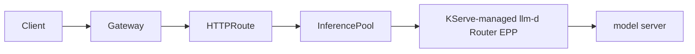

[KServe](https://kserve.github.io/website/) is a Kubernetes-native platform
for serving machine learning models. KServe can create an `InferencePool` and
run the llm-d Router Endpoint Picker (EPP) for an `LLMInferenceService`.
Agentgateway routes requests to that pool through the Gateway API Inference
Extension.

Use the standard `InferencePool` backend when you need inference-aware endpoint
selection. Add an  only when you
also need agentgateway LLM processing, such as token-based rate limiting,
guardrails, or LLM observability.



KServe also maintains an
[LLMInferenceService with agentgateway guide](https://kserve.github.io/website/docs/next/model-serving/generative-inference/llmisvc/llmisvc-agentgateway).
For production llm-d deployment patterns, see the
[llm-d gateway documentation](https://llm-d.ai/docs/infrastructure/gateway)
and [agentgateway integration](https://llm-d.ai/docs/infrastructure/gateway/agentgateway).

## Before you begin

This guide is tested with the following versions.

| Component | Version |
| --- | --- |
| Kubernetes Gateway API | v1.6.0 |
| Gateway API Inference Extension | v1.5.0 |
| agentgateway | v1.4.1 |
| KServe | v0.20.0-rc0 |

You need a Kubernetes cluster, Helm, and `kubectl`.

## Install the APIs and controllers

1. Install the Kubernetes Gateway API Custom Resource Definitions (CRDs).

   ```shell
   kubectl apply --server-side -f \
     https://github.com/kubernetes-sigs/gateway-api/releases/download/v1.6.0/standard-install.yaml
   ```

2. Install cert-manager, which KServe uses for webhook certificates.

   ```shell
   kubectl apply -f \
     https://github.com/cert-manager/cert-manager/releases/download/v1.20.2/cert-manager.yaml

   kubectl wait --for=condition=available deployment --all \
     --namespace cert-manager \
     --timeout=180s
   ```

3. Install KServe and configure its `LLMInferenceService` controller to use a
   shared agentgateway Gateway. The KServe chart also installs the transitional
   Inference Extension CRDs that its migration controller requires.

   ```shell
   kubectl create namespace kserve

   helm upgrade -i kserve-llmisvc-crd \
     oci://ghcr.io/kserve/charts/kserve-llmisvc-crd \
     --version v0.20.0-rc0 \
     --namespace kserve

   helm upgrade -i kserve-llmisvc-resources \
     oci://ghcr.io/kserve/charts/kserve-llmisvc-resources \
     --version v0.20.0-rc0 \
     --namespace kserve \
     --set kserve.controller.deploymentMode=Standard \
     --set kserve.controller.gateway.ingressGateway.enableGatewayApi=true \
     --set kserve.controller.gateway.ingressGateway.createGateway=false \
     --set kserve.controller.gateway.ingressGateway.kserveGateway=kserve/kserve-ingress-gateway \
     --set kserve.controller.gateway.ingressGateway.className=agentgateway \
     --set kserve.controller.gateway.disableIstioVirtualHost=true \
     --set kserve.controller.gateway.disableIngressCreation=false \
     --set kserve.controller.knativeAddressableResolver.enabled=false \
     --set kserve.controller.gateway.localGateway.gateway="" \
     --set kserve.controller.gateway.localGateway.gatewayService=""

   kubectl rollout status deployment/llmisvc-controller-manager \
     --namespace kserve \
     --timeout=240s

   helm upgrade -i kserve-runtime-configs \
     oci://ghcr.io/kserve/charts/kserve-runtime-configs \
     --version v0.20.0-rc0 \
     --namespace kserve \
     --set kserve.llmisvcConfigs.enabled=true
   ```

4. Apply the final GAIE v1.5.0 CRD bundle. Applying it after the KServe chart
   updates the stable API definitions while retaining the transitional CRDs
   that KServe needs during the migration.

   ```shell
   kubectl apply --server-side -f \
     https://github.com/kubernetes-sigs/gateway-api-inference-extension/releases/download/v1.5.0/manifests.yaml
   ```

5. Install agentgateway with Inference Extension support. Installing it after
   the GAIE CRDs ensures that the controller discovers `InferencePool`.

   ```shell
   helm upgrade -i agentgateway-crds \
     oci://cr.agentgateway.dev/charts/agentgateway-crds \
     --create-namespace \
     --namespace agentgateway-system \
     --version v1.4.1

   helm upgrade -i agentgateway \
     oci://cr.agentgateway.dev/charts/agentgateway \
     --namespace agentgateway-system \
     --version v1.4.1 \
     --set inferenceExtension.enabled=true
   ```

6. Create an agentgateway `Gateway`. KServe attaches generated `HTTPRoute`
   resources from model namespaces to this shared Gateway.

   ```yaml
   kubectl apply -f - <<EOF
   apiVersion: gateway.networking.k8s.io/v1
   kind: Gateway
   metadata:
     name: kserve-ingress-gateway
     namespace: kserve
   spec:
     gatewayClassName: agentgateway
     listeners:
       - name: http
         protocol: HTTP
         port: 80
         allowedRoutes:
           namespaces:
             from: All
     infrastructure:
       labels:
         serving.kserve.io/gateway: kserve-ingress-gateway
   EOF

   kubectl wait --for=condition=Programmed \
     gateway/kserve-ingress-gateway \
     --namespace kserve \
     --timeout=180s
   ```

   Do not install the [llm-d Router Helm chart](https://github.com/llm-d/llm-d-router/tree/main/config/charts)
   in this workflow. KServe owns the router deployment and uses the llm-d
   endpoint-picker image from its runtime configuration.

## Deploy a simulated LLM

1. Create a namespace for the model.

   ```shell
   kubectl create namespace kserve-test
   ```

2. Deploy an `LLMInferenceService` with its managed scheduler enabled. This
   example uses
   [llm-d-inference-sim](https://github.com/llm-d/llm-d-inference-sim)
   instead of downloading model weights or requiring GPUs.

   ```yaml
   kubectl apply -f - <<EOF
   apiVersion: serving.kserve.io/v1alpha2
   kind: LLMInferenceService
   metadata:
     name: mock-llm
     namespace: kserve-test
   spec:
     model:
       name: mock-llm
       uri: hf://mock/mock-llm
     replicas: 1
     storageInitializer:
       enabled: false
     router:
       route: {}
       scheduler: {}
     template:
       containers:
         - name: main
           image: ghcr.io/llm-d/llm-d-inference-sim:v0.9.0-rc3
           command:
             - /app/llm-d-inference-sim
           args:
             - --model
             - mock-llm
             - --port
             - "8000"
             - --mode
             - echo
           ports:
             - name: http
               containerPort: 8000
           resources:
             requests:
               cpu: 100m
               memory: 128Mi
             limits:
               cpu: 500m
               memory: 256Mi
   EOF
   ```

3. Wait for the service and generated routing resources.

   ```shell
   kubectl wait --for=condition=Ready \
     llminferenceservice/mock-llm \
     --namespace kserve-test \
     --timeout=300s

   kubectl get inferencepool mock-llm-inference-pool \
     --namespace kserve-test
   kubectl get httproute mock-llm-kserve-route \
     --namespace kserve-test
   ```

4. Confirm that the generated route uses the standard `InferencePool`
   backend and that KServe runs the migrated llm-d Router image.

   ```shell
   kubectl get httproute mock-llm-kserve-route \
     --namespace kserve-test \
     -o jsonpath='{.spec.rules[?(@.name=="v1-chat-completions-path")].backendRefs[0]}{"\n"}'

   kubectl get deployment mock-llm-kserve-router-scheduler \
     --namespace kserve-test \
     -o jsonpath='{.spec.template.spec.containers[?(@.name=="main")].image}{"\n"}'
   ```

   The backend is `mock-llm-inference-pool`. The EPP image repository is
   `ghcr.io/llm-d/llm-d-router-endpoint-picker`.

## Test the standard InferencePool backend

1. Port-forward the Gateway service.

   ```shell
   kubectl port-forward \
     --namespace kserve \
     service/kserve-ingress-gateway \
     8080:80
   ```

2. In another terminal, send a request through the path generated by KServe.

   ```shell
   curl -i http://localhost:8080/kserve-test/mock-llm/v1/chat/completions \
     -H "Content-Type: application/json" \
     -d '{
       "model": "mock-llm",
       "messages": [{"role": "user", "content": "Hello"}]
     }'
   ```

   The response has an HTTP `200 OK` status. No
   `AgentgatewayBackend` is required for this path.

## Optional: Apply an AI policy

Token-based rate limiting and other supported AI policies require agentgateway
to parse the LLM request or response. To apply these policies, create an
 that wraps the same `InferencePool`,
then override the KServe route to use that backend.

1. Create the backend.

   ```yaml
   kubectl apply -f - <<EOF
   apiVersion: 
   kind: 
   metadata:
     name: mock-llm-backend
     namespace: kserve-test
   spec:
     ai:
       provider:
         custom:
           backendRef:
             group: inference.networking.k8s.io
             kind: InferencePool
             name: mock-llm-inference-pool
           model: mock-llm
           formats:
             - type: Completions
               path: /v1/chat/completions
   EOF
   ```

2. Update the `LLMInferenceService` route. The managed scheduler remains
   enabled, so KServe continues to own the `InferencePool` and llm-d Router
   EPP.

   ```shell
   kubectl patch llminferenceservice mock-llm \
     --namespace kserve-test \
     --type merge \
     --patch '{
       "spec": {
         "router": {
           "route": {
             "http": {
               "spec": {
                 "parentRefs": [{
                   "group": "gateway.networking.k8s.io",
                   "kind": "Gateway",
                   "name": "kserve-ingress-gateway",
                   "namespace": "kserve"
                 }],
                 "rules": [{
                   "backendRefs": [{
                     "group": "agentgateway.dev",
                     "kind": "AgentgatewayBackend",
                     "name": "mock-llm-backend"
                   }],
                   "matches": [{
                     "path": {
                       "type": "PathPrefix",
                       "value": "/v1/chat/completions"
                     }
                   }],
                   "timeouts": {
                     "backendRequest": "0s",
                     "request": "0s"
                   }
                 }]
               }
             }
           },
           "scheduler": {}
         }
       }
     }'
   ```

3. Apply a token-based rate limit to the generated route.

   ```yaml
   kubectl apply -f - <<EOF
   apiVersion: 
   kind: 
   metadata:
     name: mock-llm-token-budget
     namespace: kserve-test
   spec:
     targetRefs:
       - group: gateway.networking.k8s.io
         kind: HTTPRoute
         name: mock-llm-kserve-route
     traffic:
       rateLimit:
         local:
           - tokens: 10
             unit: Minutes
   EOF
   ```

4. Send requests to the policy-enabled route.

   ```shell
   for i in $(seq 1 5); do
     curl -s -o /dev/null -w "%{http_code}\n" \
       http://localhost:8080/v1/chat/completions \
       -H "Content-Type: application/json" \
       -d '{
         "model": "mock-llm",
         "messages": [{"role": "user", "content": "Hello"}]
       }'
   done
   ```

   Successful requests return `200`. After the response token usage consumes
   the budget, agentgateway returns `429 Too Many Requests`.

## Cleanup

Remove the resources created in this guide.

```shell
kubectl delete namespace kserve-test
helm uninstall kserve-runtime-configs --namespace kserve
helm uninstall kserve-llmisvc-resources --namespace kserve
helm uninstall kserve-llmisvc-crd --namespace kserve
kubectl delete gateway kserve-ingress-gateway --namespace kserve
kubectl delete namespace kserve
helm uninstall agentgateway --namespace agentgateway-system
helm uninstall agentgateway-crds --namespace agentgateway-system
```
