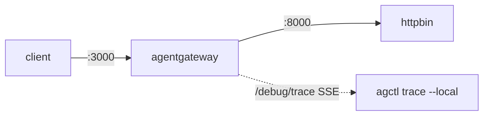

Capture a per-request trace as a standalone agentgateway instance handles the request, by using `agctl trace`.

## About

`agctl trace` taps the agentgateway admin endpoint at `/debug/trace` and streams a step-by-step record of how the proxy processes the next request that arrives. The trace shows you the matched route, the policies that were applied, the backend that was chosen, and the response status. Tracing helps you understand why a request matched or did not match a route, why a policy was or was not applied, or why a request returned an unexpected status.



You can run `agctl trace` in two modes:

* **Watch mode**: `agctl trace` waits for the next request that arrives at the proxy and traces it. Send the request from any client, such as `curl` in another terminal.
* **Inject mode**: `agctl trace --port <listener> -- <url>` enables tracing and sends the request itself. The host portion of the URL sets the `Host` header but is not used for DNS resolution.

## Before you begin

* [Install agctl]().
* Install the [agentgateway binary]() and have a `config.yaml` ready. The examples in this guide use the [non-agentic HTTP quickstart]() setup, with agentgateway listening on `:3000` and forwarding to httpbin on `:8000`.

If you do not already have a setup, the following minimal `config.yaml` works for the examples in this guide.

```yaml
# yaml-language-server: $schema=https://agentgateway.dev/schema/config
binds:
- port: 3000
  listeners:
  - protocol: HTTP
    routes:
    - name: httpbin
      backends:
      - host: 127.0.0.1:8000
```


mkdir -p "$HOME/.local/bin"
export PATH="$HOME/.local/bin:$PATH"
VERSION="v"
BINARY_URL="https://github.com/agentgateway/agentgateway/releases/download/${VERSION}/agentgateway-$(uname -s | tr '[:upper:]' '[:lower:]')-$(uname -m | sed 's/x86_64/amd64/')"
curl -sL "$BINARY_URL" -o "$HOME/.local/bin/agentgateway"
chmod +x "$HOME/.local/bin/agentgateway"

cat > /tmp/agctl-trace-config.yaml << 'EOF'
binds:
- port: 3000
  listeners:
  - protocol: HTTP
    routes:
    - name: httpbin
      backends:
      - host: 127.0.0.1:8000
EOF
agentgateway -f /tmp/agctl-trace-config.yaml --validate-only


## Steps

{}

### Step 1: Start agentgateway

In one terminal, run agentgateway with your config file.

```sh
agentgateway -f config.yaml
```

You should see a log line that confirms the admin server is listening on port `15000`.

```
info  app  serving UI at http://localhost:15000/ui
info  proxy::gateway  started bind  bind="bind/3000"
```

### Step 2: Trace a request from another client (watch mode)

In a second terminal, start a watch.

```sh
agctl trace --local --raw
```

In a third terminal, send a request to agentgateway.

```sh
curl http://127.0.0.1:3000/headers
```

The watch terminal prints a JSON Lines trace of the request, such as the following.

```json
{"eventStart":null,"eventEnd":5,"severity":"info","message":{"type":"requestStarted"}}
{"eventStart":null,"eventEnd":69,"severity":"info","message":{"type":"requestSnapshot","stage":"initial request","requestState":{"request":{"method":"GET","uri":"http://127.0.0.1:3000/headers","path":"/headers","host":"127.0.0.1:3000",...}}}}
{"eventStart":null,"eventEnd":100,"severity":"info","message":{"type":"routeSelection","selectedRoute":"default/default/bind/3000/listener0/default/httpbin","evaluatedRoutes":["default/default/bind/3000/listener0/default/httpbin"]}}
{"eventStart":null,"eventEnd":117,"severity":"info","message":{"type":"policySelection","effectivePolicy":{"localRateLimit":null,"authorization":null,...}}}
{"eventStart":null,"eventEnd":159,"severity":"info","message":{"type":"backendCallStart","target":"127.0.0.1:8000"}}
{"eventStart":157,"eventEnd":9730,"severity":"info","message":{"type":"backendCallResult","status":200,"error":null}}
{"eventStart":null,"eventEnd":9777,"severity":"info","message":{"type":"responseSnapshot","stage":"final response","requestState":{"response":{"code":200,...}}}}
{"eventStart":null,"eventEnd":9800,"severity":"info","message":{"type":"requestFinished"}}
```

The trace records the following stages for each request.

| Event type | Stage | What it tells you |
| -- | -- | -- |
| `requestStarted` | &mdash; | The proxy accepted a new request. |
| `requestSnapshot` | `initial request` | The request as it arrived, before any processing. |
| `requestSnapshot` | `gateway policies` | The request after gateway-level policies ran. |
| `routeSelection` | &mdash; | The route that matched the request, and the routes that were evaluated. |
| `policySelection` | &mdash; | The merged effective policy that applies to the matched route. |
| `requestSnapshot` | `route policies` | The request after route-level policies ran. |
| `requestSnapshot` | `final request` | The request as it is sent to the backend, including the resolved backend. |
| `backendCallStart` | &mdash; | The proxy began the upstream call. |
| `backendCallResult` | &mdash; | The upstream returned a status. The `error` field carries any transport error. |
| `responseSnapshot` | `backend response ready` | The response from the backend, before any response processing. |
| `responseSnapshot` | `final response` | The response as it is returned to the client. |
| `requestFinished` | &mdash; | The proxy completed the request. |

### Step 3: Trace a request that agctl sends (inject mode)

Run `agctl trace` with `--port` and a request URL after `--`. `agctl` enables tracing and sends the request itself, so you do not need a separate client.

```sh
agctl trace --local --raw --port 3000 -- http://example.com/headers
```

The host portion of the URL (`example.com`) sets the `Host` header on the request but is not used for DNS resolution. `agctl` always sends the request to `127.0.0.1:<port>`.

You can pass extra `curl` arguments after the URL, such as headers or a request body.

```sh
agctl trace --local --raw --port 3000 -- http://example.com/post \
  -X POST \
  -H "Content-Type: application/json" \
  -d '{"key":"value"}'
```

### Step 4: Open the interactive TUI

Omit `--raw` to render the trace in an interactive terminal UI that lets you step through each event and drill into the request and response state.

```sh
agctl trace --local --port 3000 -- http://example.com/headers
```

Press <kbd>q</kbd> to quit the TUI.

{}

## Troubleshooting

### `connection refused` from agctl trace --local

**What's happening**: `agctl trace --local` cannot reach the admin endpoint on `127.0.0.1:15000`.

**Why it's happening**: Agentgateway is not running, has not finished starting, or you have set a non-default `adminAddr`.

**How to fix it**: Confirm that agentgateway is running and that the admin server is listening.

```sh
curl -s http://127.0.0.1:15000/config_dump | head
```

If you have set a custom admin address in your config file, pass `--proxy-admin-port` to point `agctl` at the right port.

```sh
agctl trace --local --proxy-admin-port 16000
```

### The trace never fires

**What's happening**: `agctl trace` waits indefinitely and no events appear.

**Why it's happening**: No request has reached the proxy yet, or your client is sending requests to a different port than the proxy listener.

**How to fix it**: Confirm that requests are actually reaching agentgateway. The agentgateway logs print one `info request` line per accepted request. If you do not see those lines, the request is not making it to the proxy.

## What's next

* [Inspect agentgateway configuration with agctl]().
* [Debug your setup]().
