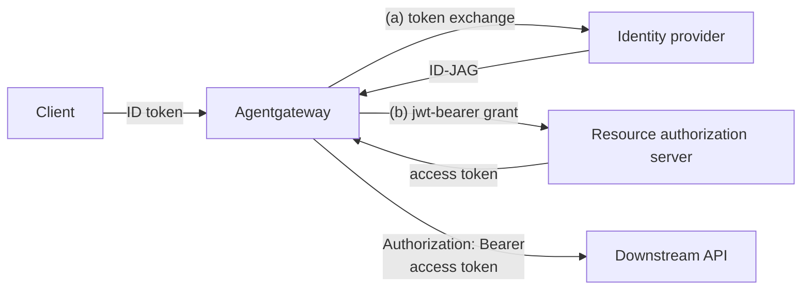

Set up Cross App Access (ID-JAG) with an .

## About

The `crossAppAccess` backend authentication method implements the [OAuth Identity Assertion Authorization Grant](https://datatracker.ietf.org/doc/draft-ietf-oauth-identity-assertion-authz-grant/), also called "ID-JAG" or "Cross App Access" (XAA). With this method, agentgateway calls a downstream API as the authenticated end user, without requiring the user to interactively log in to that downstream app. This pattern is common in agentic scenarios where an agent calls other apps' APIs on behalf of the user, such as per-user access to MCP servers ([MCP enterprise-managed authorization](https://modelcontextprotocol.io/extensions/auth/enterprise-managed-authorization)).

The gateway acts as a confidential OAuth client and performs a two-leg exchange on each backend call:

1. **Authenticate the user.** The inbound request carries the user's OIDC ID token, validated by a route-level [JWT authentication]() policy. The validated token is the subject of the exchange. The JWT policy must validate an OIDC ID token, not an arbitrary access token, because the identity provider expects an ID token as the subject.
2. **Exchange the token.** The gateway performs two sequential exchanges:
   1. **RFC 8693 token exchange.** The gateway calls the user's identity provider (IdP) authorization server with an [RFC 8693](https://datatracker.ietf.org/doc/html/rfc8693) token exchange and receives an ID-JAG assertion that is bound to the resource authorization server.
   2. **RFC 7523 JWT-bearer grant.** The gateway presents the ID-JAG to the resource's authorization server with an [RFC 7523](https://datatracker.ietf.org/doc/html/rfc7523) JWT-bearer grant and receives a Bearer access token that is scoped to the downstream API.
3. **Attach and cache.** The Bearer token is added as `Authorization: Bearer <token>` to the upstream request and cached until shortly before it expires.



Cross App Access differs from [OAuth token exchange]() in that it crosses a trust boundary: the IdP and the resource's authorization server are separate parties, so the gateway performs two exchanges and holds two client registrations, one at each token endpoint. For a single-leg exchange at one authorization server, use `oauthTokenExchange` instead.

> [!NOTE]
> To keep the demo self-contained, a single Keycloak instance acts as both parties: the user's IdP and the resource authorization server. In production, these parties are typically separate trust domains. For examples against separate providers, review the [traffic-cross-app-access examples](https://github.com/agentgateway/agentgateway/tree/main/examples/traffic-cross-app-access) in the upstream `agentgateway` repository. That example uses `xaa-dev` (hosted IdenX IdP + hosted resource authorization server) and `okta-auth0` (Okta IdP + Auth0 resource authorization server). These IdPs illustrate the two-party topology, but note that the configs are written for standalone mode, not Kubernetes.

## Before you begin



## Deploy Keycloak

Deploy a Keycloak authorization server into your cluster to act as both the user's identity provider and the resource authorization server. This walkthrough uses a single Keycloak that performs both legs of the exchange.

Issuing and consuming an ID-JAG requires the experimental `identity-assertion-jwt` Keycloak feature, which is not in a stock Keycloak release. The demo uses the `ceposta/keycloak:id-jag` image, which bakes in the feature.

1. Deploy Keycloak and its Service into the `httpbin` namespace. The `KC_HOSTNAME` variable pins the token issuer to the in-cluster DNS name, so that the ID token you mint through a port-forward and the gateway's in-cluster exchange calls agree on the issuer (`iss`). The ID-JAG's issuer must be stable, because the resource authorization server validates it against the same issuer.

   ```yaml {paths="cross-app-access"}
   kubectl apply -f- <<EOF
   apiVersion: apps/v1
   kind: Deployment
   metadata:
     name: keycloak
     namespace: httpbin
   spec:
     replicas: 1
     selector:
       matchLabels:
         app: keycloak
     template:
       metadata:
         labels:
           app: keycloak
       spec:
         containers:
         - name: keycloak
           image: ceposta/keycloak:id-jag
           args: ["start-dev", "--http-port=8080"]
           env:
           - name: KC_BOOTSTRAP_ADMIN_USERNAME
             value: admin
           - name: KC_BOOTSTRAP_ADMIN_PASSWORD
             value: admin
           - name: KC_HOSTNAME
             value: "http://keycloak.httpbin.svc.cluster.local:8080"
           - name: KC_HOSTNAME_STRICT
             value: "false"
           - name: KC_HOSTNAME_BACKCHANNEL_DYNAMIC
             value: "false"
           ports:
           - containerPort: 8080
           # Report ready only once Keycloak is actually serving, so that later
           # steps (realm configuration, JWKS fetch) do not race its startup.
           readinessProbe:
             httpGet:
               path: /realms/master
               port: 8080
             initialDelaySeconds: 15
             periodSeconds: 5
             failureThreshold: 60
   ---
   apiVersion: v1
   kind: Service
   metadata:
     name: keycloak
     namespace: httpbin
   spec:
     selector:
       app: keycloak
     ports:
     - name: http
       port: 8080
       targetPort: 8080
   EOF
   ```

2. Wait for Keycloak to be ready. The readiness probe reports the pod ready only after Keycloak serves requests, so this command returns when Keycloak is available to configure. Startup can take a few minutes.

   ```sh {paths="cross-app-access"}
   kubectl rollout status deployment/keycloak -n httpbin --timeout=300s
   ```

3. Configure the `idjag-demo` realm with a script from the agentgateway repository. Clone the repository and go to the example setup scripts.

   ```sh {paths="cross-app-access"}
   git clone https://github.com/agentgateway/agentgateway.git
   cd agentgateway/examples/traffic-cross-app-access/keycloak
   ```

4. Run the configuration script against the in-cluster Keycloak. The `KCADM` variable runs the Keycloak admin CLI inside the running pod, and `SERVER` points at the in-cluster hostname so that the realm's self-referential identity provider uses the same issuer as `KC_HOSTNAME`. The script creates the `idjag-demo` realm, the `alice`/`alice` user, an `agent-client` (the gateway's requesting client, which mints the ID-JAG through token exchange), and a `resource-client` (the resource authorization server client, which consumes the ID-JAG through the JWT-bearer grant).

   ```sh {paths="cross-app-access"}
   POD=$(kubectl get pod -n httpbin -l app=keycloak -o jsonpath='{.items[0].metadata.name}')
   KCADM="kubectl exec -i -n httpbin $POD -- /opt/keycloak/bin/kcadm.sh" \
   SERVER="http://keycloak.httpbin.svc.cluster.local:8080" \
   KC_AGENT_SECRET=agent-secret KC_RESOURCE_SECRET=resource-secret \
     ./configure-keycloak.sh
   ```

   Example output:

   ```
   Keycloak configured:
     realm         : idjag-demo
     user          : alice / alice
     agent-client  : agent-secret     (requesting app; mints ID-JAG via token exchange)
     resource-client: resource-secret (resource AS; consumes ID-JAG via jwt-bearer)
     IdP           : self-idjag       (self-referential JWT_AUTHORIZATION_GRANT)
   ```

## Configure Cross App Access

Configure agentgateway to validate the inbound ID token and perform the two-leg exchange.

1. Create an  for the token endpoint, pointing at the in-cluster Keycloak Service. Both legs of the exchange use the same Keycloak, so they share this .

   ```yaml {paths="cross-app-access"}
   kubectl apply -f- <<EOF
   apiVersion: 
   kind: 
   metadata:
     name: keycloak-token-endpoint
     namespace: httpbin
   spec:
     static:
       host: keycloak.httpbin.svc.cluster.local
       port: 8080
   EOF
   ```

2. Create Kubernetes Secrets with the two OAuth client secrets, one for each leg. These match the client secrets that the configuration script created.

   ```yaml {paths="cross-app-access"}
   kubectl apply -f- <<EOF
   apiVersion: v1
   kind: Secret
   metadata:
     name: agent-oauth-client
     namespace: httpbin
   type: Opaque
   stringData:
     clientSecret: agent-secret
   ---
   apiVersion: v1
   kind: Secret
   metadata:
     name: resource-oauth-client
     namespace: httpbin
   type: Opaque
   stringData:
     clientSecret: resource-secret
   EOF
   ```

3. Create a route-level  that validates the inbound OIDC ID token. The `audiences` value matches the `agent-client` that mints the user's ID token, and the validated token becomes the subject of the exchange.

   ```yaml {paths="cross-app-access"}
   kubectl apply -f- <<EOF
   apiVersion: 
   kind: 
   metadata:
     name: jwt-idtoken
     namespace: httpbin
   spec:
     targetRefs:
     - group: gateway.networking.k8s.io
       kind: HTTPRoute
       name: httpbin
     traffic:
       jwtAuthentication:
         mode: Strict
         providers:
         - issuer: "http://keycloak.httpbin.svc.cluster.local:8080/realms/idjag-demo"
           audiences:
           - agent-client
           jwks:
             remote:
               jwksPath: "/realms/idjag-demo/protocol/openid-connect/certs"
               cacheDuration: "5m"
               backendRef:
                 group: ""
                 kind: Service
                 name: keycloak
                 namespace: httpbin
                 port: 8080
   EOF
   ```

4. Create a backend-level  that attaches the `crossAppAccess` method to the `httpbin` Service. The `identityProvider` leg authenticates as `agent-client` to mint the ID-JAG, and the `resourceAuthorizationServer` leg authenticates as `resource-client` to exchange the ID-JAG for a backend access token. The `audience` must equal the resource identifier that `resource-client` is registered with.

   ```yaml {paths="cross-app-access"}
   kubectl apply -f- <<EOF
   apiVersion: 
   kind: 
   metadata:
     name: backend-cross-app-access
     namespace: httpbin
   spec:
     targetRefs:
     - group: ""
       kind: Service
       name: httpbin
     backend:
       auth:
         crossAppAccess:
           identityProvider:
             backendRef:
               group: 
               kind: 
               name: keycloak-token-endpoint
             path: /realms/idjag-demo/protocol/openid-connect/token
             clientAuth:
               clientId: agent-client
               method: ClientSecretBasic
               secretRef:
                 name: agent-oauth-client
           resourceAuthorizationServer:
             backendRef:
               group: 
               kind: 
               name: keycloak-token-endpoint
             path: /realms/idjag-demo/protocol/openid-connect/token
             clientAuth:
               clientId: resource-client
               method: ClientSecretBasic
               secretRef:
                 name: resource-oauth-client
           audience: https://resource.idjag.demo
           scopes:
           - todos.read
   EOF
   ```

    For more information, see the [API docs]().

   | Field | Description |
   | -- | -- |
   | `identityProvider` | The user's IdP authorization server token endpoint, referenced as an  through `backendRef`, with the token endpoint `path`. Agentgateway sends the validated ID token as the RFC 8693 `subject_token` on this leg. |
   | `resourceAuthorizationServer` | The resource authorization server token endpoint, in the same shape as `identityProvider`. This leg uses the RFC 7523 JWT-bearer grant, with the ID-JAG from the IdP leg sent as the assertion. This is a separate client registration from the IdP one. |
   | `clientAuth` | Client authentication for each token endpoint. `method` is `ClientSecretBasic` (default), `ClientSecretPost`, or `PrivateKeyJwt`. Use `secretRef` to read the client secret from a Kubernetes Secret. |
   | `audience` | Required identifier of the resource authorization server. The issued ID-JAG is bound to this value. |
   | `resources` | Optional protected resource or API identifiers ([RFC 8707](https://datatracker.ietf.org/doc/html/rfc8707)), sent on the token exchange leg. Configure these explicitly when the authorization server expects them. |
   | `scopes` | Optional scopes to request. The authorization server might grant a subset. |
   | `cache` | Optional token cache configuration. Defaults to an in-memory cache with 8192 entries. Set `cache.defaultTtl` as a fallback for when the token response omits `expires_in` (defaults to `300s`), and `cache.maxEntries: 0` to disable caching. The cache duration is capped by the subject token's JWT `exp` claim when present. |

## Verify the exchange

Mint `alice`'s ID token, send a request through agentgateway with it, and verify that the downstream API receives a different, backend-scoped access token.

1. Port-forward the Keycloak Service so that you can reach its token endpoint locally.

   ```sh
   kubectl port-forward -n httpbin svc/keycloak 8080:8080
   ```

2. In another terminal, mint `alice`'s OIDC ID token from Keycloak as `agent-client`. This token is the inbound credential and the subject of the exchange. Tokens expire, so re-mint if you come back later.

   ```sh
   export ID_TOKEN=$(curl -s -X POST "http://localhost:8080/realms/idjag-demo/protocol/openid-connect/token" \
     -d grant_type=password -d client_id=agent-client -d client_secret=agent-secret \
     -d username=alice -d password=alice -d scope=openid | jq -r .id_token)
   echo "${ID_TOKEN:0:40}..."
   ```

3. Send a request to the httpbin `/headers` endpoint through the gateway, with the ID token. The gateway validates the token, performs the two-leg exchange at Keycloak, and forwards the request to httpbin with the resulting access token. Because httpbin reflects the request headers, the command decodes the token that the backend received.

   ```sh
   curl -s "http://$INGRESS_GW_ADDRESS:80/headers" -H "host: www.example.com" \
     -H "Authorization: Bearer $ID_TOKEN" | python3 -c '
   import sys,json,base64
   h=json.load(sys.stdin)["headers"]
   tok=(h.get("Authorization") or h.get("authorization"))
   tok=(tok[0] if isinstance(tok,list) else tok).split()[1]
   p=json.loads(base64.urlsafe_b64decode(tok.split(".")[1]+"=="))
   print("backend received a", p["typ"], "token for", p["preferred_username"],
         "| azp:", p["azp"], "| scope:", p["scope"])'
   ```

   In the example output, the backend received a Bearer access token for `alice` that is authorized for the `resource-client` party (`azp`) with the `todos.read` scope. The inbound ID token was stripped and never reached the backend.

   ```
   backend received a Bearer token for alice | azp: resource-client | scope: email todos.read profile
   ```

4. Confirm that the gateway rejects requests without a valid ID token before any exchange happens.

   ```sh
   curl -s -o /dev/null -w "no token   -> %{http_code}\n" "http://$INGRESS_GW_ADDRESS:80/headers" -H "host: www.example.com"
   curl -s -o /dev/null -w "bad token  -> %{http_code}\n" "http://$INGRESS_GW_ADDRESS:80/headers" -H "host: www.example.com" -H "Authorization: Bearer not.a.jwt"
   ```

   Example output:

   ```
   no token   -> 401
   bad token  -> 401
   ```


# WHAT THIS TEST VALIDATES:
#   * Keycloak (ceposta/keycloak:id-jag) deploys and the idjag-demo realm configures via the example script.
#   * The AgentgatewayBackend, both client-secret Secrets, the route-level jwtAuthentication policy,
#     and the backend-level crossAppAccess policy all apply cleanly against the nightly CRD.
#   * End to end: a valid inbound OIDC ID token is exchanged, and the httpbin backend receives a
#     different, backend-scoped Bearer token whose authorized party (azp) is resource-client.
#   * jwtAuthentication rejects requests with no token and with an invalid token (HTTP 401).
# WHAT THIS TEST DOES NOT VALIDATE (and why):
#   * The forwarded local mint path in the visible steps -- local forwarding is unsupported in
#     automated tests, so the hidden test mints alice's token through the gateway instead (a Keycloak
#     HTTPRoute created below). The pinned KC_HOSTNAME keeps the issuer identical either way.
#   * The PrivateKeyJwt example -- display-only snippet, needs an external IdP that requires it.

# Expose the Keycloak token endpoint through the gateway so the token can be minted without a
# port-forward. The issuer stays the pinned in-cluster hostname, so jwtAuthentication still matches.
kubectl apply -f- <<EOF
apiVersion: gateway.networking.k8s.io/v1
kind: HTTPRoute
metadata:
  name: keycloak
  namespace: httpbin
spec:
  parentRefs:
  - name: agentgateway-proxy
    namespace: agentgateway-system
  hostnames:
  - "keycloak.local"
  rules:
  - backendRefs:
    - name: keycloak
      port: 8080
EOF



# Warm up the new keycloak.local virtual host (any HTTP response signals the data plane is ready).
for i in $(seq 1 60); do
  curl -s --max-time 5 -o /dev/null "http://${INGRESS_GW_ADDRESS}:80/realms/idjag-demo/protocol/openid-connect/token" -H "host: keycloak.local" && break
  sleep 2
done



# Mint alice's OIDC ID token through the gateway, exchange it, and assert the backend received a
# token whose azp is resource-client. Non-zero exit fails the test.
ID_TOKEN=$(curl -s --max-time 15 -X POST "http://${INGRESS_GW_ADDRESS}:80/realms/idjag-demo/protocol/openid-connect/token" \
  -H "host: keycloak.local" \
  -d grant_type=password -d client_id=agent-client -d client_secret=agent-secret \
  -d username=alice -d password=alice -d scope=openid | jq -r .id_token)
test -n "$ID_TOKEN" -a "$ID_TOKEN" != "null" || { echo "FAILED: could not mint alice's ID token"; exit 1; }

AZP=$(curl -s --max-time 15 "http://${INGRESS_GW_ADDRESS}:80/headers" -H "host: www.example.com" \
  -H "Authorization: Bearer $ID_TOKEN" | python3 -c '
import sys,json,base64
h=json.load(sys.stdin)["headers"]
tok=(h.get("Authorization") or h.get("authorization"))
tok=(tok[0] if isinstance(tok,list) else tok).split()[1]
print(json.loads(base64.urlsafe_b64decode(tok.split(".")[1]+"=="))["azp"])')
echo "backend token azp: $AZP"
[ "$AZP" = "resource-client" ] || { echo "FAILED: expected azp=resource-client, got '$AZP'"; exit 1; }

NO_TOKEN=$(curl -s -o /dev/null -w '%{http_code}' "http://${INGRESS_GW_ADDRESS}:80/headers" -H "host: www.example.com")
[ "$NO_TOKEN" = "401" ] || { echo "FAILED: expected 401 with no token, got $NO_TOKEN"; exit 1; }
BAD_TOKEN=$(curl -s -o /dev/null -w '%{http_code}' "http://${INGRESS_GW_ADDRESS}:80/headers" -H "host: www.example.com" -H "Authorization: Bearer not.a.jwt")
[ "$BAD_TOKEN" = "401" ] || { echo "FAILED: expected 401 with bad token, got $BAD_TOKEN"; exit 1; }
echo "cross-app-access exchange verified"


## Private key JWT client authentication

Enterprise IdPs such as Okta commonly require the `PrivateKeyJwt` client authentication method, in which the gateway authenticates with a signed JWT assertion instead of a client secret. Store the PEM-encoded signing key in a Kubernetes Secret and reference it with `signingKeyRef`. Because token endpoints are configured as backend references rather than raw URLs, `PrivateKeyJwt` requires an explicit `assertionAudience`.

```yaml
clientAuth:
  clientId: gateway-at-chat
  method: PrivateKeyJwt
  privateKeyJwt:
    signingKeyRef:
      name: gateway-signing-key
    alg: RS256  # one of RS256/RS384/RS512/ES256/ES384
    kid: my-signing-key  # optional `kid` header
    assertionAudience: https://chat.example.com/oauth2/token
```

## Limitations

The following parts of the Identity Assertion Authorization Grant draft are not yet supported:

- DPoP sender-constrained tokens (RFC 9449).
- `.well-known` endpoint discovery (RFC 8414, endpoints must be configured explicitly).
- SAML or refresh-token subject types (only OIDC ID tokens are used as the subject).

## Cleanup



```sh {paths="cross-app-access"}
kubectl delete  backend-cross-app-access jwt-idtoken -n httpbin
kubectl delete  keycloak-token-endpoint -n httpbin
kubectl delete secret agent-oauth-client resource-oauth-client -n httpbin
kubectl delete deployment keycloak -n httpbin
kubectl delete service keycloak -n httpbin
```

## Next steps

- Exchange the incoming credential for a per-backend token at a single authorization server with [OAuth token exchange]().
- Validate incoming JWTs with the [JWT authentication]() policy.
