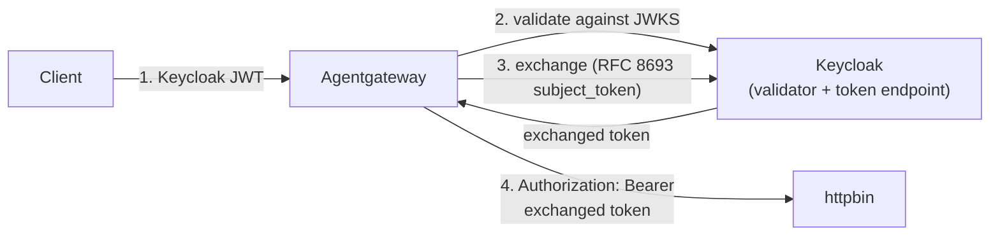

Exchange the incoming token for a backend-scoped token with the [RFC 8693](https://datatracker.ietf.org/doc/html/rfc8693) token exchange grant, configured on an .

## About

The `TokenExchange` grant is the default grant of the `oauthTokenExchange` backend authentication method. The gateway sends the incoming token to the authorization server as the `subject_token` and forwards the exchanged token to the backend.

In this guide, one Keycloak instance plays both roles: the authorization server that mints the exchanged token, and, after you add [edge validation](#edge-validation), the issuer that the gateway validates the incoming token against.



For the JWT bearer grant, which sends the incoming token as an `assertion` instead, see [JWT bearer grant](). For an exchange that crosses a trust boundary between two authorization servers, see [Cross App Access]().

## Before you begin



## Deploy Keycloak



## Configure token exchange

Configure agentgateway to exchange tokens.

1. Create an  for the token endpoint, pointing at the in-cluster Keycloak Service.

   ```yaml {paths="te-standard"}
   kubectl apply -f- <<EOF
   apiVersion: 
   kind: 
   metadata:
     name: keycloak-token-endpoint
     namespace: httpbin
   spec:
     static:
       host: keycloak.httpbin.svc.cluster.local
       port: 8080
   EOF
   ```

2. Create a Kubernetes Secret with the gateway client's secret. This matches the `requester-client` secret from the imported realm.

   ```yaml {paths="te-standard"}
   kubectl apply -f- <<EOF
   apiVersion: v1
   kind: Secret
   metadata:
     name: oauth-client
     namespace: httpbin
   type: Opaque
   stringData:
     clientSecret: requester-secret
   EOF
   ```


3. Create an  that attaches the `oauthTokenExchange` method to the `httpbin` Service. The `backendRef` field references the , `path` sets the token endpoint path, and `grantType` selects the RFC 8693 exchange.

   ```yaml {paths="te-standard"}
   kubectl apply -f- <<EOF
   apiVersion: 
   kind: 
   metadata:
     name: backend-token-exchange
     namespace: httpbin
   spec:
     targetRefs:
     - group: ""
       kind: Service
       name: httpbin
     backend:
       auth:
         oauthTokenExchange:
           backendRef:
             group: 
             kind: 
             name: keycloak-token-endpoint
           path: /realms/backend-oauth/protocol/openid-connect/token
           grantType: TokenExchange
           audiences:
           - target-client
           clientAuth:
             clientId: requester-client
             method: ClientSecretBasic
             secretRef:
               name: oauth-client
   EOF
   ```

   

4. Confirm that the policy is accepted and attached.

   ```sh {paths="te-standard"}
   kubectl -n httpbin get  backend-token-exchange -o jsonpath='{.status.ancestors[0].conditions[*].type}={.status.ancestors[0].conditions[*].status}{"\n"}'
   ```

   Example output:

   ```
   Accepted Attached=True True
   ```

## Verify the exchange

Mint the incoming token, send a request through agentgateway with it, and verify that the token the gateway forwards is a different one: it is issued for the `target-client` audience with `requester-client` as the authorized party (`azp`), not the client that minted the incoming token.

1. Port-forward the Keycloak Service so that you can reach its token endpoint locally.

   ```sh
   kubectl port-forward -n httpbin svc/keycloak 8080:8080
   ```

2. In another terminal, mint the incoming token. Mint a user token from the `backend-oauth` realm as `initial-client`; the gateway sends this as the `subject_token`. Tokens expire, so re-mint if you come back later.

   ```sh
   export INBOUND_TOKEN="$(curl -s http://localhost:8080/realms/backend-oauth/protocol/openid-connect/token \
     -u initial-client:initial-secret -d grant_type=password \
     -d username=testuser -d password=testpass | jq -r .access_token)"
   echo $INBOUND_TOKEN
   ```

3. Send a request to the httpbin `/headers` endpoint through the gateway, with the incoming token. The gateway exchanges the token at Keycloak and forwards the request to httpbin with the *exchanged* token. Because httpbin reflects the request headers, you can see the token that the gateway forwarded.

   ```sh
   curl -s http://$INGRESS_GW_ADDRESS:80/headers \
     -H "host: www.example.com" \
     -H "authorization: Bearer $INBOUND_TOKEN"
   ```

   In the response, note that the `Authorization` header reflected by httpbin contains a *different* token than the one you sent.

4. Copy the exchanged token from the `Authorization` header in the response, and save it to an environment variable.

   ```sh
   export FORWARDED_TOKEN=eyJhbGciOiJSUzI1NiIsInR5cCIgOiAiSldUI...
   ```

5. Decode the token's payload to confirm the exchange.

   ```sh
   echo "$FORWARDED_TOKEN" | cut -d. -f2 | jq -R 'gsub("-";"+") | gsub("_";"/") | . + ("=" * ((4 - (length % 4)) % 4)) | @base64d | fromjson'
   ```

   The decoded token was issued for the target audience (`aud`), and its authorized party (`azp`) is the gateway's client (`requester-client`), not the client that minted the incoming token. The JWT bearer grant produces the same exchanged token from a different incoming token.

   ```json
   {
     "iss": "http://keycloak.httpbin.svc.cluster.local:8080/realms/backend-oauth",
     "aud": "target-client",
     "azp": "requester-client",
     "sub": "4f5b414b-1f66-4251-ae2c-fc7f488ab141"
   }
   ```


# WHAT THIS TEST VALIDATES:
#   * Keycloak deploys with both realms imported, and the AgentgatewayBackend, client Secret, and
#     oauthTokenExchange policy all apply cleanly.
#   * End to end: a token minted as initial-client is exchanged, and httpbin receives a *different*
#     token whose audience is target-client and whose authorized party (azp) is requester-client.
#   * Edge validation: with the jwt-edge policy attached, an invalid token and a missing token are
#     both rejected with a 401 before the gateway calls the token endpoint.
#   * The preserveToken trap: the same edge policy *without* preserveToken makes every valid request
#     fail with a 400, which is why the guide marks that field IMPORTANT.
# WHAT THIS TEST DOES NOT VALIDATE (and why):
#   * The port-forward in the visible steps -- local forwarding is unsupported in automated tests, so
#     the hidden test mints through the gateway instead. KC_HOSTNAME pins the issuer either way.
#   * Token types, requestedTokenType, and the non-compliant-provider warnings -- those sections are
#     reference tables, not a walkthrough; the invalid values are rejected at apply time by the CRD.

# Expose the Keycloak token endpoint through the gateway so tokens can be minted without a
# port-forward. The issuer stays the pinned in-cluster hostname, so jwtAuthentication still matches.
kubectl apply -f- <<EOF
apiVersion: gateway.networking.k8s.io/v1
kind: HTTPRoute
metadata:
  name: keycloak
  namespace: httpbin
spec:
  parentRefs:
  - name: agentgateway-proxy
    namespace: 
  hostnames:
  - "keycloak.local"
  rules:
  - backendRefs:
    - name: keycloak
      port: 8080
EOF



YAMLTest -f - <<'EOF'
- name: wait for the token exchange policy to be accepted
  wait:
    target:
      kind: AgentgatewayPolicy
      metadata:
        namespace: httpbin
        name: backend-token-exchange
    jsonPath: "$.status.ancestors[0].conditions[?(@.type=='Accepted')].status"
    jsonPathExpectation:
      comparator: equals
      value: "True"
    polling:
      timeoutSeconds: 120
      intervalSeconds: 5
EOF



# Mint the incoming token as initial-client. Keycloak readiness and data plane programming both lag
# the rollout, and an unready upstream answers 503, so retry until a real token comes back rather
# than treating any HTTP response as readiness.
mint_incoming_token() {
  local out=""
  for i in $(seq 1 60); do
    out=$(curl -s --max-time 10 "http://${INGRESS_GW_ADDRESS}:80/realms/backend-oauth/protocol/openid-connect/token" -H "host: keycloak.local" -u initial-client:initial-secret -d grant_type=password -d username=testuser -d password=testpass | jq -r '.access_token // empty' 2>/dev/null || true)
    [ -n "$out" ] && { printf '%s' "$out"; return 0; }
    sleep 2
  done
  return 1
}

INBOUND_TOKEN=$(mint_incoming_token) || { echo "FAILED: could not mint the incoming token"; exit 1; }
test -n "$INBOUND_TOKEN" || { echo "FAILED: could not mint the incoming token"; exit 1; }

# The exchange can lag policy acceptance, so poll until the backend reports azp=requester-client.
AZP=""
RESP=""
for i in $(seq 1 30); do
  RESP=$(curl -s --max-time 15 "http://${INGRESS_GW_ADDRESS}:80/headers" -H "host: www.example.com"     -H "authorization: Bearer $INBOUND_TOKEN")
  AZP=$(printf '%s' "$RESP" | python3 -c '
import sys,json,base64
try:
    h=json.load(sys.stdin)["headers"]
    tok=h.get("Authorization") or h.get("authorization")
    tok=(tok[0] if isinstance(tok,list) else tok).split()[1]
    print(json.loads(base64.urlsafe_b64decode(tok.split(".")[1]+"=="))["azp"])
except Exception:
    pass')
  [ "$AZP" = "requester-client" ] && break
  sleep 2
done
if [ "$AZP" != "requester-client" ]; then
  echo "FAILED: expected the forwarded token azp=requester-client, got '$AZP'"
  echo "last response body (first 500 chars): $(printf '%s' "$RESP" | head -c 500)"
  exit 1
fi

# The forwarded token must also be scoped to the target audience, not the inbound one.
AUD=$(printf '%s' "$RESP" | python3 -c '
import sys,json,base64
try:
    h=json.load(sys.stdin)["headers"]
    tok=h.get("Authorization") or h.get("authorization")
    tok=(tok[0] if isinstance(tok,list) else tok).split()[1]
    seg=tok.split(".")[1]
    print(json.loads(base64.urlsafe_b64decode(seg+"="*(-len(seg)%4)))["aud"])
except Exception:
    pass')
[ "$AUD" = "target-client" ] || { echo "FAILED: expected aud=target-client, got '$AUD'"; exit 1; }
echo "standard token exchange verified (aud=$AUD azp=$AZP)"


## Validate the incoming token at the edge {#edge-validation}

The exchange presents the incoming token to the authorization server exactly as it arrived, and does not verify the signature first. Add a route-level `jwtAuthentication` policy so that an invalid or expired token is rejected at the gateway before any call to the token endpoint. The preceding steps leave it out so that the exchange is easy to follow on its own; add it before you use token exchange in production.

1. Create a second  that validates the incoming token against Keycloak's JWKS. This policy targets the `HTTPRoute`, not the Service, because validation belongs at the route.

   > [!IMPORTANT]
   > Set `preserveToken: true`. By default the gateway removes the JWT after it validates it, so the exchange finds no `subject_token` and every request fails with a `400` and the message `invalid request`. For more information, see [`preserveToken`]().

   ```yaml {paths="te-standard"}
   kubectl apply -f- <<EOF
   apiVersion: 
   kind: 
   metadata:
     name: jwt-edge
     namespace: httpbin
   spec:
     targetRefs:
     - group: gateway.networking.k8s.io
       kind: HTTPRoute
       name: httpbin
     traffic:
       jwtAuthentication:
         preserveToken: true
         providers:
         - issuer: "http://keycloak.httpbin.svc.cluster.local:8080/realms/backend-oauth"
           jwks:
             remote:
               jwksPath: /realms/backend-oauth/protocol/openid-connect/certs
               backendRef:
                 group: ""
                 kind: Service
                 name: keycloak
                 port: 8080
   EOF
   ```

2. Send the same request again with the valid token from the previous section. The exchange still runs, and httpbin still reflects the exchanged token.

   ```sh
   curl -s http://$INGRESS_GW_ADDRESS:80/headers \
     -H "host: www.example.com" \
     -H "authorization: Bearer $INBOUND_TOKEN"
   ```

3. Send a request with a token that does not validate. The gateway rejects it with a `401`, and never calls the token endpoint.

   ```sh
   curl -s http://$INGRESS_GW_ADDRESS:80/headers \
     -H "host: www.example.com" \
     -H "authorization: Bearer not-a-valid-token"
   ```

   Example output:

   ```
   authentication failure: the token header is malformed: Error(InvalidToken)
   ```

4. Send a request with no token at all. The gateway rejects this case too.

   ```sh
   curl -s http://$INGRESS_GW_ADDRESS:80/headers -H "host: www.example.com"
   ```

   Example output:

   ```
   authentication failure: no bearer token found
   ```


YAMLTest -f - <<'EOF'
- name: wait for the edge jwt policy to be accepted
  wait:
    target:
      kind: AgentgatewayPolicy
      metadata:
        namespace: httpbin
        name: jwt-edge
    jsonPath: "$.status.ancestors[0].conditions[?(@.type=='Accepted')].status"
    jsonPathExpectation:
      comparator: equals
      value: "True"
    polling:
      timeoutSeconds: 120
      intervalSeconds: 5
EOF



# Re-mint, because the edge policy now rejects anything that does not validate.
INBOUND_TOKEN=$(mint_incoming_token) || { echo "FAILED: could not re-mint the incoming token"; exit 1; }
test -n "$INBOUND_TOKEN" || { echo "FAILED: could not re-mint the incoming token"; exit 1; }

# With preserveToken: true the exchange still runs behind edge validation.
OK=""
for i in $(seq 1 30); do
  OK=$(curl -s -o /dev/null -w '%{http_code}' --max-time 15 "http://${INGRESS_GW_ADDRESS}:80/headers"     -H "host: www.example.com" -H "authorization: Bearer $INBOUND_TOKEN")
  [ "$OK" = "200" ] && break
  sleep 2
done
[ "$OK" = "200" ] || { echo "FAILED: expected 200 with a valid token and preserveToken, got $OK"; exit 1; }

BAD=$(curl -s -o /dev/null -w '%{http_code}' --max-time 15 "http://${INGRESS_GW_ADDRESS}:80/headers"   -H "host: www.example.com" -H "authorization: Bearer not-a-valid-token")
[ "$BAD" = "401" ] || { echo "FAILED: expected 401 with an invalid token, got $BAD"; exit 1; }

NONE=$(curl -s -o /dev/null -w '%{http_code}' --max-time 15 "http://${INGRESS_GW_ADDRESS}:80/headers"   -H "host: www.example.com")
[ "$NONE" = "401" ] || { echo "FAILED: expected 401 with no token, got $NONE"; exit 1; }
echo "edge validation verified (valid=$OK invalid=$BAD none=$NONE)"



# Prove the preserveToken trap the guide calls out: drop the field and the exchange loses its
# subject_token, so a valid request fails with a 400. Then restore it for the rest of the guide.
kubectl apply -f- <<EOF
apiVersion: 
kind: 
metadata:
  name: jwt-edge
  namespace: httpbin
spec:
  targetRefs:
  - group: gateway.networking.k8s.io
    kind: HTTPRoute
    name: httpbin
  traffic:
    jwtAuthentication:
      providers:
      - issuer: "http://keycloak.httpbin.svc.cluster.local:8080/realms/backend-oauth"
        jwks:
          remote:
            jwksPath: /realms/backend-oauth/protocol/openid-connect/certs
            backendRef:
              group: ""
              kind: Service
              name: keycloak
              port: 8080
EOF

TRAP=""
for i in $(seq 1 30); do
  TRAP=$(curl -s -o /dev/null -w '%{http_code}' --max-time 15 "http://${INGRESS_GW_ADDRESS}:80/headers"     -H "host: www.example.com" -H "authorization: Bearer $INBOUND_TOKEN")
  [ "$TRAP" = "400" ] && break
  sleep 2
done
[ "$TRAP" = "400" ] || { echo "FAILED: expected 400 without preserveToken, got $TRAP"; exit 1; }
echo "preserveToken trap verified (got $TRAP without the field)"


## Token types {#token-types}

The `subjectToken.tokenType` and `actorToken.tokenType` fields accept a built-in name (`AccessToken`, `Jwt`, or `IdToken`), or any absolute URI without a fragment for an authorization server that defines its own token exchange profile. The gateway expands a built-in name to its `urn:ietf:params:oauth:token-type:*` form, and passes a custom URI through unchanged.

For example, set `subjectToken.tokenType` to the type that your authorization server expects.

```yaml
subjectToken:
  source:
    header:
      name: authorization
      prefix: "Bearer "
  tokenType: "urn:company:domain:human"
```

The gateway sends that value verbatim as the `subject_token_type` form parameter. An `actorToken.tokenType` value travels the same way, as `actor_token_type`.

An invalid value is rejected after you apply the policy, not by the API server. The policy reports `Accepted: True` with the reason `PartiallyValid` and the following message, and the data plane refuses it, so every request on the route fails with a `400` and the message `invalid request`.

```
oauth subjectToken tokenType "not a uri" must be a built-in token type or an absolute URI without a fragment
```

### Request a token type {#requested-token-type}

Unlike the subject and actor token types, `requestedTokenType` is a closed set. Only `AccessToken`, `Jwt`, and `IdToken` can be requested, and the API server rejects the policy otherwise.

| Value | Result |
| -- | -- |
| A custom URI | `Unsupported value: "urn:company:domain:human": supported values: "AccessToken", "Jwt", "IdToken", "IdJag"` |
| `IdJag` | `requestedTokenType IdJag is only supported by crossAppAccess`. The value appears in the list because the type list is shared with [Cross App Access](). |
| Any value, with the `JwtBearer` grant type | `requestedTokenType is only valid with TokenExchange grantType` |

When you set `requestedTokenType`, the gateway sends `requested_token_type` on the token request, then compares the `issued_token_type` of the response against it. A mismatch fails the exchange with a `500`, and the request never reaches the backend.

```
backend authentication failed: token exchange returned issued_token_type urn:ietf:params:oauth:token-type:jwt, expected urn:ietf:params:oauth:token-type:access_token
```

> [!NOTE]
> When you omit `requestedTokenType`, the gateway sends no `requested_token_type` parameter, and it does not check `issued_token_type` at all. The authorization server chooses the type, and the gateway accepts whatever the response returns. Set the field when the type of the issued token matters to the backend.

### Support for non-compliant providers {#oauth-warnings}

The gateway accepts the following three settings for compatibility with providers that do not accept the standards-compliant forms. Each one logs a warning in the proxy and still forwards traffic. A future release might reject them, so prefer [RFC 8707](https://datatracker.ietf.org/doc/html/rfc8707) resource URIs, valid scope tokens, and header or cookie placement where your provider allows it.

| Setting | Warning in the proxy log |
| -- | -- |
| A `resources` entry that is not an absolute URI without a fragment | `oauth token exchange resource is not an absolute URI without a fragment` |
| A `scopes` entry with characters outside the [RFC 6749](https://datatracker.ietf.org/doc/html/rfc6749) scope-token grammar, such as a space, a quotation mark, a backslash, a control character, or a non-ASCII character | `oauth token exchange scopes contains an invalid OAuth scope-token` |
| `location.queryParameter`, which carries the exchanged token in a URI query parameter | `oauth token exchange is configured to forward the exchanged bearer token in a URI query parameter` |


<!--

## Troubleshooting

### subject_token validation failure

**What's happening:**

The token endpoint returns an `invalid_token` or `invalid_request` error, and the gateway responds with `HTTP 400`. The authorization server logs a `subject_token validation failure`.

**Why it's happening:**

The authorization server cannot validate the incoming token, often because the token's issuer (`iss`) does not match the issuer that the authorization server expects when the gateway reaches it. With Keycloak, this happens when the token is minted through one hostname (for example, a port-forward) but the gateway calls the token endpoint through a different in-cluster hostname.

**How to fix it:**

Make sure the incoming token's issuer matches the token endpoint's issuer as the gateway reaches it. For Keycloak in a cluster, pin the issuer with the `KC_HOSTNAME` environment variable so it is stable regardless of how Keycloak is reached.

-->

## Next steps

This guide uses a demo Keycloak and the httpbin sample app. To use token exchange in production:

* **Point at your own authorization server.** Create an  for your IdP (such as Keycloak, Microsoft Entra, Okta, Auth0, or ZITADEL). Use port `443` for automatic backend TLS. Replace the demo realm, client IDs, audiences, and Kubernetes Secret with your own.
* **Attach the policy to the backends that need scoped tokens.** Target the  at the Services or s that require their own credential, such as MCP servers, upstream APIs, or LLM providers. Pair it with route-level [JWT authentication]() to validate the incoming token first.
* **Use token exchange to preserve agent and user identity.** Token exchange lets the gateway hand each backend a narrowly scoped, per-backend token while preserving the caller's identity end-to-end. In agentic flows, the exchange can carry an agent acting on behalf of a user, so every downstream call keeps an auditable, least-privilege identity chain instead of sharing one broad credential.

## Cleanup

```sh {paths="te-standard"}
kubectl delete  backend-token-exchange jwt-edge -n httpbin
kubectl delete  keycloak-token-endpoint -n httpbin
kubectl delete secret oauth-client -n httpbin
kubectl delete deployment keycloak -n httpbin
kubectl delete service keycloak -n httpbin
kubectl delete configmap backend-oauth-realm -n httpbin
```


kubectl delete httproute keycloak -n httpbin --ignore-not-found

