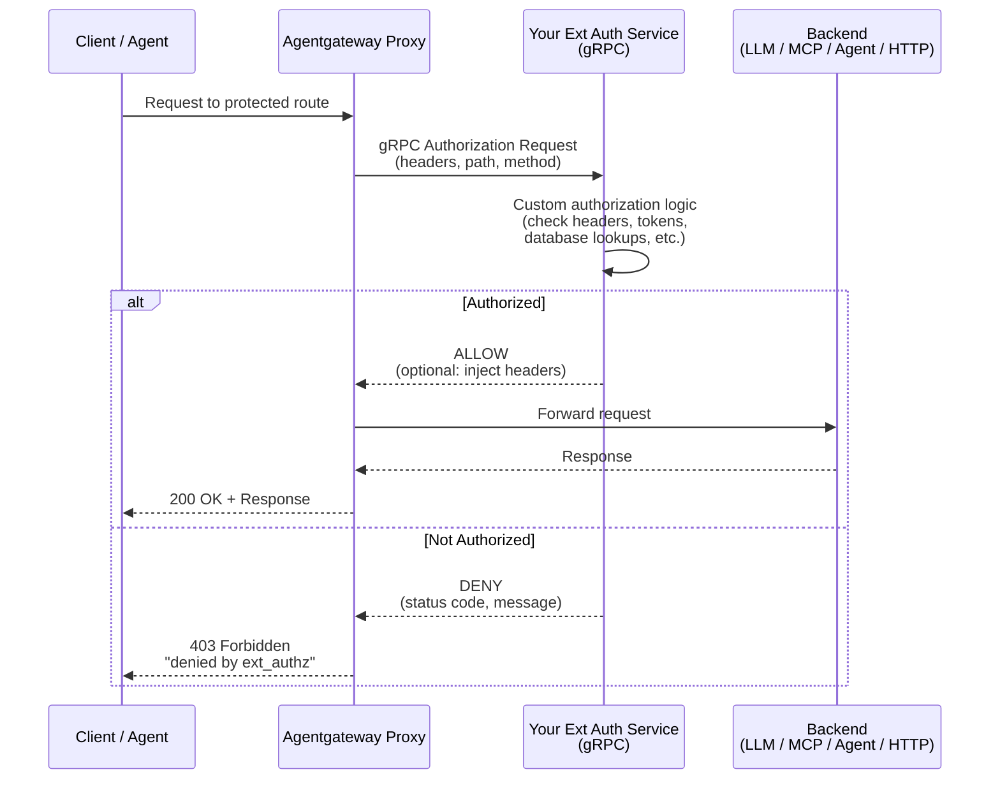

Bring your own external authorization service to protect requests that go through your Gateway.

## About external auth {#about}

 lets you integrate your own external authorization service to your Gateway. Then, this external authorization service makes authorization decisions for requests that go through the Gateway, as shown in the following diagram.

Review the following diagram to understand the flow of a request: 



## Before you begin 




Note that this guide assumes that you want to apply the policy to the OpenAI LLM provider. You can use other LLM providers or apply external auth to an MCP server, agents, and Kubernetes services. Make sure to adjust these steps to apply to your  type or Kubernetes service.


## Deploy your own external authorization service {#byo-ext-auth}

Deploy your own external authorization service as a backend service that is accessible to your agentgateway proxy.


Keep in mind that your external authorization service must conform to the [Envoy external auth proto](https://github.com/envoyproxy/envoy/blob/main/api/envoy/service/auth/v3/external_auth.proto). The external authorization service also configures the conditions for authorizing a request, such as the inclusion of a certain header or other credentials.


1. Deploy your external authorization service. The following example uses the [Istio external authorization service](https://github.com/istio/istio/tree/master/samples/extauthz) for quick testing purposes. This service is configured to allow requests with the `x-ext-authz: allow` header.

   ```yaml
   kubectl apply -f - <<EOF
   apiVersion: apps/v1
   kind: Deployment
   metadata:
     namespace: 
     name: ext-authz
     labels:
       app: ext-authz
   spec:
     replicas: 1
     selector:
       matchLabels:
         app: ext-authz
     template:
       metadata:
         labels:
           app: ext-authz
           app.kubernetes.io/name: ext-authz
       spec:
         containers:
         - image: gcr.io/istio-testing/ext-authz:1.25-dev
           name: ext-authz
           ports:
           - containerPort: 9000
   EOF
   ```

2. Create a Service for the Deployment that your proxy can access.

   ```yaml
   kubectl apply -f - <<EOF
   apiVersion: v1
   kind: Service
   metadata:
     namespace: 
     name: ext-authz
     labels:
       app: ext-authz
   spec:
     ports:
     - port: 4444
       targetPort: 9000
       protocol: TCP
       appProtocol: kubernetes.io/h2c
     selector:
       app: ext-authz
   EOF
   ```

## Create external auth policy {#create-policy}

You can apply a policy at two levels: the Gateway level or the HTTPRoute level. If you apply the policy at both levels, the request must pass both policies to be authorized.

1. Send a test request to the OpenAI backend. Verify that you get back a 200 HTTP response code and that no authorization is required.

   
   {}
   ```sh
   curl -v "${INGRESS_GW_ADDRESS}:8080/openai" -H content-type:application/json -d '{
    "model": "gpt-3.5-turbo",
    "messages": [
      {
        "role": "system",
        "content": "You are a poetic assistant, skilled in explaining complex programming concepts with creative flair."
      },
      {
        "role": "user",
        "content": "Write 5 sentences."
      }
    ]
   }'
   ```
   {}
   {}
   ```sh
   curl -v "localhost:8080/openai" -H content-type:application/json -d '{
    "model": "gpt-3.5-turbo",
    "messages": [
      {
        "role": "system",
        "content": "You are a poetic assistant, skilled in explaining complex programming concepts with creative flair."
      },
      {
        "role": "user",
        "content": "Write 5 sentences."
      }
    ]
   }'
   ```
   {}
   

   Example output: 
   
   ```txt
   HTTP/1.1 200 OK
   ...
   ```

2. Create an  that applies to the Gateway and references the external authorization service that you created. Note that you can also set the `targetRefs` to select an HTTPRoute, which is demonstrated in later steps.

   ```yaml
   kubectl apply -f - <<EOF
   apiVersion: 
   kind: 
   metadata:
     namespace: 
     name: gateway-ext-auth-policy
     labels:
       app: ext-authz
   spec:
     targetRefs:
     - group: gateway.networking.k8s.io
       kind: Gateway
       name: agentgateway-proxy
     traffic:
       extAuth:
         backendRef:
           name: ext-authz
           namespace: 
           port: 4444
         grpc: {}
   EOF
   ```

3. Repeat your request to the OpenAI backend and verify that the request is denied.

   
   {}
   ```sh
   curl -v "${INGRESS_GW_ADDRESS}:8080/openai" -H content-type:application/json -d '{
    "model": "gpt-3.5-turbo",
    "messages": [
      {
        "role": "system",
        "content": "You are a poetic assistant, skilled in explaining complex programming concepts with creative flair."
      },
      {
        "role": "user",
        "content": "Write 5 sentences."
      }
    ]
   }'
   ```
   {}
   {}
   ```sh
   curl -v "localhost:8080/openai" -H content-type:application/json -d '{
    "model": "gpt-3.5-turbo",
    "messages": [
      {
        "role": "system",
        "content": "You are a poetic assistant, skilled in explaining complex programming concepts with creative flair."
      },
      {
        "role": "user",
        "content": "Write 5 sentences."
      }
    ]
   }'
   ```
   {}
   

   Example output: Note the 403 Forbidden response, along with the special `x-ext-authz*` headers that the Istio external authorization service adds to the request to explain the decision.
   
   ```txt
   * upload completely sent off: 268 bytes
   < HTTP/1.1 403 Forbidden
   < content-type: text/plain
   < content-length: 29
   < 
   * Connection #0 to host localhost left intact
   denied by ext_authz for not found header `x-ext-authz: allow` in the request%    
   ```

4. Send another request, this time with the `x-ext-authz: allow` header. The Istio external authorization service is configured to allow requests with this header. Therefore, the request succeeds.

   
   {}
   ```sh
   curl -v "${INGRESS_GW_ADDRESS}:8080/openai" -H content-type:application/json \
   -H "x-ext-authz: allow" \
   -H "x-ai-api-key:N2YwMDIxZTEtNGUzNS1jNzgzLTRkYjAtYjE2YzRkZGVmNjcy" \
   -d '{
    "model": "gpt-3.5-turbo",
    "messages": [
      {
        "role": "system",
        "content": "You are a poetic assistant, skilled in explaining complex programming concepts with creative flair."
      },
      {
        "role": "user",
        "content": "Write 5 sentences."
      }
    ]
   }'
   ```
   {}
   {}
   ```sh
   curl -v "localhost:8080/openai" -H content-type:application/json \
    -H "x-ext-authz: allow" \
    -H "x-ai-api-key:N2YwMDIxZTEtNGUzNS1jNzgzLTRkYjAtYjE2YzRkZGVmNjcy" \
    -d '{
     "model": "gpt-3.5-turbo",
     "messages": [
      {
        "role": "system",
        "content": "You are a poetic assistant, skilled in explaining complex programming concepts with creative flair."
      },
      {
        "role": "user",
        "content": "Write 5 sentences."
      }
    ]
   }'
   ```
   {}
   

 

## Cleanup



```sh
kubectl delete  gateway-ext-auth-policy -n 
kubectl delete deployment ext-authz -n 
kubectl delete service ext-authz -n 
```
