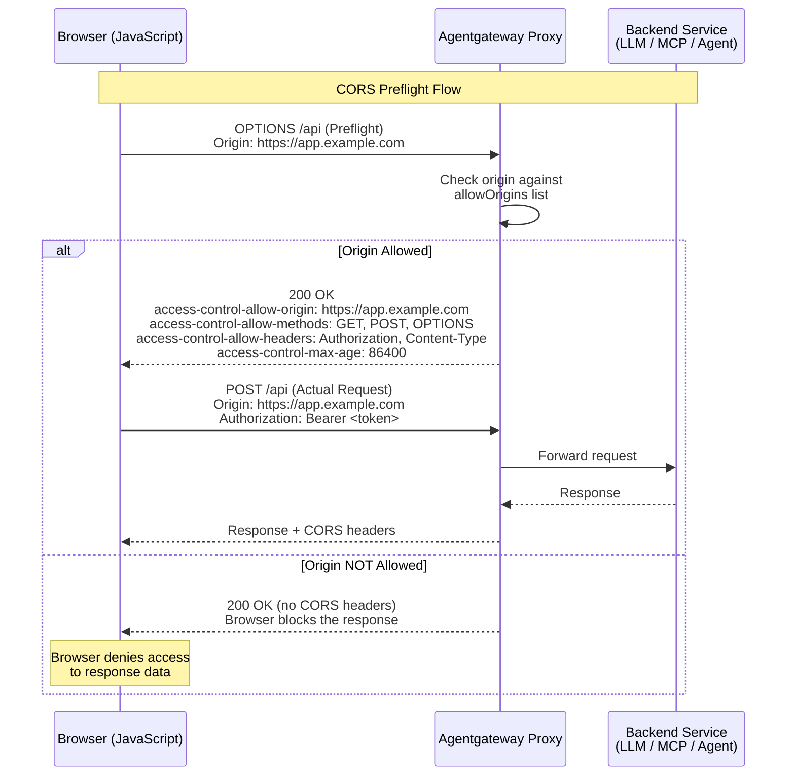

Enforce client-site access controls with cross-origin resource sharing (CORS).





## About CORS

Cross-Origin Resource Sharing (CORS) is a security feature that is implemented by web browsers and that controls how web pages in one domain can request and interact with resources that are hosted on a different domain. By default, web browsers only allow requests to resources that are hosted on the same domain as the web page that served the original request. Access to web pages or resources that are hosted on a different domain is restricted to prevent potential security vulnerabilities, such as cross-site request forgery (CRSF).

When CORS is enabled in a web browser and a request for a different domain comes in, the web browser checks whether this request is allowed or not. To do that, it typically sends a preflight request (HTTP `OPTIONS` method) to the server or service that serves the requested resource. The service returns the methods that are permitted to send the actual cross-origin request, such as GET, POST, etc. If the request to the different domain is allowed, the response includes CORS-specific headers that instruct the web browser how to make the cross-origin request. For example, the CORS headers typically include the origin that is allowed to access the resource, and the credentials or headers that must be included in the cross-origin request.

Review the following diagram to see an example CORS request flow: 


Note that the preflight request is optional. Web browsers can also be configured to send the cross-origin directly. However, access to the request resource is granted only if CORS headers were returned in the response. If no headers are returned during the preflight request, the web browser denies access to the resource in the other domain.

CORS policies are typically implemented to limit access to server resources for JavaScripts that are embedded in a web page, such as:

* A JavaScript on a web page at `example.com` tries to access a different domain, such as `api.com`.
* A JavaScript on a web page at `example.com` tries to access a different subdomain, such as `api.example.com`.
* A JavaScript on a web page at `example.com` tries to access a different port, such as `example.com:3001`.
* A JavaScript on a web page at `https://example.com` tries to access the resources by using a different protocol, such as `http://example.com`.

### Configuration options {#options}

You can configure the CORS policy at two levels:

* **HTTPRoute**: For the native way in Kubernetes Gateway API, configure a CORS policy in the HTTPRoute. You can choose to apply the CORS policy to all the routes that are defined in the HTTPRoute, or to a selection of `backendRefs`. This route-level policy takes precedence over any  CORS that you might configure. For more information, see the [Kubernetes Gateway API docs](https://gateway-api.sigs.k8s.io/reference/spec/#httpcorsfilter) and [CORS design docs](https://gateway-api.sigs.k8s.io/geps/gep-1767/).
* ****: For more flexibility to reuse the CORS policy across HTTPRoutes, specific routes, and Gateways, configure a CORS policy in the . You can attach an  to a Gateway or the routes in an HTTPRoute resource.

## Before you begin



## Set up CORS policies

1. Create a CORS policy for the httpbin app in an HTTPRoute or . The following example sets up custom HTTP methods and max age for requests for the `https://example.com/` origin.

   
   {}
   ```sh,paths="cors-in-httproute"
   kubectl apply -f- <<EOF
   apiVersion: gateway.networking.k8s.io/v1
   kind: HTTPRoute
   metadata:
     name: httpbin
     namespace: httpbin
   spec:
     parentRefs:
       - name: agentgateway-proxy
         namespace: 
     rules:
       - filters:
           - type: CORS
             cors:
               allowCredentials: true
               allowHeaders:
                 - Origin
               allowMethods:
                 - GET
                 - POST
                 - OPTIONS
               allowOrigins:
                 - "https://example.com"
               exposeHeaders:
               - Origin
               - X-HTTPRoute-Header
               maxAge: 86400
         backendRefs:
           - name: httpbin
             port: 8000
   EOF
   ```

   {}
   {}

   ```sh,paths="cors-in-agentgatewaypolicy"
   kubectl apply -f- <<EOF
   apiVersion: 
   kind: 
   metadata:
     name: httpbin-cors
     namespace: 
   spec:
     targetRefs:
       - group: gateway.networking.k8s.io
         kind: Gateway
         name: agentgateway-proxy
     traffic:
       cors:
         allowCredentials: true
         allowHeaders:
           - "Origin"
           - "Authorization"
           - "Content-Type"
         allowMethods:
           - "GET"
           - "POST"
           - "OPTIONS"
         allowOrigins:
           - "https://example.com"
         exposeHeaders:
         - "Origin"
         - "X-TrafficPolicy-Header"
         maxAge: 86400
   EOF
   ```
   {}
  
  YAMLTest -f - <<'EOF'
  - name: CORS preflight returns expected headers
    http:
      url: "http://${INGRESS_GW_ADDRESS}:80/get"
      method: OPTIONS
      headers:
        host: www.example.com
        Origin: https://example.com
    source:
      type: local
    expect:
      statusCode: 200
      headers:
        - name: access-control-allow-origin
          comparator: equals
          value: https://example.com
        - name: access-control-allow-methods
          comparator: contains
          value: GET
        - name: access-control-max-age
          comparator: equals
          value: "86400"
  EOF
  
   

2. Send a request to the httpbin app and use `https://example.com` as the origin. Verify that your request succeeds and that you get back the configured CORS headers.

   
   {}
   ```sh
   curl -I -X OPTIONS http://$INGRESS_GW_ADDRESS:80/get -H "host: www.example.com" \
    -H "Origin: https://example.com"
   ```
   {}
   {}
   ```sh
   curl -I -X OPTIONS localhost:8080/headers -H "host: www.example.com" \
    -H "Origin: https://example.com"
   ```
   {}
   

   Example output: Notice that the `access-control-*` values reflect your CORS policy and change depending on the resources that you created.
   * If you created an HTTPRoute with a CORS filter, you see the `Origin` and `X-HTTPRoute-Header` headers.
   * If you created a TrafficPolicy with a CORS filter, you see the `Origin` and `X-TrafficPolicy-Header` headers.

   Example output:

   ```console {hl_lines=[2,3,4,5]}
   HTTP/1.1 200 OK
   access-control-allow-origin: https://example.com
   access-control-allow-methods: GET,POST,OPTIONS
   access-control-allow-headers: origin
   access-control-max-age: 86400
   content-length: 0
   ```

3. Send another request to the httpbin app. This time, you use `notallowed.com` as your origin. Although the request succeeds, you do not get back your configured CORS settings such as max age, allowed origin, or allowed methods, because `notallowed.com` is not configured as a supported origin.

   
   {}
   ```sh
   curl -I -X OPTIONS http://$INGRESS_GW_ADDRESS:80/get -H "host: www.example.com" \
    -H "Origin: https://notallowed.com"
   ```
   {}
   {}
   ```sh
   curl -I -X OPTIONS localhost:8080/headers -H "host: www.example.com" \
    -H "Origin: https://notallowed.com"
   ```
   {}
   

   Example output:
   ```console {hl_lines=[2,3,4,5]}
   HTTP/1.1 200 OK
   access-control-allow-credentials: true
   access-control-allow-methods: GET, POST, HEAD, PUT, DELETE, PATCH, OPTIONS
   access-control-allow-origin: https://notallowed.com
   access-control-max-age: 3600
   content-length: 0
   ```

  
  YAMLTest -f - <<'EOF'
  - name: CORS preflight returns expected headers
    http:
      url: "http://${INGRESS_GW_ADDRESS}:80/get"
      method: OPTIONS
      headers:
        host: www.example.com
        Origin: https://notallowed.com
    source:
      type: local
    expect:
      statusCode: 200
      headers:
        - name: access-control-allow-origin
          comparator: equals
          value: https://notallowed.com
        - name: access-control-allow-methods
          comparator: contains
          value: HEAD # contains all methods not just the ones you configured, because the origin is not allowed
        - name: access-control-max-age
          comparator: equals
          value: "3600"
  EOF
  

## Cleanup




{}

Restore the HTTPRoute for the httpbin app.
```yaml
kubectl apply -f- <<EOF
apiVersion: gateway.networking.k8s.io/v1
kind: HTTPRoute
metadata:
  name: httpbin
  namespace: httpbin
spec:
  parentRefs:
    - name: agentgateway-proxy
      namespace: agentgateway-system
  hostnames:
    - "www.example.com"
  rules:
    - backendRefs:
        - name: httpbin
          port: 8000
EOF
```

{}
{}

```sh
kubectl delete  httpbin-cors -n 
```

{}

