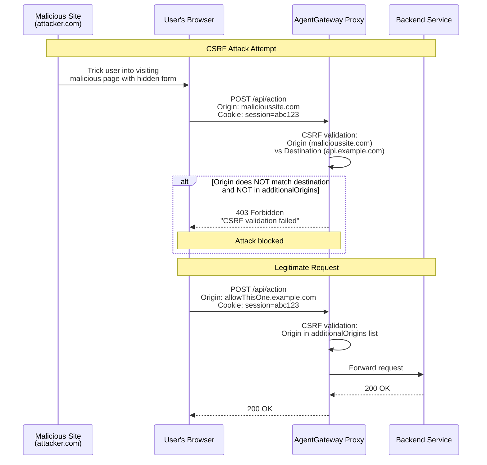

Protect your web apps from Cross-Site Request Forgery (CSRF) attacks by configuring origin validation.

## About CSRF protection

According to [OWASP](https://owasp.org/www-community/attacks/csrf), CSRF is defined as follows:

> Cross-Site Request Forgery (CSRF) is an attack that forces an end user to execute unwanted actions on a web application in which they're currently authenticated. With a little help of social engineering (such as sending a link via email or chat), an attacker may trick the users of a web application into executing actions of the attacker's choosing. If the victim is a normal user, a successful CSRF attack can force the user to perform state changing requests like transferring funds, changing their email address, and so forth. If the victim is an administrative account, CSRF can compromise the entire web application.

To help prevent CSRF attacks, you can enable CSRF protection for your gateway or a specific route. For each route that you apply the CSRF policy to, the filter checks to make sure that a request's origin matches its destination. If the origin and destination do not match, a 403 Forbidden error code is returned. 

Review the following diagram to see an example CSRF request flow:



Note that because CSRF attacks specifically target state-changing requests, the filter only acts on HTTP requests that have a state-changing method such as `POST` or `PUT`.




## Set up CSRF protection

Configure an  to enable CSRF protection for your Gateway. This policy validates the `Origin` header of incoming requests and blocks requests from untrusted origins.

1. Create an  with your CSRF configuration.
   ```yaml,paths="csrf"
   kubectl apply -f - <<EOF
   apiVersion: 
   kind: 
   metadata:
     name: csrf
     namespace: 
   spec:
     # Target the Gateway to apply CSRF protection to all routes
     targetRefs:
     - group: gateway.networking.k8s.io
       kind: Gateway
       name: agentgateway-proxy
     traffic:
       csrf:
         # Additional origins that are allowed to make requests
         # These are origins beyond the request's own origin that you trust
         additionalOrigins:
         - example.org
         - allowThisOne.example.com
   EOF
   ```

   | Field | Description | 
   |-------|-------------|
   | `csrf` | Enables CSRF protection for the targeted Gateway or routes. When configured, all cross-origin requests are validated. | 
   | `additionalOrigins` | List of additional origins that are allowed to make requests to your app beyond the same-origin requests. This is useful for trusted partners, subdomains, or CDNs. Origins cannot include wildcards. | 



YAMLTest -f - <<'EOF'
- name: CSRF allows POST with no origin header
  http:
    url: "http://${INGRESS_GW_ADDRESS}:80/post"
    method: POST
    headers:
      host: www.example.com
  source:
    type: local
  expect:
    statusCode: 200
- name: CSRF allows POST from trusted additional origin
  http:
    url: "http://${INGRESS_GW_ADDRESS}:80/post"
    method: POST
    headers:
      host: www.example.com
      origin: allowThisOne.example.com
  source:
    type: local
  expect:
    statusCode: 200
- name: CSRF blocks POST from untrusted origin
  http:
    url: "http://${INGRESS_GW_ADDRESS}:80/post"
    method: POST
    headers:
      host: www.example.com
      origin: malicioussite.com
  source:
    type: local
  expect:
    statusCode: 403
EOF


2. Send a request to the httpbin app on the `www.example.com` domain. Include the `malicioussite.com` origin that is not allowed in your policy. Verify that the request is denied and that you get back a 403 HTTP response code.

   
   {}
   ```sh
   curl -vi -X POST http://$INGRESS_GW_ADDRESS:80/post \
    -H "host: www.example.com:8080" \
    -H "origin: malicioussite.com"
   ```
   {}
   {}
   ```sh
   curl -vi -X POST localhost:8080/post \
    -H "host: www.example.com" \
    -H "origin: malicioussite.com"
   ```
   {}
   
   
   Example output: 
   
   ```console
   * Request completely sent off
   < HTTP/1.1 403 Forbidden
   HTTP/1.1 403 Forbidden
   ...
   < 
   CSRF validation failed%
   ```

3. Send another request to the httpbin app. This time, you include the `allowThisOne.example.com` origin header that is allowed in your policy. Verify that you get back a 200 HTTP response code, because the origin matches the origin that you specified in the  resource.
   
   
   {}
   ```sh
   curl -vi -X POST http://$INGRESS_GW_ADDRESS:80/post \
   -H "host: www.example.com" \
   -H "origin: allowThisOne.example.com"
   ```
   {}
   {}
   ```sh
   curl -vi -X POST localhost:8080/post \
   -H "host: www.example.com" \
   -H "origin: allowThisOne.example.com"
   ```
   {}
      
     
   Example output: 
   ```console
   HTTP/1.1 200 OK
   ...
   {
     "args": {},
     "headers": {
       "Accept": [
         "*/*"
       ],
       "Host": [
         "www.example.com"
       ],
       "Origin": [
         "allowThisOne.example.com"
       ],
       "User-Agent": [
         "curl/8.7.1"
       ]
     }
   ...
   ```

## Clean up



```sh
kubectl delete  csrf -n 
```
