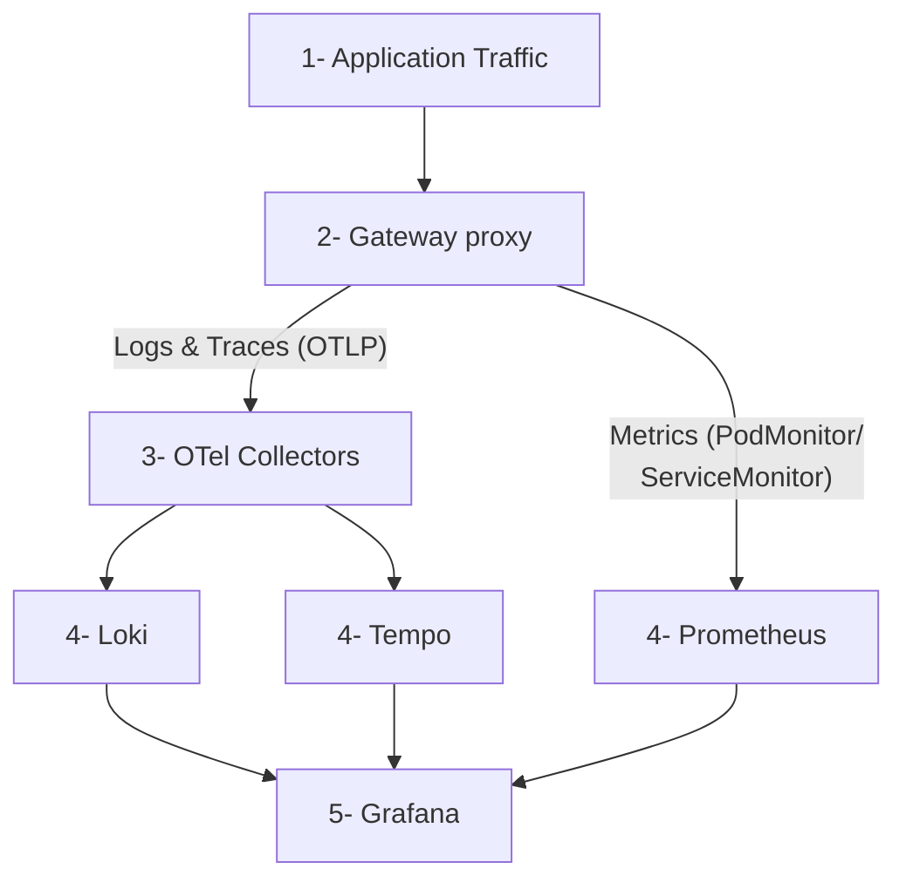

Deploy an open source observability stack based on OpenTelemetry (OTel) that includes the following components:

- **Logs**: Centralized log collection and storage with Grafana [Loki](https://github.com/grafana/loki).
- **Traces**: Distributed tracing with Grafana [Tempo](https://github.com/grafana/tempo).
- **Metrics**: Time-series metrics collection with [Prometheus](https://github.com/prometheus/prometheus).
- **Collection**: Unified telemetry collection with [OpenTelemetry Collector](https://github.com/open-telemetry/opentelemetry-collector).
- **Visualization**: Comprehensive dashboards with [Grafana](https://github.com/grafana/grafana).

## About

Observability tools are essential to gain insight into the health and performance of your gateway proxies. [OpenTelemetry](https://opentelemetry.io) (OTel) is a flexible, open source framework that provides a set of APIs, libraries, and instrumentation to help capture and export observability data. However, you can follow a similar process as this guide to use the tools that you prefer.

### Observability data types {#data-types}

Observability is built on three core pillars as described in the following table. By combining these three data types, you get a complete picture of your system's health and performance.

| Pillar | Description |
| -- | -- |
| Logs | Discrete events that happen at a specific time with detailed context. |
| Metrics | Numerical measurements aggregated over time intervals. |
| Traces | Records of requests as they flow through distributed systems. |

### Architecture

Review the following diagram to understand the architecture of the observability stack.

The gateway proxy acts as the primary telemetry generator. OTel Collectors route logs and traces to their storage backends, while Prometheus scrapes metrics directly from the gateway pods via PodMonitor and ServiceMonitor resources.

Architecture data flow:
1. **Application Traffic**: Applications send requests to the gateway proxy.
2. **Gateway Processing**: The gateway proxy processes requests and emits telemetry on two paths: it pushes logs and traces to the OTel Collectors via OTLP, and exposes metrics on dedicated ports for Prometheus to scrape.
3. **Telemetry Collection**: OTel Collectors receive logs and traces and route them to Loki and Tempo. Prometheus scrapes the control plane and proxy metrics endpoints directly via PodMonitor and ServiceMonitor resources.
4. **Data Storage**:
   - **Logs** go to Loki for log aggregation and storage.
   - **Traces** go to Tempo for distributed tracing storage.
   - **Metrics** go to Prometheus for time-series metrics storage.
5. **Visualization**: Grafana queries all three storage backends as data sources to create unified dashboards.

### More considerations {#more-considerations}

**Metrics collection**: Prometheus scrapes the gateway control plane and proxy metrics endpoints directly via PodMonitor and ServiceMonitor resources (`pull` model). Logs and traces use the `push` model: the gateway proxy pushes OTLP data to the OTel Collectors, which forward them to Loki and Tempo respectively.

**Debug exporter**: The example pipelines in both OTel collectors set up the `debug` exporter. This exporter is useful for testing and validation purposes. However, for production scenarios, remove this exporter to avoid performance impacts.

## Before you begin

