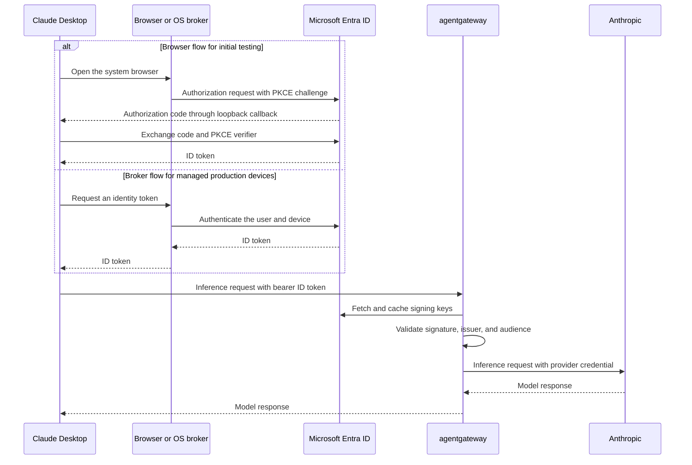

If you distribute one static API key to every user, you cannot attribute requests to a person or revoke access for only one user. Instead, select the **Interactive sign-in** credential kind. Claude Desktop then runs an OAuth 2.0 authorization code flow with Proof Key for Code Exchange (PKCE) against your identity provider and sends the resulting token on every inference request. Agentgateway validates the token and adds the LLM provider credential itself, so the user's device never holds a provider API key.

The interactive sign-in flow is the same for standalone and Kubernetes deployments. Only the agentgateway configuration differs: standalone configures JWT validation directly on the route, whereas Kubernetes uses an  and an  for the JWKS endpoint.

The OAuth callback returns to Claude Desktop, not to agentgateway. The gateway
hostname is the inference endpoint and must not be registered as the OAuth
redirect URI.

After you disable or offboard a user, the identity provider prevents new sign-ins and token refreshes. An ID token that was already issued can remain valid until it expires, depending on the identity provider's revocation and session policies.
