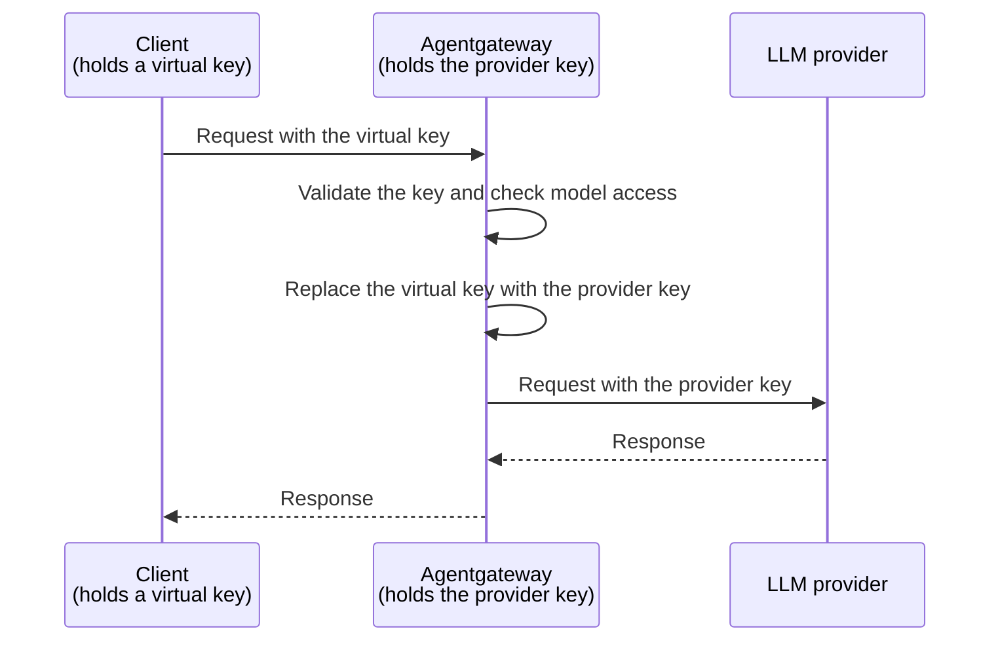

```mermaid
sequenceDiagram
    participant C as Client<br/>(holds a virtual key)
    participant AGW as Agentgateway<br/>(holds the provider key)
    participant P as LLM provider
    C->>AGW: Request with the virtual key
    AGW->>AGW: Validate the key and check model access
    AGW->>AGW: Replace the virtual key with the provider key
    AGW->>P: Request with the provider key
    P-->>AGW: Response
    AGW-->>C: Response
```
