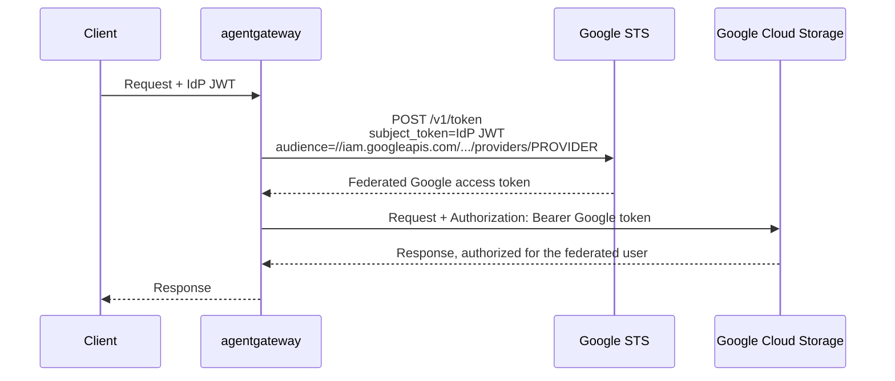

The [Google Cloud Security Token Service](https://cloud.google.com/iam/docs/reference/sts/rest) (STS) implements the RFC 8693 token exchange grant for [Workload Identity Federation](https://cloud.google.com/iam/docs/workload-identity-federation). You register your identity provider (IdP) as a provider in a workload identity pool. The STS then accepts a JWT that your IdP issued as the `subject_token`, and returns a short-lived Google Cloud access token for the federated identity in the token's `sub` claim.

In this guide, agentgateway performs that exchange for each request to a Google Cloud API. The client sends its usual IdP token, and the Google API receives a Google access token. Google Cloud authorizes the request as the end user's federated identity, so IAM policies and Cloud Audit Logs reflect the user, not the gateway. No Google service account key is stored in the gateway or the client.

Google Cloud trusts the token because of the workload identity pool provider, not because of the caller. The STS token endpoint does not take client authentication, so the exchange has no client ID or client secret to store.

This exchange differs from {}[Google Cloud backend authentication](){}{}[Google Cloud backend authentication](){}, where the gateway calls Google Cloud with its own identity, such as a service account. Use token exchange when Google Cloud must authorize each request as the user who sent it.
