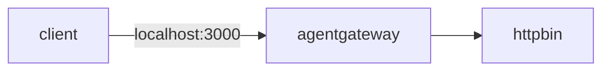

Use the agentgateway binary to route HTTP traffic to a simple backend (httpbin) running locally.



1. The client sends requests to agentgateway on port 3000.
2. Agentgateway forwards the requests to the httpbin backend based on the route and backend configuration.
3. Httpbin responds, and agentgateway returns the response back to the client.

## Before you begin


# Install agentgateway binary





2. Install [Docker](https://docs.docker.com/get-started/get-docker/) to run httpbin.

## Steps

{}

### Step 1: Start httpbin in Docker

Run the httpbin image so it listens on port 80 inside the container. Map it to a host port such as 8000 so that agentgateway can reach it.


{}

```sh {paths="httpbin,httpbin-linux"}
docker run --rm -d -p 8000:80 --name httpbin kennethreitz/httpbin
```
{}
{}

```sh {paths="httpbin-macos"}
docker run --rm -d --platform linux/amd64 -p 8000:80 --name httpbin kennethreitz/httpbin
```
{}


Verify that httpbin responds.

```sh {paths="httpbin"}
curl -s http://localhost:8000/headers | head -20 || true
```

Example output:

```json
{
  "headers": {
    "Accept": "*/*",
    "Host": "localhost:8000",
    "User-Agent": "curl/8.7.1"
  }
}
```

### Step 2: Configure agentgateway to route to httpbin

You add the gateway and route from the UI, so you can start agentgateway without a config file. When you run `agentgateway` without specifying a config, it bootstraps a basic config at `~/.config/agentgateway/config.yaml` and uses it automatically.

1. In a separate terminal, start agentgateway.

   ```sh
   agentgateway
   ```

2. Open the [agentgateway UI](http://localhost:4000/ui/). 
   
   * On the first run of the UI, the welcome wizard already enables the **API** row, because the bootstrap config includes a gateway. Click **Continue**. 
   * If you already opened the UI, the **Gateway Overview** home page shows the **Traffic** row enabled.

3. Add a gateway.
   1. In the **Traffic** section of the navigation menu, click **Gateways**.
   2. Click **Add gateway**, enter `httpbin` for the **Name** and `3000` for the **Port**, and click **Save gateway**.

      The bootstrap config already created a gateway named `default` on port 4000. The name `default` is reserved for it, so give the new gateway a different name.

4. Add a route to httpbin.
   1. Click **Routes**, and then click **Add route**.
   2. For the **Gateway**, select the `httpbin` gateway you created.
   3. For the **Name**, enter `httpbin`. **Save route** stays disabled until the route has a name.
   4. Under **Backends**, click **Add backend**, keep the **Host** target type, and enter `127.0.0.1:8000` for the host.
   5. Click **Save route**.

   
   


# Hidden test: the UI steps above (Add gateway/route) are not scriptable, so this block
# reproduces the equivalent config they produce, to keep the resulting setup tested.
cat > config.yaml << 'EOF'
# yaml-language-server: $schema=https://agentgateway.dev/schema/config
gateways:
  httpbin:
    port: 3000
    protocol: HTTP
routes:
- name: httpbin
  gateways: httpbin
  backends:
  - host: 127.0.0.1:8000
EOF
agentgateway -f config.yaml &
AGW_PID=$!
trap 'kill $AGW_PID 2>/dev/null' EXIT
sleep 3


### Step 3: Send a request through agentgateway

Send a request to agentgateway on port 3000. Agentgateway forwards it to httpbin; the response is returned to you.

```sh {paths="httpbin"}
curl -i http://localhost:3000/headers
```


YAMLTest -f - <<'EOF'
- name: request through agentgateway to httpbin returns 200
  http:
    url: "http://localhost:3000"
    path: /headers
    method: GET
  source:
    type: local
  expect:
    statusCode: 200
EOF


Example response (status and headers):

```txt
HTTP/1.1 200 OK
content-type: application/json
...
```

Example JSON body:

```json
{
  "headers": {
    "Accept": "*/*",
    "Host": "localhost:3000",
    "User-Agent": "curl/8.7.1"
  }
}
```

You can try other httpbin endpoints through agentgateway, such as the following.

```sh {paths="httpbin"}
curl -s http://localhost:3000/get
curl -s http://localhost:3000/post -X POST -H "Content-Type: application/json" -d '{"key":"value"}'
```

### Step 4 (Optional): Stop httpbin

When you are done, stop and remove the httpbin container.

```sh {paths="httpbin"}
docker stop httpbin
```

{}

## Next steps

Check out more guides for managing your APIs with agentgateway.


  
  
  

