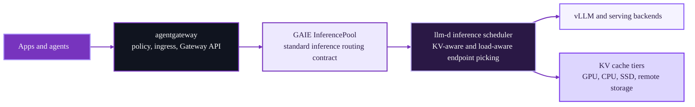

AI models and the surrounding ecosystem feel like they are evolving at the speed of light. A year ago,
the question was how to expose model endpoints. Now the question is how to run inference as a real platform
workload with policy, multi-tenancy, intelligent routing, cache locality, predictable latency, and room to
scale across nodes and data centers.

This shift is exactly why [agentgateway](https://agentgateway.dev/), [llm-d](https://llm-d.ai/), and the
[Gateway API Inference Extension (GAIE)](https://gateway-api-inference-extension.sigs.k8s.io/) belong together.

[llm-d](https://llm-d.ai/docs/architecture/) is pushing new frontiers in intelligent scheduling, prefill/decode
disaggregation, tiered KV caching, and workload-aware autoscaling. [agentgateway](https://github.com/agentgateway/agentgateway/releases/tag/v1.0.0)
is a high performance production-ready AI gateway for LLM, MCP, A2A, and Kubernetes-native inference traffic.
GAIE has become the standard contract between the gateway layer and inference-aware scheduling.

Put those pieces together and you get something more useful than a demo stack. You get a Kubernetes-native path
to production inference serving.

## Inference is evolving from serving model endpoints to inference systems

Across llm-d, GAIE, and the broader open inference ecosystem, three shifts stand out.

- **Inference routing is becoming first-class infrastructure.** The gateway is no longer just a pass-through. It needs to understand models,
  priorities, failure modes, and inference objectives.
- **Performance gains increasingly come from scheduling and cache locality.** Low-level GPU optimizations still matter, but platform wins now
  come from prefix-cache-aware routing, prefill/decode disaggregation, and better utilization of expensive accelerators.
- **Standards matter.** Platform teams want the freedom to combine a gateway, scheduler, model server, and autoscaling strategy
  without custom glue or vendor lock-in at any layer.

That is the bigger story behind this stack. The market is not just asking for faster inference. It is asking for composable inference systems
based on industry standards.

## Where the superpowers come from



Each layer does a different job.

- **agentgateway** gives you the production traffic layer. It is a high-performance, Rust-based AI gateway that supports both
  standalone and Kubernetes deployment modes, recently achieved GA in [release v1.0.0](https://github.com/agentgateway/agentgateway/releases/tag/v1.0.0),
  and is the first [GAIE v1.4.0](https://github.com/kubernetes-sigs/gateway-api-inference-extension/blob/main/conformance/reports/v1.4.0/gateway/agentgateway/README.md)
  conformant gateway.
- **GAIE** gives you the shared language between the gateway and the inference scheduler. Its [InferencePool](https://gateway-api-inference-extension.sigs.k8s.io/api-types/inferencepool/) API and [extension protocol](https://github.com/kubernetes-sigs/gateway-api-inference-extension/blob/v1.4.0/docs/proposals/004-endpoint-picker-protocol/README.md) let gateways route inference traffic without hard-coding scheduler behavior into the gateway itself.
- **llm-d** gives you the serving intelligence. Its architecture focuses on [intelligent inference scheduling, prefill/decode disaggregation,
  wide expert parallelism, tiered KV prefix caching, and workload autoscaling](https://llm-d.ai/docs/architecture/).

The clean separation while being integrated through standard interfaces is the superpower. agentgateway does not need to reimplement llm-d's scheduler logic.
llm-d does not need to reinvent gateway functionality, security policy, or Kubernetes networking APIs. GAIE is the thread that stitches them all together.
That makes the stack easier to understand and evolve over time.

## Why this combination matters right now

The [llm-d inference scheduler](https://github.com/llm-d/llm-d-inference-scheduler) makes this relationship explicit. Its Endpoint Picker
extends GAIE and adds llm-d-specific capabilities such as P/D disaggregation. At the same time, the [llm-d architecture](https://llm-d.ai/docs/architecture/)
leans into the exact optimizations that operators care about most:

- Prefix-cache-aware routing
- Utilization-based load balancing
- Predicted latency balancing
- Disaggregated prefill and decode
- Tiered KV caching across host and storage layers

That is not abstract roadmap material. It is the current capabilities and future direction of the project. llm-d's move into [CNCF Sandbox](https://github.com/cncf/sandbox/issues/462) sharpens that story for users. It means the project is being positioned with vendor-neutral governance, broader cross-vendor participation, and tighter alignment with upstream cloud-native interfaces instead of a single-vendor roadmap. For users, that translates into three practical benefits:

- More confidence that the serving stack is being built as a portable, vendor-agnostic platform capability.
- Better interoperability pressure across adjacent projects in the inference and CNCF ecosystems.
- Stronger trust signals around legal, security, and IP hygiene for teams that want to standardize on llm-d in production.

On the gateway side, the integration is now easier to consume. llm-d now includes the [latest support for agentgateway and GAIE](https://github.com/llm-d/llm-d/pull/421).

## Why GAIE is a big deal

GAIE matters because it keeps turning inference routing into a portable, testable interface instead of a stack-specific trick.

The [v1.4.0](https://github.com/kubernetes-sigs/gateway-api-inference-extension/releases/tag/v1.4.0) release added standalone Endpoint Picker (EPP) support,
split conformance into its own Go module, and included InferencePool, Helm, and gRPC improvements such as `appProtocol`, `FailOpen`,
and ALPN `h2`. It also continued pushing flow control, body-based routing, predicted latency, and data layer internals forward.

That matters for one simple reason: conformance is what turns a nice architecture diagram into a real platform choice.

## Try it out

If you want to see this stack running end-to-end, use the [agentgateway + llm-d demo](https://github.com/solo-io/agentgateway-llm-d).

The demo packages the latest releases of `agentgateway`, `GAIE`, and `llm-d` without the need for GPUs to give the stack a try.
It lets you send OpenAI-compatible requests through agentgateway, compare gateway traffic against a direct baseline, and inspect the system in Prometheus
and Grafana. Running the demo is as simple as:

```bash
git clone https://github.com/solo-io/agentgateway-llm-d.git
cd agentgateway-llm-d
cp config/demo.env.example config/demo.env
./scripts/demo.sh setup
./scripts/demo.sh port-forward start
./scripts/demo.sh smoke
```

After that, run `./scripts/demo.sh traffic start` to light up the dashboards, or `./scripts/demo.sh walkthrough` for a guided flow.

If you are building an inference platform on Kubernetes, agentgateway + llm-d + GAIE is the stack worth paying attention to.
