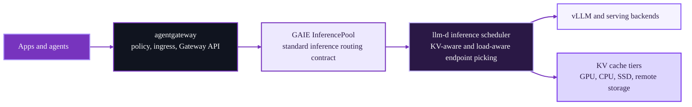

AI models and the surrounding ecosystem are evolving faster than any previous technology revolution. A year ago, the question was how to expose model endpoints. Now the question is how to run inference as a real platform workload with policy, multi-tenancy, intelligent routing, cache locality, predictable latency, and room to scale across accelerators.

That shift is exactly why [agentgateway](https://agentgateway.dev/), [llm-d](https://llm-d.ai/), and the [Gateway API Inference Extension (GAIE)](https://gateway-api-inference-extension.sigs.k8s.io/) belong in the same conversation.

[llm-d](https://llm-d.ai/docs/architecture/) is pushing the state of the art in intelligent scheduling, prefill/decode disaggregation, tiered KV caching, and workload-aware autoscaling. [agentgateway](https://github.com/agentgateway/agentgateway/releases/tag/v1.0.0) is now a production-ready AI gateway for LLM, MCP, A2A, and Kubernetes-native inference traffic. GAIE has become the standard contract between the gateway layer and inference-aware scheduling.

That also makes agentgateway's latest GAIE milestone important: as of March 20, 2026, it is the first and only GAIE gateway with a published [v1.4.0 conformance report](https://github.com/kubernetes-sigs/gateway-api-inference-extension/tree/main/conformance/reports/v1.4.0/gateway/agentgateway).

Put those pieces together and you get something more useful than a demo stack. You get a Kubernetes-native path to production inference serving.

## The market is moving from model endpoints to inference systems

Based on the latest [llm-d architecture](https://llm-d.ai/docs/architecture/), [GAIE docs](https://gateway-api-inference-extension.sigs.k8s.io/), and the growing focus across the open inference ecosystem on KV caching and disaggregated serving, three shifts stand out.

- **Inference routing is becoming first-class infrastructure.** The gateway is no longer just a pass-through. It needs to understand models, priorities, failure modes, and inference objectives.
- **Performance gains increasingly come from scheduling and cache locality.** Faster kernels still matter, but platform wins now come from prefix-cache-aware routing, prefill/decode disaggregation, and better utilization of expensive accelerators.
- **Standards are starting to matter.** Platform teams want the freedom to combine a gateway, scheduler, model server, and autoscaling strategy without custom glue at every layer.

That is the bigger story behind this stack. The market is not just asking for faster inference. It is asking for composable inference systems.

## Where the superpowers come from

Each layer does a different job.

- **agentgateway** gives you the production traffic layer. It is a high-performance, Rust-based AI gateway that supports both standalone and Kubernetes deployment modes, was recently GA'd in [release v1.0.0](https://github.com/agentgateway/agentgateway/releases/tag/v1.0.0), and is the first and only GAIE gateway with a published [v1.4.0 conformance report](https://github.com/kubernetes-sigs/gateway-api-inference-extension/tree/main/conformance/reports/v1.4.0/gateway/agentgateway).
- **GAIE** gives you the shared language between the gateway and the scheduler. Its [InferencePool](https://gateway-api-inference-extension.sigs.k8s.io/api-types/inferencepool/) model and [extension protocol](https://github.com/kubernetes-sigs/gateway-api-inference-extension/blob/v1.4.0/docs/proposals/004-endpoint-picker-protocol/README.md) let gateways route inference traffic without hard-coding scheduler behavior into the gateway itself.
- **llm-d** gives you the serving intelligence. Its architecture focuses on [intelligent inference scheduling, prefill/decode disaggregation, wide expert parallelism, tiered KV prefix caching, and workload autoscaling](https://llm-d.ai/docs/architecture/).

That separation is the superpower.

agentgateway does not need to reimplement llm-d's scheduler logic. llm-d does not need to reinvent gateway functionality, security policy, or Kubernetes Gateway API operations. GAIE is the thread that stitches them together. That makes the stack easier to understand and evolve over time.

## Why this combination matters right now

The [llm-d inference scheduler](https://github.com/llm-d/llm-d-inference-scheduler) makes this relationship explicit. Its Endpoint Picker extends GAIE and adds llm-d-specific capabilities such as P/D disaggregation.

At the same time, the [llm-d architecture](https://llm-d.ai/docs/architecture/) is leaning hard into the exact optimizations operators now care about most:

- Prefix-cache-aware routing
- Utilization-based load balancing
- Predicted latency balancing
- Disaggregated prefill and decode
- Tiered KV caching across host and storage layers

That is not abstract roadmap material. It is the current direction of the project.

llm-d's move into [CNCF Sandbox](https://github.com/cncf/sandbox/issues/462) sharpens that story for users. It means the project is being positioned with vendor-neutral governance, broader cross-vendor participation, and tighter alignment with upstream cloud-native interfaces instead of a single-vendor roadmap. For users, that translates into three practical benefits:

- More confidence that the serving stack is being built as a portable, hardware-agnostic platform capability.
- Better interoperability pressure across adjacent projects such as GAIE, KServe, and Envoy.
- Stronger trust signals around legal, security, and IP hygiene for teams that want to standardize on llm-d in production.

On the gateway side, the integration is now easier to consume upstream. [llm-d now includes refreshed agentgateway and GAIE support](https://github.com/llm-d/llm-d/pull/421), and [llm-d-infra now includes first-class agentgateway provider support in the chart](https://github.com/llm-d-incubation/llm-d-infra/pull/272). That turns agentgateway into a supported path, not a one-off experiment.

## Why GAIE v1.4.0 is a big deal

GAIE v1.4.0 matters because it keeps turning inference routing into a portable, testable interface instead of a stack-specific trick.

The [v1.4.0-rc.1 release](https://github.com/kubernetes-sigs/gateway-api-inference-extension/releases/tag/v1.4.0-rc.1) brought standalone chart work into the release artifacts, split conformance into its own Go module, and included InferencePool, Helm, and gRPC improvements such as `appProtocol`, `FailOpen`, and ALPN `h2`. It also continued pushing flow control, body-based routing, predicted latency, and data layer internals forward.

That matters for one simple reason: conformance is what turns a nice architecture diagram into a real platform choice.

As of March 20, 2026, the [GAIE `v1.4.0` gateway conformance reports](https://github.com/kubernetes-sigs/gateway-api-inference-extension/tree/main/conformance/reports/v1.4.0/gateway) include only [agentgateway](https://github.com/kubernetes-sigs/gateway-api-inference-extension/tree/main/conformance/reports/v1.4.0/gateway/agentgateway). The published report tests `agentgateway v1.0.0` against GAIE `v1.4.0`, which makes agentgateway the first and only gateway with a published GAIE v1.4.0 conformance report.

That is an important signal for platform teams. If you want standards-based inference routing and you want proof that it works, conformance is the story.

## Why this is a strong KubeCon message

There are a lot of ways to tell an inference serving story right now. Many of them are really stories about a single model server, a single hardware target, or a single benchmark.

This one is different.

This is a story about how the open ecosystem is starting to line up:

- a real gateway layer in agentgateway,
- a real inference serving and scheduling layer in llm-d,
- and a real upstream standard in GAIE.

That combination is what makes "inference serving superpowers" more than a slogan. You get gateway policy and traffic control, inference-aware routing, smarter endpoint picking, and a standards-based path to evolve the stack over time.

## Performance and scale are the next chapter

llm-d already publishes strong performance signals around wide expert parallelism, prefill/decode disaggregation, and KV-aware routing. The next iteration of this post should add concrete scale data for the agentgateway + llm-d combination once the March 20, 2026 llm perf runs complete.

That update is where we can turn this story from architectural momentum into hard deployment evidence:

- throughput under scale,
- latency behavior under realistic load,
- and how the gateway plus scheduler stack behaves as concurrency climbs.

For now, the most important point is this: the architecture is lining up, the standards are lining up, and the upstream integration work is already in motion.

If you are building inference platforms on Kubernetes, that is exactly the kind of momentum worth paying attention to at KubeCon.
