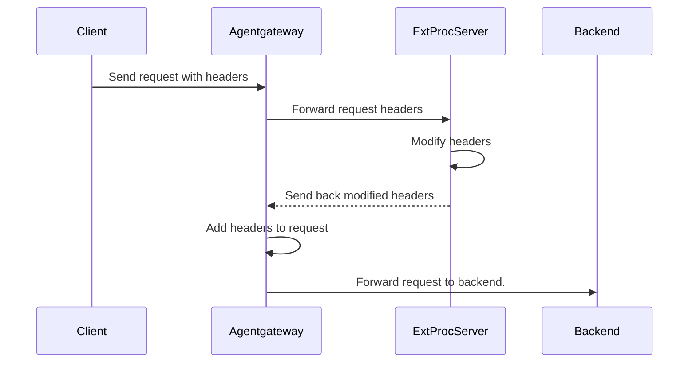

Modify aspects of an HTTP request or response with an external processing server.

## About external processing

With agentgateway's external processing (ExtProc) integration, you can implement an external gRPC processing server that can read and modify all aspects of an HTTP request or response. Agentgateway extracts specific information from the request or response, such as the headers, the body, or trailers, and automatically forwards them to the ExtProc server. The ExtProc server then manipulates these attributes according to your rules and returns the modified attributes. Agentgateway injects the modified attributes before forwarding traffic to an upstream or downstream service. The request or response can also be terminated at any given time.

## How it works



1. The client sends a request with headers to agentgateway.
2. Agentgateway extracts the header information and sends it to the external processing server.
3. The external processing server modifies, adds, or removes the request headers.
4. The modified request headers are sent back to agentgateway.
5. The modified headers are added to the request.
6. The request is forwarded to the backend service.

## Failure modes

You can choose whether you want agentgateway to forward requests if the external processing server is unavailable with the `extProc.failureMode` setting. Choose between the following modes: 

* **failOpen**: Forward requests to the backend service, even if the connection to the external processing server fails. You might choose this option to ensure availability of the backend services even when the ExtProc service is down.
* **failClosed**: Block requests if the request to the external processing server fails. This is the default behavior. 


## Setup

External processing can be applied at the route or the gateway level. If applied to both, the route-level policy takes precedence.


{}
```yaml
binds:
- port: 3000
  listeners:
  - routes:
    - backends:
      - ai:
         name: openai
         provider:
           openAI:
             # Optional; overrides the model in requests
             model: gpt-3.5-turbo
      policies:
        backendAuth:
          key: "$OPEN_AI_APIKEY"
        extProc:
          host: "extproc.com:9000"
          failureMode: failOpen
```
{}
{}
```yaml
binds:
- port: 3000
  listeners:
  - gatewayName: my-gateway
gatewayPolicies:
  - name: extproc
    target:
      gateway: my-gateway
    policy:
      extProc:
        host: "extproc.com:9000"
        failureMode: failClosed
```
{}



