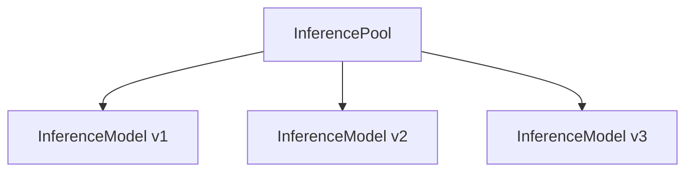
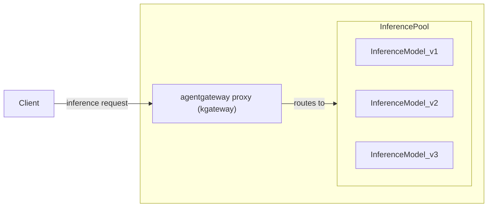

Learn more about agentgateway's intelligent routing and load balancing capabilities for AI inference workloads. 

## About Inference Extension {#about}

The [Inference Extension project](https://gateway-api-inference-extension.sigs.k8s.io/) extends the Kubernetes Gateway API with two key resources, an InferencePool and an InferenceModel, as shown in the following diagram.

The InferencePool groups together InferenceModels of LLM workloads into a routable backend resource that the Gateway API can route inference requests to. An InferenceModel represents not just a single LLM model, but a specific configuration including information such as as the version and criticality. The InferencePool uses this information to ensure fair consumption of compute resources across competing LLM workloads and share routing decisions to the Gateway API.

### Agentgateway with kgateway and Inference Extension {#kgateway}

The [kgateway open source project](https://kgateway.dev/) is the recommended control plane to quickly spin up and manage the lifecycle of agentgateway proxies in Kubernetes clusters. In addition, you can leverage kgateway’s traffic management, resiliency, and security policies to further protect your agentgateway proxy and make it more robust.

Kgateway passes conformance tests for the Kubernetes Gateway API and Inference Extensions projects so you can use the standards that you are familiar with to configure agentgateway. The following diagram shows how agent gateway proxies in kgateway can route requests to InferencePools. 

The Client sends an inference request to get a response from a local LLM workload. Agentgateway receives the request and routes to the InferencePool as a backend. Then, the InferencePool selects a specific InferenceModel to route the request to, based on criteria such as the least-loaded model or highest criticality. Agentgateway can then return the response to the Client.

## Setup steps {#setup}

Refer to the **agentgateway** tabs in the **Getting started** guide in the Inference Extension docs.


  

