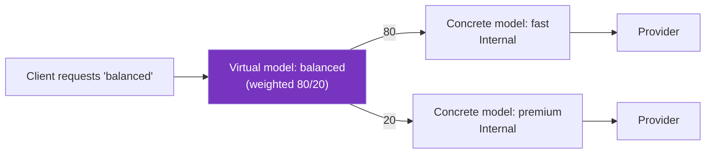

Learn how the `` API provides a model-centric way to serve LLMs in Kubernetes.

> [!WARNING]
> The `` API is experimental and disabled by default. To enable it, set the `agentgatewayModels.enabled=true` Helm value on the  control plane.

## About

Clients talk to an LLM gateway in terms of models. They send a request with `"model": "gpt-5-mini"` in the body and expect the gateway to figure out the rest.

Historically in Kubernetes, you assembled that experience yourself from a listener, an `HTTPRoute` that matched on the request body, an  for each provider, and an  for the AI behavior. Every LLM deployment needed the same scaffolding, and that scaffolding stayed visible in your configuration.

The `` API removes the scaffolding. Each resource declares one client-facing model and attaches directly to a Gateway listener. Agentgateway derives the routing, so you configure only what is specific to your setup.

Every model that attaches to the same listener is aggregated into a single model table. From that table, the listener serves the following behavior.

- Model extraction from the request body.
- The standard LLM API paths, such as `/v1/chat/completions`.
- Model discovery on `/v1/models`.
- Per-model provider routing.
- OpenAI-compatible error responses for unknown models.

### Model-centric vs. route-centric configuration

Both approaches are supported. Use this table to choose.

| Question | Answer | Recommendation |
|----------|--------|----------------|
| Are you exposing LLM models to clients through the standard OpenAI-compatible paths? | Yes | `` |
| Do you want `/v1/models` discovery without configuring it? | Yes | `` |
| Do you need to route on custom paths, methods, or query parameters? | Yes |  and `HTTPRoute` |
| Do you need to attach an  to an individual model? | Yes |  and `HTTPRoute` |
| Do you need to route to non-LLM backends on the same listener? | Either | Both can share one listener |

> [!NOTE]
> An  cannot target an ``. Policies that you attach to the Gateway apply to every model on that listener. To scope a policy to one model, either use the inline `spec.policies` field on the ``, or use the  and `HTTPRoute` approach. For the policies that the inline field supports, see [Model policies](#model-policies).

## Listener opt-in

A listener serves LLM traffic only when it explicitly allows the `` route kind in `allowedRoutes.kinds`.

```yaml
apiVersion: gateway.networking.k8s.io/v1
kind: Gateway
metadata:
  name: agentgateway-proxy
  namespace: 
spec:
  gatewayClassName: 
  listeners:
  - name: http
    port: 80
    protocol: HTTP
    allowedRoutes:
      namespaces:
        from: All
      # Enables the listener's built-in LLM paths
      kinds:
      - group: agentgateway.dev
        kind: 
```

Adding the route kind turns on the listener's built-in LLM paths. At first the listener has zero models, so every request returns a `model_not_found` error. Models become available as they attach.

A listener can allow both `` and `HTTPRoute`, so LLM endpoints and ordinary HTTP routes coexist on the same port. When you set `allowedRoutes.kinds`, the listener accepts only the kinds that you list, so include every kind that you need.

```yaml
apiVersion: gateway.networking.k8s.io/v1
kind: Gateway
metadata:
  name: agentgateway-proxy
  namespace: 
spec:
  gatewayClassName: 
  listeners:
  - name: http
    port: 80
    protocol: HTTP
    allowedRoutes:
      namespaces:
        from: All
      kinds:
      - group: agentgateway.dev
        kind: 
      - group: gateway.networking.k8s.io
        kind: HTTPRoute
```

## Concrete and virtual models

Every model is an `` resource. A model either names a particular language model the provider that serves it ("concrete" model), or routes across other models ("virtual" model). The two fields are mutually exclusive.

| Kind | Sets | Role |
|------|------|------|
| [Concrete model](#concrete-models) | `spec.provider` | A particular model from an LLM provider that serves as the destination. The provider that is named in the spec serves the request. |
| [Virtual model](#virtual-models) | `spec.virtualModel` | A client-facing name that resolves to a concrete model at request time. It has no provider of its own. |

The following diagram shows a client requesting the `balanced` virtual model, which splits traffic 80/20 across two internal concrete models. Each concrete model forwards to its provider.



> [!NOTE]
> Publishing a friendly name is not what makes a model virtual. A concrete model can publish any client-facing name and rewrite it for the provider with a `model` transformation, which is [aliasing](#model-aliasing). That model is still concrete, because a single provider serves it. A model is virtual only when it routes across several other models.

## Concrete models

A model that names its provider is a concrete model. It is an `` that sets `spec.provider`, so the gateway knows which provider serves the request.

The following example shows the pieces that a concrete model configures. Only `parentRefs` and `provider` are required.

```yaml
apiVersion: agentgateway.dev/v1alpha1
kind: 
metadata:
  name: gpt-5-mini
  namespace: 
spec:
  # The Gateway listener that serves this model
  parentRefs:
  - group: gateway.networking.k8s.io
    kind: Gateway
    name: agentgateway-proxy
    sectionName: http
  # The model name that clients request; defaults to metadata.name
  match:
    model: gpt-5-mini
  # Whether clients can request this model directly
  visibility: Public
  # The provider that serves this model
  provider: OpenAI
  # Optional: override the provider address
  baseURL: https://api.openai.com
  # Optional: policies that apply to this model only
  policies:
    auth:
      secretRef:
        name: openai-secret
```

{}

| Field | Description |
|-------|-------------|
| `parentRefs` | The Gateway and listener that serve this model. The listener must allow the `` route kind. Omit `sectionName` to attach to every eligible listener on the Gateway. |
| [`match.model`](#model-matching) | The model name that selects this resource in a client request. Defaults to `metadata.name`. |
| [`visibility`](#visibility) | Whether clients can request the model directly. Defaults to `Public`. |
| [`provider`](#providers) | The provider that serves the model, such as `OpenAI`. |
| `baseURL` | Overrides the provider address and base path prefix. |
| [`policies`](#model-policies) | Credentials, authorization, transformations, and other settings that apply to this model only. |

### Model matching

Use `spec.match.model` to control which model name in a request selects this resource. When you omit `spec.match`, the model matches `metadata.name` exactly.

For example, a model named `gpt-5-mini` with no `spec.match` serves requests that send `"model": "gpt-5-mini"` in the body. To publish a different name, set `spec.match.model` explicitly.

A match must use one of the following forms. Wildcards in any other position are rejected.

| Form | Example | Matches |
|------|---------|---------|
| Exact | `gpt-5-mini` | Only `gpt-5-mini`. |
| Suffix wildcard | `openai/*` | Any model name that starts with `openai/`. |
| Prefix wildcard | `*-latest` | Any model name that ends with `-latest`. |
| Catch-all | `*` | Any model name. |

A wildcard model usually pairs with a `model` transformation, because the provider expects its own model name rather than the client-facing one. For an example, see [Serve a model]().

### Model aliasing

A model resource is an alias by construction. The name that clients request is `metadata.name` or `match.model`, and the name that the provider receives comes from a `model` transformation. To publish `fast` as an alias for `gpt-3.5-turbo`, create a model named `fast` that rewrites the field.

```yaml
apiVersion: agentgateway.dev/v1alpha1
kind: 
metadata:
  name: fast
  namespace: 
spec:
  parentRefs:
  - group: gateway.networking.k8s.io
    kind: Gateway
    name: agentgateway-proxy
    sectionName: http
  provider: OpenAI
  policies:
    transformations:
    - field: model
      expression: '"gpt-3.5-turbo"'
```

Each alias is a separate resource, so it can carry its own credentials, authorization rules, and guardrails. For the  equivalent, see [Model aliasing]().

### Visibility

Use `spec.visibility` to control whether clients can request a model directly.

| Value | Behavior |
|-------|----------|
| `Public` (default) | Clients can request the model directly, and it appears in `/v1/models`. |
| `Internal` | Only virtual models can select the model. Direct requests return `model_not_found`, and the model is excluded from `/v1/models`. |

Set `Internal` on concrete models that exist only as virtual model targets.

### Model policies

Concrete models accept an inline `spec.policies` block that supports the following policies. Each policy applies only to the model that declares it.

| Policy | Purpose |
|--------|---------|
| `auth` | Credentials for authenticating to the provider. |
| `authorization` | Rules that clients must satisfy to use the model. |
| `transformations` | CEL transformations on fields in the provider request body. |
| `promptGuard` | Guardrails on requests and responses. |
| `health` | What counts as an unhealthy response, and when to evict. |
| `tls` | TLS settings for connections to the provider. |
| `tunnel` | Proxy tunnel used to reach the provider. |
| `headers` | Request and response header changes. |

Virtual models cannot set `spec.policies`, because a virtual model has no provider of its own to authenticate to, transform for, or health check. Configure these policies on the concrete models that the virtual model targets.

### Providers

Set `spec.provider` to one of the supported provider names, such as `OpenAI`. For a full list of providers, see the [model provider API docs]().

Some providers require a matching settings field.

- `Azure` requires `spec.azure`.
- `VertexAI` requires `spec.vertexai`.
- `Bedrock` requires `spec.bedrock`.
- `Custom` requires `spec.custom`.
- `Ollama` requires `spec.baseURL`.

Use `spec.custom.backendRef` to serve a model from a Kubernetes backend, such as an `InferencePool`.

Use `spec.baseURL` to override the provider address and base path prefix. It must be an absolute `http` or `https` URL with a host, and it cannot target localhost, loopback, or link-local addresses. Query parameters, fragments, and user info are not supported.

## Virtual models

A model that routes across other models is a virtual model. It is an `` that sets `spec.virtualModel` instead of `spec.provider`, so it has no provider of its own. It publishes one client-facing name and selects a concrete model to serve each request.

The following example splits traffic across two concrete models by weight.

```yaml
apiVersion: agentgateway.dev/v1alpha1
kind: 
metadata:
  name: balanced
  namespace: 
spec:
  # The Gateway listener that serves this model
  parentRefs:
  - group: gateway.networking.k8s.io
    kind: Gateway
    name: agentgateway-proxy
    sectionName: http
  # Routing strategy across other AgentgatewayModel resources
  virtualModel:
    weighted:
      targets:
      - modelRef:
          name: internal-fast
        weight: 80
      - modelRef:
          name: internal-premium
        weight: 20
```

### Routing strategies

Each virtual model uses exactly one strategy.

| Strategy | Selects a target by | Use it for |
|----------|---------------------|------------|
| `weighted` | Relative weight. | Traffic splitting, canary rollouts, and A/B tests. |
| `failover` | Priority group, then health and latency. | Resiliency when a provider degrades. |
| `conditional` | The first CEL expression that evaluates to `true`. | Tiering by header, body, or other request context. |

For examples of each strategy, see [Virtual models]().

### Constraints

- Targets must be `` resources in the same namespace. Cross-namespace references are not supported.
- Virtual models must be `Public`. The restriction stops virtual models from targeting each other, which could otherwise create routing loops.
- Virtual models cannot set `spec.policies`. Configure policies on the concrete target models instead.

## Known limitations

- The API is experimental and turned off by default.
- An  cannot target an ``.
- Status is not yet reported on the `` resource. The `status.parents` field stays empty even when a model serves traffic correctly. To confirm that models attached, check the Gateway listener's `attachedRoutes` count, or list the models on `/v1/models`.
