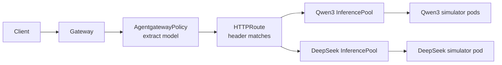

Route requests to multiple Gateway API Inference Extension `InferencePool`
backends based on the `model` field in the request body.

This guide extends the [inference routing
quickstart](). In the
quickstart, one `HTTPRoute` sends all inference requests to one simulated
Qwen3 `InferencePool`. In this guide, you add a second simulated model server
and `InferencePool`, then use an 
to extract the requested model name before route matching.

The example requests use OpenAI-style completions because the simulator exposes
that API shape by default. 
also supports [custom providers]()
when you need to declare different provider API formats, such as Anthropic
Messages or other non-default paths and request shapes. The
[EPP](https://llm-d.ai/docs/architecture/core/router) supports request parsers
such as Anthropic, Vertex AI, vLLM HTTP, vLLM gRPC, and passthrough parsers.
For parser options, see the
[llm-d Router parser docs](https://github.com/llm-d/llm-d-router/blob/main/pkg/epp/framework/plugins/requesthandling/parsers/README.md).

## Agentgateway content routing and BBR

Historically, Gateway API Inference Extension Body Based Router (BBR) handled model-name routing as
a separate payload-processing service in the request path. The gateway called
that processor through Envoy external processing, the processor parsed the body
and added routing metadata, and the route matched on that metadata. That
payload-processing component now lives in llm-d as the
[llm-d inference payload processor](https://github.com/llm-d/llm-d-inference-payload-processor);
the EPP and some related API types have also moved into llm-d.

With , you do not need an
external processing callout to BBR for this pattern. The
 runs as native
 content-based routing before
route selection, extracts the model name, and lets the `HTTPRoute` select the
right `InferencePool`. This avoids an extra ext-proc hop, can reduce request
latency, and removes a separate payload processor binary and deployment from
the operational path. You still use the llm-d EPP that is created with each
`InferencePool` for endpoint selection within the chosen pool.

## What you'll build

In this guide, you will:

1. Start from the inference routing quickstart with one Qwen3 simulator and
   one Qwen3 `InferencePool`.
2. Deploy a DeepSeek simulator and a second `InferencePool`.
3. Extract the request body `model` field into the
   `X-Gateway-Base-Model-Name` header.
4. Match that header in an `HTTPRoute` to route each request to the right
   `InferencePool`.



## Before you begin

Complete the [inference routing quickstart](). The quickstart creates:

- A `vllm-qwen3-32b` simulator deployment.
- A `vllm-qwen3-32b` `InferencePool`.
- An `inference-gateway` Gateway.
- An `llm-route` HTTPRoute that routes directly to the Qwen3 `InferencePool`.

Set the same variables that the quickstart uses.

```bash
export IGW_CHART_VERSION=v1.5.0
export GATEWAY_PROVIDER=none
```

## Deploy a second model server

Deploy another [llm-d-inference-sim](https://github.com/llm-d/llm-d-inference-sim)
simulator that serves the request format used in this guide. This example uses
a DeepSeek base model with two adapter names, `ski-resorts` and
`movie-critique`, so that you can test both base-model and adapter routing.

```yaml
kubectl apply -f - <<EOF
apiVersion: apps/v1
kind: Deployment
metadata:
  name: vllm-deepseek-r1
spec:
  replicas: 1
  selector:
    matchLabels:
      app: vllm-deepseek-r1
  template:
    metadata:
      labels:
        app: vllm-deepseek-r1
        inference.networking.k8s.io/engine-type: vllm
    spec:
      containers:
      - name: vllm-sim
        image: "ghcr.io/llm-d/llm-d-inference-sim:v0.8.2"
        imagePullPolicy: Always
        args:
        - "--model"
        - "deepseek/DeepSeek-r1"
        - "--port"
        - "8000"
        - "--max-loras"
        - "2"
        - "--lora-modules"
        - '{"name": "ski-resorts"}'
        - '{"name": "movie-critique"}'
        env:
        - name: POD_NAME
          valueFrom:
            fieldRef:
              fieldPath: metadata.name
        - name: NAMESPACE
          valueFrom:
            fieldRef:
              fieldPath: metadata.namespace
        ports:
        - containerPort: 8000
          name: http
          protocol: TCP
        resources:
          requests:
            cpu: 10m
EOF
```

Verify that the simulator deployment is available.

```bash
kubectl wait --for=condition=available --timeout=60s deployment/vllm-deepseek-r1
```

## Deploy a second InferencePool

Install another `InferencePool` and Endpoint Picker Extension (EPP) with the
same chart that the quickstart uses. The pool selects the DeepSeek simulator
pod by its `app: vllm-deepseek-r1` label.

The EPP resource settings in this example keep the deployment small enough for
local testing environments such as kind. Size EPP resources for your production
traffic volume, request parsers, and scheduling plugins.

```bash
helm install vllm-deepseek-r1 \
  --set inferencePool.modelServers.matchLabels.app=vllm-deepseek-r1 \
  --set inferenceExtension.resources.requests.cpu=10m \
  --set inferenceExtension.resources.requests.memory=128Mi \
  --set inferenceExtension.resources.limits.memory=512Mi \
  --set provider.name=$GATEWAY_PROVIDER \
  --version $IGW_CHART_VERSION \
  oci://registry.k8s.io/gateway-api-inference-extension/charts/inferencepool
```

Verify that both pools are available.

```bash
kubectl get inferencepool
```

Example output:

```text
NAME                AGE
vllm-qwen3-32b      10m
vllm-deepseek-r1    1m
```

## Extract the model name before routing

Create an  that targets the
Gateway with `phase: PreRouting`. The policy reads the JSON request body,
maps model aliases to a base model name, and writes the result to the
`X-Gateway-Base-Model-Name` header before the `HTTPRoute` rules are evaluated.

```yaml
kubectl apply -f - <<EOF
apiVersion: 
kind: 
metadata:
  name: inference-model-routing
spec:
  targetRefs:
  - group: gateway.networking.k8s.io
    kind: Gateway
    name: inference-gateway
  traffic:
    phase: PreRouting
    transformation:
      request:
        set:
        - name: X-Gateway-Base-Model-Name
          value: |
            {
              "Qwen/Qwen3-32B": "Qwen/Qwen3-32B",
              "food-review-1": "Qwen/Qwen3-32B",
              "deepseek/DeepSeek-r1": "deepseek/DeepSeek-r1",
              "ski-resorts": "deepseek/DeepSeek-r1",
              "movie-critique": "deepseek/DeepSeek-r1"
            }[string(json(request.body).model)]
EOF
```

The adapter entries, such as `food-review-1`, `ski-resorts`, and
`movie-critique`, represent user-facing model names. Keep every base model and
adapter name unique so each request maps to exactly one `InferencePool`.

## Route to the matching InferencePool

Replace the quickstart `HTTPRoute` with route rules that match on the
`X-Gateway-Base-Model-Name` header. Requests for Qwen3 route to the Qwen3 pool,
and requests for DeepSeek route to the DeepSeek pool.

```yaml
kubectl apply -f - <<EOF
apiVersion: gateway.networking.k8s.io/v1
kind: HTTPRoute
metadata:
  name: llm-route
spec:
  parentRefs:
  - group: gateway.networking.k8s.io
    kind: Gateway
    name: inference-gateway
  rules:
  - matches:
    - path:
        type: PathPrefix
        value: /v1/
      headers:
      - type: Exact
        name: X-Gateway-Base-Model-Name
        value: Qwen/Qwen3-32B
    backendRefs:
    - group: inference.networking.k8s.io
      kind: InferencePool
      name: vllm-qwen3-32b
    timeouts:
      request: 300s
  - matches:
    - path:
        type: PathPrefix
        value: /v1/
      headers:
      - type: Exact
        name: X-Gateway-Base-Model-Name
        value: deepseek/DeepSeek-r1
    backendRefs:
    - group: inference.networking.k8s.io
      kind: InferencePool
      name: vllm-deepseek-r1
    timeouts:
      request: 300s
EOF
```


This example routes directly from the `HTTPRoute` to each `InferencePool`. To
combine `InferencePool` endpoint selection with agentgateway LLM features such
as token rate limiting, guardrails, transformations, and LLM observability,
route the `HTTPRoute` to 
resources that use custom providers with `InferencePool` `backendRef` targets.
For more information, see [Use AI policies with
InferencePools]().


## Try it out

Get the gateway address.

For clusters that provide a LoadBalancer address, use the Gateway status.

```bash
IP=$(kubectl get gateway/inference-gateway -o jsonpath='{.status.addresses[0].value}')
PORT=80
```

For local clusters such as kind, port-forward the Gateway service.

```bash
GW_PORT=$(kubectl get svc/inference-gateway -o jsonpath='{.spec.ports[0].port}')
kubectl port-forward svc/inference-gateway 8080:${GW_PORT}
```

In another terminal, set the request address.

```bash
IP=localhost
PORT=8080
```

Send a request to the Qwen3 model.

```bash
curl -i ${IP}:${PORT}/v1/chat/completions \
  -H 'Content-Type: application/json' \
  -d '{
    "model": "Qwen/Qwen3-32B",
    "messages": [
      {
        "role": "user",
        "content": "Write one sentence about gateway routing."
      }
    ],
    "max_tokens": 40,
    "temperature": 0
  }'
```

Send a request to the DeepSeek model.

```bash
curl -i ${IP}:${PORT}/v1/chat/completions \
  -H 'Content-Type: application/json' \
  -d '{
    "model": "deepseek/DeepSeek-r1",
    "messages": [
      {
        "role": "user",
        "content": "Write one sentence about model routing."
      }
    ],
    "max_tokens": 40,
    "temperature": 0
  }'
```

You can also use an adapter name from the policy map. The following request
routes to the DeepSeek pool because `movie-critique` maps to
`deepseek/DeepSeek-r1`.

```bash
curl -i ${IP}:${PORT}/v1/chat/completions \
  -H 'Content-Type: application/json' \
  -d '{
    "model": "movie-critique",
    "messages": [
      {
        "role": "user",
        "content": "Recommend one movie in a witty tone."
      }
    ],
    "max_tokens": 40,
    "temperature": 0
  }'
```

## Troubleshooting

If requests do not route as expected, check the following items.

- The  targets the Gateway,
  not the `HTTPRoute`, and uses `traffic.phase: PreRouting`.
- The value in the request body `model` field exists in the policy map.
- The header match values in the `HTTPRoute` match the base model values from
  the policy map exactly.
- Both `InferencePool` resources are accepted and their selected simulator pods
  are ready.

## Cleanup



```bash
kubectl delete httproute llm-route
kubectl delete  inference-model-routing
helm uninstall vllm-deepseek-r1
kubectl delete deployment vllm-deepseek-r1
```
