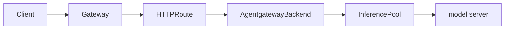



## Use AI policies with InferencePools {#ai-policies}

The quickstart routes directly from an HTTPRoute to an InferencePool. Use that
pattern when you only need Gateway API Inference Extension endpoint selection.

To also use agentgateway LLM features, such as token counting, token-based rate
limits, guardrails, transformations, and LLM observability, route the HTTPRoute
to an . Then, configure a custom
provider on the  that targets the
InferencePool.



```yaml
apiVersion: agentgateway.dev/v1alpha1
kind: 
metadata:
  name: qwen-inferencepool
  namespace: 
spec:
  ai:
    provider:
      custom:
        backendRef:
          group: inference.networking.k8s.io
          kind: InferencePool
          name: vllm-qwen3-32b
        model: Qwen/Qwen3-32B
        formats:
        - type: Completions
          path: /v1/chat/completions
---
apiVersion: gateway.networking.k8s.io/v1
kind: HTTPRoute
metadata:
  name: llm-route
  namespace: 
spec:
  parentRefs:
  - group: gateway.networking.k8s.io
    kind: Gateway
    name: inference-gateway
  rules:
  - matches:
    - path:
        type: PathPrefix
        value: /v1/chat/completions
    backendRefs:
    - group: agentgateway.dev
      kind: 
      name: qwen-inferencepool
    timeouts:
      request: 300s
```

The following example applies an LLM token budget to the same HTTPRoute. Because
the route points to an  with a
custom provider, agentgateway can parse the LLM response usage and enforce the
token limit while still using the InferencePool for endpoint selection.

```yaml
apiVersion: 
kind: 
metadata:
  name: qwen-token-budget
  namespace: 
spec:
  targetRefs:
  - group: gateway.networking.k8s.io
    kind: HTTPRoute
    name: llm-route
  traffic:
    rateLimit:
      local:
      - tokens: 1000
        unit: Minutes
```

For more token rate limiting details, see
[Rate limiting for LLMs]().

For more custom provider examples, see
[Custom providers]().

To route requests to multiple InferencePools based on the request body `model`
field, see [Multiple inference pools]().


Most users can keep the default llm-d Router OpenAI parser and send
OpenAI-compatible requests, such as `/v1/chat/completions`. If clients send a
different request format, configure the
[EPP](https://llm-d.ai/docs/architecture/core/router) parser, such as
`router.epp.parser`, for that client-facing format. For parser options, see the
[llm-d Router parser docs](https://github.com/llm-d/llm-d-router/blob/main/pkg/epp/framework/plugins/requesthandling/parsers/README.md).

