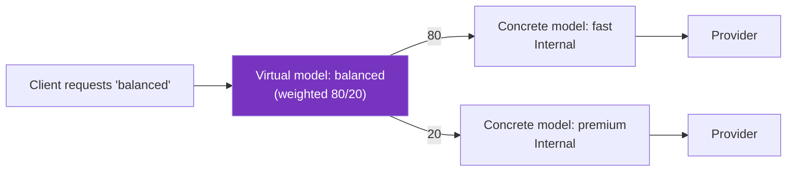

Learn how the `` API provides a model-centric way to serve LLMs in Kubernetes.

> [!WARNING]
> The `` API is experimental and disabled by default. The `v1alpha1` API is subject to change in a future release. To enable it, set the `agentgatewayModels.enabled=true` Helm value on the  control plane.

## About

Clients talk to an LLM gateway in terms of models. They send a request with `"model": "gpt-5-mini"` in the body and expect the gateway to figure out the rest.

Historically in Kubernetes, you assembled that experience yourself from a listener, an `HTTPRoute` that matched on the request body, an  for each provider, and an  for the AI behavior. Every LLM deployment needed the same scaffolding, and that scaffolding stayed visible in your configuration.

The `` API removes the scaffolding. Each resource declares one client-facing model and attaches directly to a Gateway listener. Agentgateway derives the routing, so you configure only what is specific to your setup.

Every model that attaches to the same listener is aggregated into a single model table. From that table, the listener serves the following behavior.

- Model extraction from the request body.
- The standard LLM API paths, such as `/v1/chat/completions`.
- Model discovery on `/v1/models`.
- Per-model provider routing.
- OpenAI-compatible error responses for unknown models.

### Model-centric compared to route-centric configuration

Both approaches are supported. Use this table to choose.

| Question | Answer | Recommendation |
|----------|--------|----------------|
| Are you exposing LLM models to clients through the standard OpenAI-compatible paths? | Yes | `` |
| Do you want `/v1/models` discovery without configuring it? | Yes | `` |
| Do you need to route on paths, methods, or query parameters? | Yes |  and `HTTPRoute` |
| Do you need to attach an  to an individual model? | Yes |  and `HTTPRoute` |
| Do you need to route to non-LLM backends on the same listener? | Either | Both can share one listener |

> [!NOTE]
> An  cannot target an ``. Policies that you attach to the Gateway apply to every model on that listener. To scope a policy to one model, either use the inline `spec.policies` field on the model, or use the  and `HTTPRoute` approach. For the policies that the inline field supports, see [Model policies](#model-policies).

## Listener opt-in

A listener serves LLM traffic only when it explicitly allows the `` route kind.

```yaml
allowedRoutes:
  kinds:
  - group: agentgateway.dev
    kind: 
```

Adding the route kind turns on the listener's built-in LLM paths. At first the listener has zero models, so every request returns a `model_not_found` error. Models become available as they attach.

A listener can allow both `` and `HTTPRoute`, so LLM endpoints and ordinary HTTP routes coexist on the same port.

```yaml
allowedRoutes:
  kinds:
  - group: agentgateway.dev
    kind: 
  - group: gateway.networking.k8s.io
    kind: HTTPRoute
```

## Concrete and virtual models

A model is either concrete or virtual, never both.

- A **concrete model** names a `provider` that serves it. It is the destination.
- A **virtual model** defines a `virtualModel` routing strategy across other `` resources. It is a client-facing name that resolves to a concrete model at request time.

The following diagram shows a client requesting the `balanced` virtual model, which splits traffic 80/20 across two internal concrete models. Each concrete model forwards to its provider.



## Model matching

Use `spec.match.model` to control which model name in a request selects this resource. When you omit it, the model matches `metadata.name` exactly.

A match must use one of the following forms. Wildcards in any other position are rejected.

| Form | Example | Matches |
|------|---------|---------|
| Exact | `gpt-5-mini` | Only `gpt-5-mini`. |
| Suffix wildcard | `openai/*` | Any model name that starts with `openai/`. |
| Prefix wildcard | `*-latest` | Any model name that ends with `-latest`. |
| Catch-all | `*` | Any model name. |

A wildcard model usually pairs with a `model` transformation, because the provider expects its own model name rather than the client-facing one. For an example, see [Serve a model]().

## Visibility

Use `spec.visibility` to control whether clients can request a model directly.

| Value | Behavior |
|-------|----------|
| `Public` (default) | Clients can request the model directly, and it appears in `/v1/models`. |
| `Internal` | Only virtual models can select the model. Direct requests return `model_not_found`, and the model is excluded from `/v1/models`. |

Virtual models must be `Public`. The restriction stops virtual models from targeting each other, which could otherwise create routing loops.

## Model policies

Concrete models accept an inline `spec.policies` block that supports the following policies.

| Policy | Purpose |
|--------|---------|
| `auth` | Credentials for authenticating to the provider. |
| `authorization` | Rules that clients must satisfy to use the model. |
| `transformations` | CEL transformations on fields in the provider request body. |
| `promptGuard` | Guardrails on requests and responses. |
| `health` | What counts as an unhealthy response, and when to evict. |
| `tls` | TLS settings for connections to the provider. |
| `tunnel` | Proxy tunnel used to reach the provider. |
| `headers` | Request and response header changes. |

Virtual models cannot set `spec.policies`. Configure policies on the concrete target models instead.

## Providers

Set `spec.provider` to one of the supported provider names, such as `OpenAI`. For a full list of providers, see the [model provider API docs]().

Some providers require a matching settings field.

- `Azure` requires `spec.azure`.
- `VertexAI` requires `spec.vertexai`.
- `Bedrock` requires `spec.bedrock`.
- `Custom` requires `spec.custom`.
- `Ollama` requires `spec.baseURL`.

Use `spec.custom.backendRef` to serve a model from a Kubernetes backend, such as an `InferencePool`.

Use `spec.baseURL` to override the provider address and base path prefix. It must be an absolute `http` or `https` URL with a host, and it cannot target localhost, loopback, or link-local addresses. Query parameters, fragments, and user info are not supported.

## Known limitations

- The API is experimental and turned off by default.
- An  cannot target an ``.
- Status is not yet reported on the `` resource. The `status.parents` field stays empty even when a model serves traffic correctly. To confirm that models attached, check the Gateway listener's `attachedRoutes` count, or list the models on `/v1/models`.
