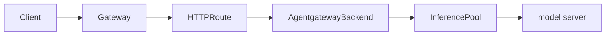

Use custom providers for unsupported, self-hosted, or non-standard LLM
targets when you want to declare the provider target and supported API formats
explicitly.

Custom providers are useful when:

- The provider supports only a subset of OpenAI APIs, such as chat completions
  but not responses.
- The provider supports multiple API shapes, such as OpenAI chat completions and
  Anthropic messages.
- The provider uses non-default paths for one or more API formats.
- You want to use LLM features, such as token counting, rate limiting,
  guardrails, transformations, and observability, with an
   that routes to a Kubernetes
  Service or InferencePool.

For managed providers such as OpenAI, Anthropic, Gemini, Vertex AI, Azure,
Bedrock, Ollama, Baseten, Cerebras, Cohere, DeepInfra, DeepSeek, Fireworks AI,
Groq, Hugging Face, Mistral, OpenRouter, Together AI, and xAI, use the
dedicated provider page unless you need explicit format or backend target
control.

## Supported targets

A custom provider must specify exactly one upstream target.

| Target | When to use |
|--------|-------------|
| `host` and `port` | Route to a DNS name or external endpoint. |
| `backendRef` to a Service | Route to a namespace-local Kubernetes Service. |
| `backendRef` to an InferencePool | Use Gateway API Inference Extension endpoint selection and agentgateway LLM features together. |

The `backendRef` must be namespace-local and can target only a Service or an
InferencePool. Service references require a port. InferencePool references do
not.

## Supported formats

Set `custom.formats` to declare the provider-native formats that the upstream
provider supports. You can also set `formats[].path` when the provider uses a
non-default path for that format.

| Format | Default upstream path |
|--------|-----------------------|
| `Completions` | `/v1/chat/completions` |
| `Messages` | `/v1/messages` |
| `Responses` | `/v1/responses` |
| `Embeddings` | `/v1/embeddings` |
| `AnthropicTokenCount` | `/v1/messages/count_tokens` |
| `Realtime` | `/v1/realtime` |

Agentgateway chooses from the provider-native formats that you declare. For
example, if a custom provider supports OpenAI chat completions but not OpenAI
responses, declare only `Completions`. If the provider exposes multiple API
shapes, declare each supported format and optionally set a per-format path.

| Client request format | Preferred custom provider format |
|-----------------------|----------------------------------|
| OpenAI chat completions | `Completions` |
| Anthropic messages | `Messages` |
| OpenAI responses | `Responses`, then `Completions` |
| OpenAI embeddings | `Embeddings` |
| Anthropic token count | `AnthropicTokenCount` |
| OpenAI realtime | `Realtime` |

If no declared provider format can serve the client request format,
agentgateway rejects the request.

## Route to a host and port

Use `host` and `port` when the LLM provider is reachable by DNS name or IP
address. The following example declares that the provider supports both OpenAI
chat completions and Anthropic messages.

```yaml
apiVersion: agentgateway.dev/v1alpha1
kind: 
metadata:
  name: ollama-custom
  namespace: 
spec:
  ai:
    provider:
      custom:
        model: llama3.2
        formats:
        - type: Completions
          path: /v1/chat/completions
        - type: Messages
          path: /v1/messages
      host: ollama..svc.cluster.local
      port: 11434
```

## Route to a Service

Use a Service `backendRef` when the LLM provider runs behind a Kubernetes
Service in the same namespace as the .

```yaml
apiVersion: agentgateway.dev/v1alpha1
kind: 
metadata:
  name: local-llm
  namespace: 
spec:
  ai:
    provider:
      custom:
        backendRef:
          name: llm-service
          port: 8080
        model: llama3
        formats:
        - type: Completions
```

## Route to an InferencePool

Use an InferencePool `backendRef` when you want the Endpoint Picker Extension
(EPP) to select a model server, but you also want agentgateway to run the LLM
request and response pipeline.

With this flow, the route points to the ,
and the custom provider points to the InferencePool.



```yaml
apiVersion: agentgateway.dev/v1alpha1
kind: 
metadata:
  name: qwen-inferencepool
  namespace: 
spec:
  ai:
    provider:
      custom:
        backendRef:
          group: inference.networking.k8s.io
          kind: InferencePool
          name: vllm-qwen25-15b-instruct
        model: Qwen/Qwen2.5-1.5B-Instruct
        formats:
        - type: Completions
          path: /v1/chat/completions
---
apiVersion: gateway.networking.k8s.io/v1
kind: HTTPRoute
metadata:
  name: qwen
  namespace: 
spec:
  parentRefs:
  - name: agentgateway-proxy
    namespace: 
  rules:
  - matches:
    - path:
        type: PathPrefix
        value: /v1/chat/completions
    backendRefs:
    - group: agentgateway.dev
      kind: 
      name: qwen-inferencepool
```


Most users can keep the default llm-d Router OpenAI parser and send
OpenAI-compatible requests, such as `/v1/chat/completions`. If clients send a
different request format, configure the llm-d Router EPP parser, such as
`router.epp.parser`, for that client-facing format. For parser options, see the
[llm-d Router parser docs](https://github.com/llm-d/llm-d-router/blob/main/pkg/epp/framework/plugins/requesthandling/parsers/README.md).


## Limitations

- Custom providers cannot target another .
- Custom provider `backendRef` can target only namespace-local Services and
  InferencePools.
- Custom providers do not add arbitrary gRPC provider support.
- Do not combine provider-level `path` or `pathPrefix` with `formats[].path`.
  Use one path configuration style per provider.
- The `Detect` and `Passthrough` route modes are not custom provider formats.
  Use provider routes when you need those modes for a request path.
