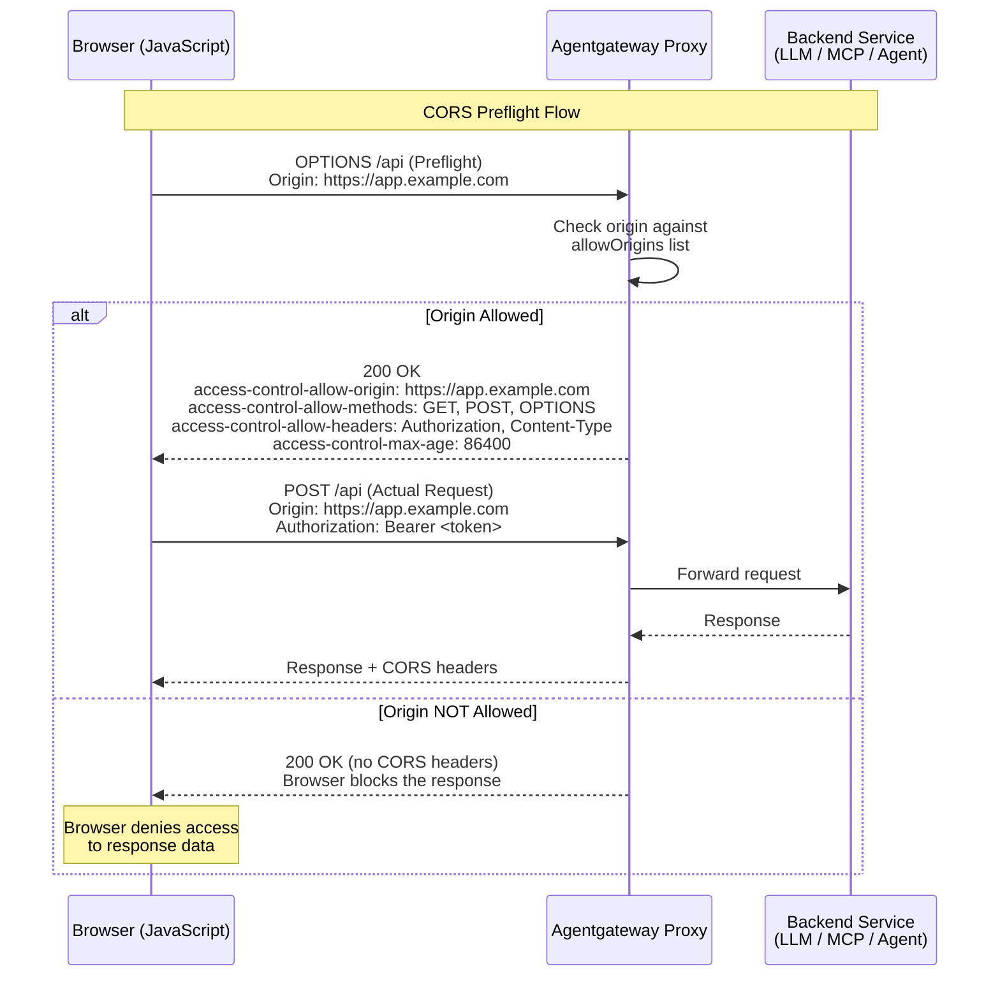

Attaches to: 




# ============================================================================
# Doc test coverage for this guide (these comments are not rendered on the page)
# ============================================================================
# WHAT THIS TEST VALIDATES:
#   * All three example configs (Simplified LLM, Simplified MCP, and
#     Routing-based) are accepted by agentgateway (--validate-only), covering
#     `allowOrigins`, `allowMethods`, `allowHeaders`, `exposeHeaders`,
#     `allowCredentials`, and `maxAge` in both duration (`10m`, `100s`) forms.
#   * The "Origin Allowed" branch of the CORS preflight diagram: with the
#     Routing-based config loaded, an OPTIONS preflight from
#     https://app.example.com returns 200 with access-control-allow-origin,
#     -allow-methods, -allow-headers, -allow-credentials, -expose-headers, and
#     -max-age set to the configured values (maxAge 100s is emitted as `100`).
#   * The "Origin NOT Allowed" branch: an OPTIONS preflight from an origin that
#     is not in `allowOrigins` still returns 200 but with no
#     access-control-allow-origin header, which is what causes the browser to
#     block the response.
#
# WHAT THIS TEST DOES NOT VALIDATE (and why):
#   * That a browser enforces the policy - different layer; as the page's own tip
#     notes, curl and other HTTP clients ignore CORS headers, so the test can only
#     assert the headers agentgateway returns.
#   * The actual (non-preflight) cross-origin request being forwarded with CORS
#     headers - requires config/traffic the page omits; the Routing-based example
#     points at a placeholder backend (`api.example.com:443`) that the test cannot
#     stand up. The preflight is answered by agentgateway itself, so it is
#     assertable.
#   * The Simplified LLM and MCP configs at runtime - external dependency; they
#     need an OpenAI API key and an npx-launched MCP server respectively, so they
#     are only validated as config.


# The Simplified (LLM) example reads the API key from the environment.
# --validate-only still resolves env vars, so a placeholder is enough here.
export OPENAI_API_KEY="${OPENAI_API_KEY:-test}"


## About CORS

Cross-origin resource sharing (CORS) is a browser security mechanism which allows a server to control which origins can request and interact with resources that are hosted on a different domain. By default, web browsers only allow requests to resources that are hosted on the same domain as the web page that served the original request. Access to web pages or resources that are hosted on a different domain is restricted to prevent potential security vulnerabilities, such as cross-site request forgery (CRSF).

When CORS is enabled in a web browser and a request for a different domain comes in, the web browser checks whether this request is allowed or not. To do that, it typically sends a preflight request (HTTP `OPTIONS` method) to the server or service that serves the requested resource. The service returns the methods that are permitted to send the actual cross-origin request, such as GET, POST, etc. If the request to the different domain is allowed, the response includes CORS-specific headers that instruct the web browser how to make the cross-origin request. For example, the CORS headers typically include the origin that is allowed to access the resource, and the credentials or headers that must be included in the cross-origin request.

Review the following diagram to see an example CORS request flow: 


Note that the preflight request is optional. Web browsers can also be configured to send the cross-origin directly. However, access to the request resource is granted only if CORS headers were returned in the response. If no headers are returned during the preflight request, the web browser denies access to the resource in the other domain.

CORS policies are typically implemented to limit access to server resources for JavaScripts that are embedded in a web page, such as:

* A JavaScript on a web page at `example.com` tries to access a different domain, such as `api.com`.
* A JavaScript on a web page at `example.com` tries to access a different subdomain, such as `api.example.com`.
* A JavaScript on a web page at `example.com` tries to access a different port, such as `example.com:3001`.
* A JavaScript on a web page at `https://example.com` tries to access the resources by using a different protocol, such as `http://example.com`.

> [!TIP]
> Requests that violate the CORS policy will still have responses returned, but the browser will reject them. As such, usage of tools like `curl` with `cors` can be confusing, as `curl` does not respect CORS headers.

- `allowOrigins`
- `allowMethods`
- `allowHeaders`
- `exposeHeaders`
- `allowCredentials`
- `maxAge`



```yaml
# yaml-language-server: $schema=https://agentgateway.dev/schema/config
llm:
  policies:
    cors:
      allowOrigins:
      - https://chat.example.com
      allowMethods:
      - POST
      - OPTIONS
      allowHeaders:
      - authorization
      - content-type
      exposeHeaders:
      - x-request-id
      allowCredentials: true
      maxAge: 10m
  models:
  - name: "*"
    provider: openAI
    params:
      apiKey: "$OPENAI_API_KEY"
```


```yaml
# yaml-language-server: $schema=https://agentgateway.dev/schema/config
mcp:
  port: 3000
  policies:
    cors:
      allowOrigins:
      - https://chat.example.com
      allowMethods:
      - POST
      - OPTIONS
      allowHeaders:
      - authorization
      - content-type
      exposeHeaders:
      - x-request-id
      allowCredentials: true
      maxAge: 10m
  targets:
  - name: everything
    stdio:
      cmd: npx
      args: ["@modelcontextprotocol/server-everything"]
```


```yaml
# yaml-language-server: $schema=https://agentgateway.dev/schema/config
gateways:
  default:
    port: 3000
routes:
- backends:
  - host: api.example.com:443
  policies:
    cors:
      allowOrigins:
      - https://app.example.com
      allowMethods:
      - GET
      - POST
      - OPTIONS
      allowHeaders:
      - authorization
      - content-type
      exposeHeaders:
      - x-request-id
      allowCredentials: true
      maxAge: 100s
```




cat <<'EOF' > config-llm.yaml
# yaml-language-server: $schema=https://agentgateway.dev/schema/config
llm:
  policies:
    cors:
      allowOrigins:
      - https://chat.example.com
      allowMethods:
      - POST
      - OPTIONS
      allowHeaders:
      - authorization
      - content-type
      exposeHeaders:
      - x-request-id
      allowCredentials: true
      maxAge: 10m
  models:
  - name: "*"
    provider: openAI
    params:
      apiKey: "$OPENAI_API_KEY"
EOF
agentgateway -f config-llm.yaml --validate-only

cat <<'EOF' > config-mcp.yaml
# yaml-language-server: $schema=https://agentgateway.dev/schema/config
mcp:
  port: 3000
  policies:
    cors:
      allowOrigins:
      - https://chat.example.com
      allowMethods:
      - POST
      - OPTIONS
      allowHeaders:
      - authorization
      - content-type
      exposeHeaders:
      - x-request-id
      allowCredentials: true
      maxAge: 10m
  targets:
  - name: everything
    stdio:
      cmd: npx
      args: ["@modelcontextprotocol/server-everything"]
EOF
agentgateway -f config-mcp.yaml --validate-only

cat <<'EOF' > config.yaml
# yaml-language-server: $schema=https://agentgateway.dev/schema/config
gateways:
  default:
    port: 3000
routes:
- backends:
  - host: api.example.com:443
  policies:
    cors:
      allowOrigins:
      - https://app.example.com
      allowMethods:
      - GET
      - POST
      - OPTIONS
      allowHeaders:
      - authorization
      - content-type
      exposeHeaders:
      - x-request-id
      allowCredentials: true
      maxAge: 100s
EOF
agentgateway -f config.yaml --validate-only



agentgateway -f config.yaml &
AGW_PID=$!
trap 'kill $AGW_PID 2>/dev/null' EXIT
sleep 3



YAMLTest -f - <<'EOF'
- name: Preflight from an allowed origin returns the configured CORS headers
  retries: 3
  http:
    url: "http://localhost:3000"
    path: /
    method: OPTIONS
    headers:
      origin: "https://app.example.com"
      access-control-request-method: GET
      access-control-request-headers: authorization
  source:
    type: local
  expect:
    statusCode: 200
    headers:
      - name: access-control-allow-origin
        comparator: equals
        value: "https://app.example.com"
      - name: access-control-allow-methods
        comparator: contains
        value: GET
      - name: access-control-allow-headers
        comparator: contains
        value: authorization
      - name: access-control-expose-headers
        comparator: contains
        value: x-request-id
      - name: access-control-allow-credentials
        comparator: equals
        value: "true"
      - name: access-control-max-age
        comparator: equals
        value: "100"
EOF



# The "Origin NOT Allowed" branch of the diagram: agentgateway still answers the
# preflight, but omits access-control-allow-origin, which is what makes the
# browser block the response.
DISALLOWED_HEADERS=$(curl -s -i -X OPTIONS http://localhost:3000/ \
  -H "Origin: https://not-allowed.example.com" \
  -H "Access-Control-Request-Method: GET")
if grep -qi '^access-control-allow-origin' <<<"$DISALLOWED_HEADERS"; then
  echo "FAIL: preflight from a disallowed origin returned access-control-allow-origin"
  echo "$DISALLOWED_HEADERS"
  exit 1
fi
echo "✓ Preflight from a disallowed origin returned no access-control-allow-origin header"

