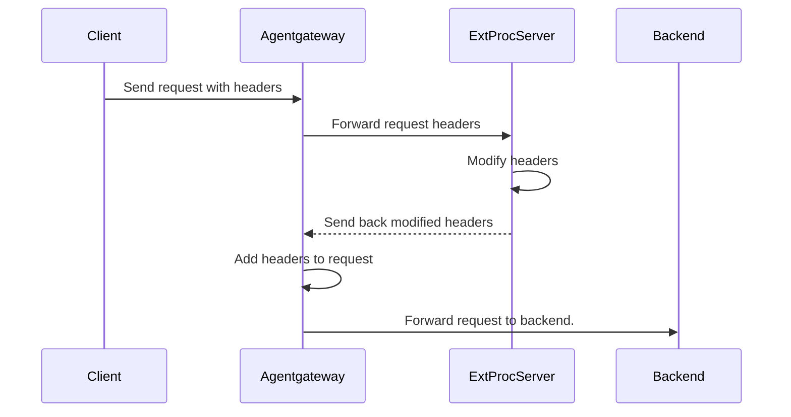

Attaches to:  

External processing is an advanced filter that allows arbitrary modifications to HTTP requests and responses with an external processing server.

Agentgateway is API-compatible with Envoy's [External Processing gRPC service](https://www.envoyproxy.io/docs/envoy/latest/api-v3/service/ext_proc/v3/external_processor.proto).

## About external processing

With agentgateway's external processing (ExtProc) integration, you can implement an external gRPC processing server that can read and modify all aspects of an HTTP request or response. Agentgateway extracts specific information from the request or response, such as the headers, the body, or trailers, and automatically forwards them to the ExtProc server. The ExtProc server then manipulates these attributes according to your rules and returns the modified attributes. Agentgateway injects the modified attributes before forwarding traffic to an upstream or downstream service. The request or response can also be terminated at any given time.

## How it works



1. The client sends a request with headers to agentgateway.
2. Agentgateway extracts the header information and sends it to the external processing server.
3. The external processing server modifies, adds, or removes the request headers.
4. The modified request headers are sent back to agentgateway.
5. The modified headers are added to the request.
6. The request is forwarded to the backend service.

## Failure modes

You can choose whether you want agentgateway to forward requests if the external processing server is unavailable with the `extProc.failureMode` setting. Choose between the following modes: 

* **failOpen**: Forward requests to the backend service, even if the connection to the external processing server fails. You might choose this option to ensure availability of the backend services even when the ExtProc service is down.
* **failClosed**: Block requests if the request to the external processing server fails. This is the default behavior.

## Compatibility

The [External Processing gRPC service](https://www.envoyproxy.io/docs/envoy/latest/api-v3/service/ext_proc/v3/external_processor.proto) was designed for Envoy,
and includes a number of Envoy-specific fields that do not make sense outside of Envoy.
Although agentgateway aims to support the API as closely as possible, there are some gaps.

A non-exhaustive list of these gaps is as follows:
* Response header and response body modifications are supported, but only during the matching response phase.
* `dynamic_metadata` is accepted from request and response header responses. `dynamic_metadata` sent after headers have already been processed is ignored.
* `mode_override` is applied only when `processingOptions.allowModeOverride` is set to `true`, and only from the matching request or response header phase. Body-phase `mode_override` values and overrides received after full-duplex streaming starts are ignored.
* `override_message_timeout` is ignored in all responses.
* `clear_route_cache` is ignored in responses. Agentgateway does not have a route cache.
* `status.CONTINUE_AND_REPLACE` is ignored in responses.

`ImmediateResponse` is supported from request header, request body, response header, and response body phases. If the external processor returns an `ImmediateResponse`, agentgateway stops the current exchange and returns that response to the downstream client.

If any incompatibility causes issues for your external processing server, open an issue on the [agentgateway GitHub repository](https://github.com/agentgateway/agentgateway/issues).

## Setup

External processing is applied at the route level.

```yaml
# yaml-language-server: $schema=https://agentgateway.dev/schema/config
binds:
- port: 3000
  listeners:
  - routes:
    - backends:
      - ai:
         name: openai
         provider:
           openAI:
             # Optional; overrides the model in requests
             model: gpt-3.5-turbo
      policies:
        backendAuth:
          key: "$OPEN_AI_APIKEY"
        extProc:
          host: "extproc.com:9000"
          failureMode: failClosed
```

## Configure processing options

By default, ExtProc sends request headers, response headers, request trailers, and response trailers to the external processing service, and streams request and response bodies. To change which request or response phases are sent to the processor, configure `extProc.processingOptions`.


The default body mode is `fullDuplexStreamed`. If the external processor must inspect a complete body before agentgateway forwards it, use `buffered` or `bufferedPartial` and account for the 8KB ExtProc buffer limit. For general request and response body buffering outside of ExtProc, see [Body buffering]().


| Field | Default | Values | Description |
| --- | --- | --- | --- |
| `extProc.processingOptions.requestHeaderMode` | `send` | `send`, `skip` | Send or skip request headers. |
| `extProc.processingOptions.responseHeaderMode` | `send` | `send`, `skip` | Send or skip response headers. |
| `extProc.processingOptions.requestBodyMode` | `fullDuplexStreamed` | `none`, `buffered`, `bufferedPartial`, `fullDuplexStreamed` | Control how request bodies are sent. `none` skips the body. `buffered` buffers the full body and returns an error if the body is larger than 8KB. `bufferedPartial` buffers up to 8KB and sends that prefix if the body is larger. `fullDuplexStreamed` streams the body to the external processor. |
| `extProc.processingOptions.responseBodyMode` | `fullDuplexStreamed` | `none`, `buffered`, `bufferedPartial`, `fullDuplexStreamed` | Control how response bodies are sent. The body modes behave the same as `requestBodyMode`, but apply to upstream responses. |
| `extProc.processingOptions.requestTrailerMode` | `send` | `send`, `skip` | Send or skip request trailers. |
| `extProc.processingOptions.responseTrailerMode` | `send` | `send`, `skip` | Send or skip response trailers. |
| `extProc.processingOptions.allowModeOverride` | `false` | `true`, `false` | Allow `mode_override` values returned by the external processor in matching header responses to update later request and response processing phases for the same exchange. |

The following example sends headers and trailers, buffers request bodies up to the 8KB limit, skips response bodies, and allows the external processor to override later processing phases after a matching header response.

```yaml
# yaml-language-server: $schema=https://agentgateway.dev/schema/config
binds:
- port: 3000
  listeners:
  - routes:
    - backends:
      - mcp:
          targets:
          - name: default
            sse:
              host: mcp.example.com
              port: 8080
      policies:
        extProc:
          host: "extproc.com:9000"
          failureMode: failClosed
          processingOptions:
            requestHeaderMode: send
            responseHeaderMode: send
            requestBodyMode: bufferedPartial
            responseBodyMode: none
            requestTrailerMode: send
            responseTrailerMode: send
            allowModeOverride: true
```

You can also set `processingOptions` inside a conditional ExtProc policy. Each conditional policy entry can use different phase settings.

```yaml
# yaml-language-server: $schema=https://agentgateway.dev/schema/config
binds:
- port: 3000
  listeners:
  - routes:
    - backends:
      - mcp:
          targets:
          - name: default
            sse:
              host: mcp.example.com
              port: 8080
      policies:
        extProc:
          conditional:
          - condition: 'request.path.startsWith("/upload")'
            host: "extproc.com:9000"
            processingOptions:
              requestBodyMode: buffered
              responseBodyMode: none
          - host: "extproc.com:9000"
            processingOptions:
              requestBodyMode: none
              responseBodyMode: none
```

## Conditional execution

To send only certain requests through external processing, use the `conditional` field. For example, you can route LLM chat traffic through a content filter and bypass the processor for every other request. For details, see [Conditional policies]().
