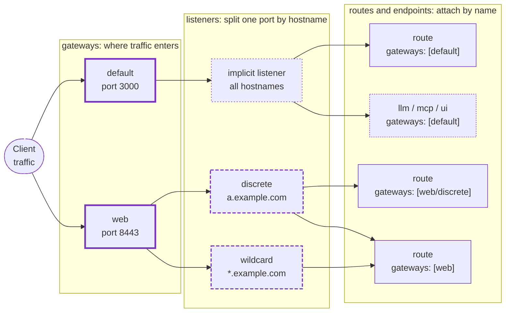

Gateways are the entry point to agentgateway. Each gateway is a named port that agentgateway listens on, and the endpoints that serve traffic attach to it: HTTP and TCP routes, LLM models, MCP targets, and the agentgateway UI.

Every gateway has one or more listeners. A gateway that serves a single hostname needs only the implicit listener that it comes with, and a gateway that serves several hostnames on one port defines a named listener for each one.

Because everything attaches to a gateway by name, you can serve several endpoints on one port, or expose the same routes on more than one port.

> [!NOTE]
> Gateways replace the `binds` field. The `binds` field still works, but it is deprecated. For help converting an existing configuration, see [Migrate from binds](#migrate-from-binds).






# Create self-signed certs referenced by the examples
mkdir -p certs
openssl req -x509 -newkey rsa:2048 -keyout certs/key.pem -out certs/cert.pem -days 365 -nodes -subj "/CN=localhost" 2>/dev/null
openssl req -x509 -newkey rsa:2048 -keyout certs/key-a.pem -out certs/cert-a.pem -days 365 -nodes -subj "/CN=a.example.com" 2>/dev/null
openssl req -x509 -newkey rsa:2048 -keyout certs/key-wildcard.pem -out certs/cert-wildcard.pem -days 365 -nodes -subj "/CN=wildcard.example.com" 2>/dev/null


## How gateways, listeners, and routes fit together {#concepts}

Agentgateway configuration has three layers.

* **Gateways** define where traffic enters. A gateway sets a port, and optionally a protocol and TLS settings. Gateways are configured as a map, so each one has a name that other sections reference.
* **Listeners** optionally subdivide a gateway. Use listeners when one port must serve multiple hostnames with different TLS certificates. A gateway without listeners has a single implicit listener.
* **Routes** define how traffic that reaches a gateway is matched and forwarded. Routes are configured at the top level and attach to gateways by name, which is what lets one route serve several gateways.

The `llm`, `mcp`, and `ui` sections attach to gateways the same way that routes do.

The following diagram shows traffic flowing left to right through the three layers, for two gateways.

* The `default` gateway on port 3000 sets no `listeners`, so it gets one implicit listener that serves all hostnames. You do not configure that listener; the dotted box marks it as implied.
* The `web` gateway on port 8443 splits its port into two named listeners that serve different hostnames.
* Routes, LLM, MCP, and the UI attach by name in the last column. A route that names `web` is served by every listener under that gateway, so both `discrete` and `wildcard` forward to it. A route that names `web/discrete` is served by that one listener only.



## Define a gateway {#define}

Each key in the `gateways` map is the gateway name, and each gateway needs a `port`. The following configuration listens for HTTP traffic on port 3000 and forwards it to a backend on `localhost:8000`.

```yaml
# yaml-language-server: $schema=https://agentgateway.dev/schema/config
gateways:
  default:
    port: 3000
routes:
- backends:
  - host: localhost:8000
```

The route in this example does not set a `gateways` field. When you omit that field, the route attaches to the gateway named `default`. Naming your primary gateway `default` keeps simple configurations short.


# WHAT THIS TEST VALIDATES:
#   * A minimal gateway with an implicitly attached route is accepted by agentgateway.
# WHAT THIS TEST DOES NOT VALIDATE (and why):
#   * That traffic reaches localhost:8000 at runtime — the backend does not exist
#     in the test environment.
cat <<'EOF' > config.yaml
# yaml-language-server: $schema=https://agentgateway.dev/schema/config
gateways:
  default:
    port: 3000
routes:
- backends:
  - host: localhost:8000
EOF
agentgateway -f config.yaml --validate-only


## Attach routes to a gateway {#attach-routes}

To attach a route to a specific gateway, list the gateway name in the route's `gateways` field. The following configuration serves two different sets of routes on two ports.

```yaml
# yaml-language-server: $schema=https://agentgateway.dev/schema/config
gateways:
  public:
    port: 8080
  internal:
    port: 8081
routes:
- name: public-api
  gateways: [public]
  matches:
  - path:
      pathPrefix: /api
  backends:
  - host: api.example.com:443
- name: internal-admin
  gateways: [internal]
  matches:
  - path:
      pathPrefix: /admin
  backends:
  - host: admin.internal:8000
```


# WHAT THIS TEST VALIDATES:
#   * Routes attached to two separately named gateways are accepted by agentgateway.
# WHAT THIS TEST DOES NOT VALIDATE (and why):
#   * That each route serves traffic on its own port at runtime — the backends do
#     not exist in the test environment.
cat <<'EOF' > config2.yaml
# yaml-language-server: $schema=https://agentgateway.dev/schema/config
gateways:
  public:
    port: 8080
  internal:
    port: 8081
routes:
- name: public-api
  gateways: [public]
  matches:
  - path:
      pathPrefix: /api
  backends:
  - host: api.example.com:443
- name: internal-admin
  gateways: [internal]
  matches:
  - path:
      pathPrefix: /admin
  backends:
  - host: admin.internal:8000
EOF
agentgateway -f config2.yaml --validate-only


### Serve the same routes on multiple gateways {#multiple-gateways}

Because routes attach by name, one route can serve several gateways. A common case is serving the same API on both plaintext HTTP and HTTPS.

```yaml
# yaml-language-server: $schema=https://agentgateway.dev/schema/config
gateways:
  http:
    port: 8080
  https:
    port: 8443
    tls:
      cert: ./certs/cert.pem
      key: ./certs/key.pem
routes:
- name: api
  gateways: [http, https]  # One route definition serves both ports
  backends:
  - host: api.example.com:443
```


# WHAT THIS TEST VALIDATES:
#   * A single route attached to both an HTTP and an HTTPS gateway is accepted by
#     agentgateway.
# WHAT THIS TEST DOES NOT VALIDATE (and why):
#   * That both ports serve the route at runtime — requires client requests and a
#     backend the page does not exercise.
cat <<'EOF' > config3.yaml
# yaml-language-server: $schema=https://agentgateway.dev/schema/config
gateways:
  http:
    port: 8080
  https:
    port: 8443
    tls:
      cert: ./certs/cert.pem
      key: ./certs/key.pem
routes:
- name: api
  gateways: [http, https]
  backends:
  - host: api.example.com:443
EOF
agentgateway -f config3.yaml --validate-only


## Add listeners to a gateway {#listeners}

Use the `listeners` field when one port must serve multiple hostnames with different TLS certificates. Each listener takes a `name`, and routes reference it in the form `<gateway-name>/<listener-name>`.

When you set `listeners`, `port` is the only other field you can set on the gateway itself. Move the protocol, hostname, and TLS settings into each listener.

```yaml
# yaml-language-server: $schema=https://agentgateway.dev/schema/config
gateways:
  web:
    port: 8443
    listeners:
    - name: discrete
      hostname: a.example.com
      tls:
        cert: ./certs/cert-a.pem
        key: ./certs/key-a.pem
    - name: wildcard
      hostname: "*.example.com"
      tls:
        cert: ./certs/cert-wildcard.pem
        key: ./certs/key-wildcard.pem
routes:
- name: a-only
  gateways: [web/discrete]  # Serves a.example.com only
  backends:
  - host: a-backend.example.com:443
- name: everything-else
  gateways: [web]  # Serves every listener under the web gateway
  backends:
  - host: shared-backend.example.com:443
```

All listeners under a gateway share the gateway's port, so they cannot mix encrypted and plaintext traffic. If you need both HTTP and HTTPS, define two gateways as shown in [Serve the same routes on multiple gateways](#multiple-gateways).


# WHAT THIS TEST VALIDATES:
#   * A gateway with two named SNI listeners, and routes attached to one listener
#     and to the whole gateway, is accepted by agentgateway.
# WHAT THIS TEST DOES NOT VALIDATE (and why):
#   * That SNI selects the right certificate and listener at runtime — requires TLS
#     client connections the page does not exercise.
cat <<'EOF' > config4.yaml
# yaml-language-server: $schema=https://agentgateway.dev/schema/config
gateways:
  web:
    port: 8443
    listeners:
    - name: discrete
      hostname: a.example.com
      tls:
        cert: ./certs/cert-a.pem
        key: ./certs/key-a.pem
    - name: wildcard
      hostname: "*.example.com"
      tls:
        cert: ./certs/cert-wildcard.pem
        key: ./certs/key-wildcard.pem
routes:
- name: a-only
  gateways: [web/discrete]
  backends:
  - host: a-backend.example.com:443
- name: everything-else
  gateways: [web]
  backends:
  - host: shared-backend.example.com:443
EOF
agentgateway -f config4.yaml --validate-only


## Set the gateway protocol {#protocol}

The `protocol` field controls whether a gateway accepts HTTP routes or TCP routes. Valid values are `HTTP`, `HTTPS`, `TCP`, and `TLS`. When you omit the field, a gateway defaults to `HTTP`, or to `HTTPS` when you set `tls`.

TCP and TLS gateways serve `tcpRoutes` instead of `routes`.

```yaml
# yaml-language-server: $schema=https://agentgateway.dev/schema/config
gateways:
  tcp:
    port: 9000
    protocol: TCP
tcpRoutes:
- gateways: [tcp]
  backends:
  - host: localhost:8000
```

For more information about each protocol, including TLS termination and passthrough, see [Listeners]().


# WHAT THIS TEST VALIDATES:
#   * A TCP gateway with an attached tcpRoute is accepted by agentgateway.
# WHAT THIS TEST DOES NOT VALIDATE (and why):
#   * That TCP traffic is forwarded at runtime — the backend does not exist in the
#     test environment.
cat <<'EOF' > config5.yaml
# yaml-language-server: $schema=https://agentgateway.dev/schema/config
gateways:
  tcp:
    port: 9000
    protocol: TCP
tcpRoutes:
- gateways: [tcp]
  backends:
  - host: localhost:8000
EOF
agentgateway -f config5.yaml --validate-only


## Attach LLM, MCP, and the UI to a gateway {#features}

The `llm`, `mcp`, and `ui` sections each take a `gateways` field, so you can serve them all from one port. Each section serves its own paths: LLM uses the standard serving paths such as `/v1/chat/completions`, MCP uses `/mcp`, and the UI serves the remaining paths.

The following configuration exposes an LLM model, an MCP target, and the UI on port 3000. None of the three sections sets `gateways`, so all of them attach to the gateway named `default`.

```yaml
# yaml-language-server: $schema=https://agentgateway.dev/schema/config
gateways:
  default:
    port: 3000
llm:
  models:
  - name: "*"
    provider: openAI
    params:
      apiKey: "$OPENAI_API_KEY"
mcp:
  targets:
  - name: everything
    stdio:
      cmd: npx
      args:
      - '@modelcontextprotocol/server-everything'
ui: {}
```

With no `ui` section, the UI is served only on the admin interface on `localhost:15000`, which is loopback-only. Setting the `ui` section serves it on a gateway, which is how you reach it from anywhere else. For more information, see [The UI and the admin interface are not the same thing]().

> [!WARNING]
> Serving the UI on a gateway exposes it to anyone who can reach that port. Protect it with authentication, typically [OIDC](), before you expose it outside of localhost. The gateway serves the UI and its API only. The admin interface's debugging endpoints, such as `/config_dump`, are not served on it.


# WHAT THIS TEST VALIDATES:
#   * An LLM model, MCP target, and the UI attached to one gateway are accepted by
#     agentgateway.
# WHAT THIS TEST DOES NOT VALIDATE (and why):
#   * That each section serves its paths at runtime — requires a provider API key,
#     an MCP server process, and a browser session the page does not exercise.
export OPENAI_API_KEY="${OPENAI_API_KEY:-dummy}"
cat <<'EOF' > config6.yaml
# yaml-language-server: $schema=https://agentgateway.dev/schema/config
gateways:
  default:
    port: 3000
llm:
  models:
  - name: "*"
    provider: openAI
    params:
      apiKey: "$OPENAI_API_KEY"
mcp:
  targets:
  - name: everything
    stdio:
      cmd: npx
      args:
      - '@modelcontextprotocol/server-everything'
ui: {}
EOF
agentgateway -f config6.yaml --validate-only


Because each section attaches separately, you can also split them across ports. The following configuration serves the UI on its own port while LLM traffic stays on the shared gateway.

```yaml
# yaml-language-server: $schema=https://agentgateway.dev/schema/config
gateways:
  default:
    port: 3000
  ui-gateway:
    port: 9000
llm:
  models:
  - name: "*"
    provider: openAI
    params:
      apiKey: "$OPENAI_API_KEY"
ui:
  gateways: [ui-gateway]
```


# WHAT THIS TEST VALIDATES:
#   * Splitting the UI and LLM across two gateways is accepted by agentgateway.
# WHAT THIS TEST DOES NOT VALIDATE (and why):
#   * That each port serves the expected section at runtime — requires a provider
#     API key and a browser session the page does not exercise.
export OPENAI_API_KEY="${OPENAI_API_KEY:-dummy}"
cat <<'EOF' > config7.yaml
# yaml-language-server: $schema=https://agentgateway.dev/schema/config
gateways:
  default:
    port: 3000
  ui-gateway:
    port: 9000
llm:
  models:
  - name: "*"
    provider: openAI
    params:
      apiKey: "$OPENAI_API_KEY"
ui:
  gateways: [ui-gateway]
EOF
agentgateway -f config7.yaml --validate-only


## Attach policies to a gateway {#policies}

Gateways and listeners accept the same policies that listeners accepted under `binds`, such as `jwtAuth`, `authorization`, `cors`, `basicAuth`, `apiKey`, `oidc`, `extAuthz`, `extProc`, and `transformations`. A policy on a gateway applies to all traffic that enters that gateway, including LLM, MCP, and UI traffic.

```yaml
# yaml-language-server: $schema=https://agentgateway.dev/schema/config
gateways:
  default:
    port: 3000
    cors:  # Applies to every route on this gateway
      allowOrigins:
      - "https://app.example.com"
      allowMethods:
      - GET
      - POST
routes:
- backends:
  - host: localhost:8000
```

To scope a policy more narrowly, attach it to a listener or to a route instead. For more information, see [Attachment points]().


# WHAT THIS TEST VALIDATES:
#   * A CORS policy attached to a gateway is accepted by agentgateway.
# WHAT THIS TEST DOES NOT VALIDATE (and why):
#   * That CORS headers are applied at runtime — requires a preflight request the
#     page does not exercise.
cat <<'EOF' > config8.yaml
# yaml-language-server: $schema=https://agentgateway.dev/schema/config
gateways:
  default:
    port: 3000
    cors:
      allowOrigins:
      - "https://app.example.com"
      allowMethods:
      - GET
      - POST
routes:
- backends:
  - host: localhost:8000
EOF
agentgateway -f config8.yaml --validate-only


## Migrate from binds {#migrate-from-binds}

The `binds` field nests listeners and routes inside each port, which means a route belongs to exactly one listener. Gateways invert that relationship: routes are top level and reference gateways by name.

| Concept | `binds` | `gateways` |
|---------|---------|------------|
| Port | An entry in the `binds` list | A named entry in the `gateways` map |
| Listener | `binds[].listeners[]` | `gateways.<name>.listeners[]`, or the gateway itself |
| HTTP routes | Nested under `binds[].listeners[].routes` | Top-level `routes`, attached with `gateways` |
| TCP routes | Nested under `binds[].listeners[].tcpRoutes` | Top-level `tcpRoutes`, attached with `gateways` |
| Reuse across ports | Duplicate the route under each listener | List several gateways in one route |
| LLM, MCP, and UI on the same port as routes | Not supported | Attach each section to the same gateway |

The following configuration uses `binds`.

```yaml
# yaml-language-server: $schema=https://agentgateway.dev/schema/config
binds:
- port: 3000
  listeners:
  - protocol: HTTP
    routes:
    - name: api
      matches:
      - path:
          pathPrefix: /api
      backends:
      - host: localhost:8000
```

The following configuration is the equivalent with `gateways`.

```yaml
# yaml-language-server: $schema=https://agentgateway.dev/schema/config
gateways:
  default:
    port: 3000
    protocol: HTTP
routes:
- name: api
  matches:
  - path:
      pathPrefix: /api
  backends:
  - host: localhost:8000
```

To convert a configuration:

1. Replace the `binds` list with a `gateways` map. Give each port a name, and name your primary gateway `default` so that routes and endpoints attach to it without an explicit `gateways` field.
2. Move each bind's `port` to the gateway. If the bind had one listener, move that listener's `protocol`, `hostname`, and `tls` settings to the gateway too. If the bind had multiple listeners, keep them in the gateway's `listeners` field and give each one a `name`.
3. Unwrap each listener's `policies` block. Gateways and listeners take policies as direct fields, so a policy that was at `binds[].listeners[].policies.jwtAuth` moves to `gateways.<name>.jwtAuth`. Route and backend policies keep their `policies` wrapper.
4. Move `routes` and `tcpRoutes` to the top level. Add a `gateways` field to each route that names the gateway or the `<gateway-name>/<listener-name>` it serves.
5. Replace deprecated `llm.port`, `llm.tls`, and `mcp.port` settings with a gateway that the `llm` and `mcp` sections attach to.
6. Validate the result before you run it.

   ```shell
   agentgateway -f config.yaml --validate-only
   ```

If you configure agentgateway through the UI, the UI detects an existing `binds` configuration and offers a one-click migration to gateways.

> [!NOTE]
> You can keep `binds` and `gateways` in the same file while you migrate, as long as they do not claim the same port.
