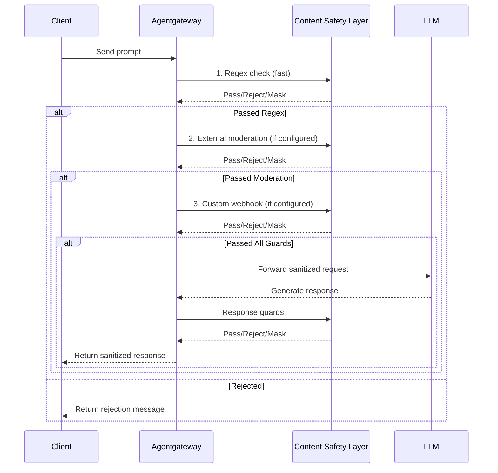

Protect LLM requests and responses from sensitive data exposure and harmful content using layered content safety controls.

## About

Content safety (also known as PII detection, PII sanitization, or data loss prevention) helps you prevent sensitive information from reaching LLM providers and block harmful content in both requests and responses. Agentgateway provides a layered approach to content safety through prompt guards that can reject, mask, or moderate content before it reaches the LLM or returns to users.

You can layer multiple protection mechanisms to create comprehensive content safety:
- **Regex-based detection**: Fast, deterministic matching for known patterns like credit cards, SSNs, emails, and custom patterns
- **External moderation**: Leverage cloud provider guardrails for advanced content filtering
- **Custom webhooks**: Integrate your own content safety logic for specialized requirements

This guide shows you how to use each layer and combine them for defense-in-depth content protection.

## Before you begin

Complete the [LLM gateway tutorial]() to set up agentgateway with an LLM provider.


# Install agentgateway binary
mkdir -p "$HOME/.local/bin"
export PATH="$HOME/.local/bin:$PATH"
VERSION="v"
BINARY_URL="https://github.com/agentgateway/agentgateway/releases/download/${VERSION}/agentgateway-$(uname -s | tr '[:upper:]' '[:lower:]')-$(uname -m | sed 's/x86_64/amd64/')"
curl -sL "$BINARY_URL" -o "$HOME/.local/bin/agentgateway"
chmod +x "$HOME/.local/bin/agentgateway"
export OPENAI_API_KEY="${OPENAI_API_KEY:-<your-api-key>}"


## How content safety works

Agentgateway processes content safety checks in the request and response paths. You can configure multiple prompt guards that run in sequence, allowing you to combine different detection methods.



The diagram shows content flowing through multiple guard layers. Each layer can:
- **Pass**: Allow content to proceed to the next layer
- **Reject**: Block the request and return an error message
- **Mask**: Replace sensitive patterns with placeholders and continue

## Layer 1: Regex-based detection

Regex-based prompt guards provide fast, deterministic pattern matching for known sensitive data formats. Use this layer for common PII patterns and custom organization-specific strings.

### Built-in patterns

Agentgateway includes built-in regex patterns for common sensitive data types:
- `creditCard`: Credit card numbers (Visa, MasterCard, Amex, Discover)
- `ssn`: US Social Security Numbers
- `email`: Email addresses
- `phoneNumber`: US phone numbers
- `caSin`: Canadian Social Insurance Numbers

Example configuration that masks credit cards in responses:

```yaml
# yaml-language-server: $schema=https://agentgateway.dev/schema/config

llm:
  models:
  - name: "*"
    provider: openAI
    params:
      apiKey: "$OPENAI_API_KEY"
    guardrails:
      response:
      - regex:
          action: mask
          rules:
          - builtin: creditCard
          - builtin: ssn
          - builtin: email
```

### Custom patterns

You can also define custom regex patterns for organization-specific sensitive data.

Example that rejects requests containing specific restricted terms:

```yaml {paths="content-safety-regex"}
cat <<'EOF' > config.yaml
# yaml-language-server: $schema=https://agentgateway.dev/schema/config

llm:
  models:
  - name: "*"
    provider: openAI
    params:
      apiKey: "$OPENAI_API_KEY"
    guardrails:
      request:
      - regex:
          action: reject
          rules:
          - pattern: "confidential"
          - pattern: "internal-only"
          - pattern: "project-\\w+-secret"  # Custom pattern with regex
        rejection:
          body: "Request blocked due to policy violation"
EOF
```


agentgateway -f config.yaml &
AGW_PID=$!
trap 'kill $AGW_PID 2>/dev/null' EXIT
sleep 3


### Test regex guards

Send a normal request and verify it succeeds:

```sh {paths="content-safety-regex"}
curl -s http://localhost:4000/v1/chat/completions \
  -H "content-type: application/json" \
  -d '{
    "model": "gpt-3.5-turbo",
    "messages": [
      {
        "role": "user",
        "content": "Say hello"
      }
    ]
  }' | jq .
```

Send a request containing a restricted term and verify it is rejected:

```sh {paths="content-safety-regex"}
curl -s -o /dev/null -w "%{http_code}" http://localhost:4000/v1/chat/completions \
  -H "content-type: application/json" \
  -d '{
    "model": "gpt-3.5-turbo",
    "messages": [
      {
        "role": "user",
        "content": "This is confidential information"
      }
    ]
  }'
```


YAMLTest -f - <<'EOF'
- name: normal request succeeds through content safety guard
  http:
    url: "http://localhost:4000"
    path: /v1/chat/completions
    method: POST
    headers:
      content-type: application/json
    body: |
      {
        "model": "gpt-3.5-turbo",
        "messages": [{"role": "user", "content": "Say hello"}]
      }
  source:
    type: local
  expect:
    statusCode: 200

- name: request with restricted term is rejected by regex guard
  http:
    url: "http://localhost:4000"
    path: /v1/chat/completions
    method: POST
    headers:
      content-type: application/json
    body: |
      {
        "model": "gpt-3.5-turbo",
        "messages": [{"role": "user", "content": "This is confidential information"}]
      }
  source:
    type: local
  expect:
    statusCode: 403
EOF


Example output for a rejected request:
```
Request blocked due to policy violation
```

To test built-in pattern masking, use the built-in patterns configuration and send a request with a fake credit card number:

```sh
curl http://localhost:4000/v1/chat/completions \
  -H "content-type: application/json" \
  -d '{
    "model": "gpt-3.5-turbo",
    "messages": [
      {
        "role": "user",
        "content": "What type of number is 5105105105105100?"
      }
    ]
  }' | jq
```

Example output showing the credit card masked as `<CREDIT_CARD>`:

```json
{
  "choices": [
    {
      "message": {
        "content": "<CREDIT_CARD> is an even number."
      }
    }
  ]
}
```

## Layer 2: External moderation endpoints

External moderation endpoints use cloud provider AI services to detect harmful content, hate speech, violence, and other policy violations. These services often use ML models trained specifically for content moderation.

### OpenAI Moderation

The OpenAI Moderation API detects potentially harmful content across categories including hate, harassment, self-harm, sexual content, and violence.

1. Configure the prompt guard to use OpenAI Moderation:
   ```yaml
   # yaml-language-server: $schema=https://agentgateway.dev/schema/config

   llm:
     models:
     - name: "*"
       provider: openAI
       params:
         apiKey: "$OPENAI_API_KEY"
       guardrails:
         request:
         - openAIModeration:
             model: omni-moderation-latest
             policies:
               backendAuth:
                 key:
                   file: $HOME/.secrets/openai
           rejection:
             body: "Content blocked by moderation policy"
   ```

2. Test with content that triggers moderation:
   ```sh
   curl -i http://localhost:4000/v1/chat/completions \
     -H "content-type: application/json" \
     -d '{
       "model": "gpt-4o-mini",
       "messages": [
         {
           "role": "user",
           "content": "I want to harm myself"
         }
       ]
     }'
   ```

   Expected response:
   ```
   HTTP/1.1 403 Forbidden
   Content blocked by moderation policy
   ```

### AWS Bedrock Guardrails

AWS Bedrock Guardrails provide content filtering, PII detection, topic restrictions, and word filters. You must first create a guardrail in the AWS Bedrock console.


For instructions on creating Bedrock Guardrails, see the [AWS Bedrock Guardrails documentation](https://docs.aws.amazon.com/bedrock/latest/userguide/guardrails-permissions.html).


1. Get your guardrail identifier and version:
   ```sh
   aws bedrock list-guardrails
   ```

2. Configure the prompt guard:
   ```yaml
   # yaml-language-server: $schema=https://agentgateway.dev/schema/config

   llm:
     models:
     - name: "*"
       provider: openAI
       params:
         apiKey: "$OPENAI_API_KEY"
       guardrails:
         request:
         - bedrockGuardrails:
             guardrailIdentifier: your-guardrail-id
             guardrailVersion: "1"  # or "DRAFT"
             region: us-west-2
             policies:
               backendAuth:
                 aws: {}
         response:
         - bedrockGuardrails:
             guardrailIdentifier: your-guardrail-id
             guardrailVersion: "1"
             region: us-west-2
             policies:
               backendAuth:
                 aws: {}
   ```


The `aws: {}` configuration uses the default AWS credential chain (IAM role, environment variables, or instance profile).


## Layer 3: Custom webhook integration

For advanced content safety requirements beyond regex and cloud provider services, you can integrate custom webhook servers. This allows you to use specialized ML models, proprietary detection logic, or integrate with existing security tools.

### Use cases for custom webhooks

- Named Entity Recognition (NER) for detecting person names, organizations, locations
- Industry-specific compliance rules (HIPAA, PCI-DSS, GDPR)
- Integration with existing DLP or security tools
- Custom ML models for domain-specific content detection
- Multi-step validation workflows
- Advanced contextual analysis

### Webhook configuration

Configure a prompt guard to call your webhook service:

```yaml
# yaml-language-server: $schema=https://agentgateway.dev/schema/config

llm:
  models:
  - name: "*"
    provider: openAI
    params:
      apiKey: "$OPENAI_API_KEY"
    guardrails:
      request:
      - webhook:
          protocol: http
          address: content-safety-webhook.example.com:8000
      response:
      - webhook:
          protocol: http
          address: content-safety-webhook.example.com:8000
```

For details on the webhook protocol and implementing custom webhook servers, see the Guardrail Webhook API documentation.

## Combining multiple layers

You can configure multiple prompt guards that run in sequence, creating defense-in-depth protection. Guards are evaluated in the order they appear in the configuration.

Example configuration that uses all three layers:

```yaml
# yaml-language-server: $schema=https://agentgateway.dev/schema/config

llm:
  models:
  - name: "*"
    provider: openAI
    params:
      apiKey: "$OPENAI_API_KEY"
    guardrails:
      request:
      # Layer 1: Fast regex check for known patterns
      - regex:
          action: reject
          rules:
          - builtin: ssn
          - builtin: creditCard
          - builtin: email
        rejection:
          body: "Request contains PII and cannot be processed"
      # Layer 2: OpenAI moderation for harmful content
      - openAIModeration:
          model: omni-moderation-latest
          policies:
            backendAuth:
              key:
                file: $HOME/.secrets/openai
        rejection:
          body: "Content blocked by moderation policy"
      # Layer 3: Custom webhook for domain-specific checks
      - webhook:
          protocol: http
          address: content-safety-webhook.example.com:8000
      response:
      # Response guards run in same order
      - regex:
          action: mask
          rules:
          - builtin: ssn
          - builtin: creditCard
      - webhook:
          protocol: http
          address: content-safety-webhook.example.com:8000
```

## Choosing the right approach

Use this table to decide which content safety layer to use for your requirements:

| Requirement | Recommended Approach | Reason |
|-------------|---------------------|--------|
| Detect known PII formats (SSN, credit cards, emails) | Regex with builtins | Fast, deterministic, no external dependencies |
| Block hate speech, violence, harmful content | External moderation (OpenAI, Bedrock) | ML-based detection trained for content safety |
| Organization-specific restricted terms | Regex with custom patterns | Simple pattern matching for known strings |
| Named entity recognition (people, orgs, places) | Custom webhook | Requires NER models not available in built-in options |
| HIPAA, PCI-DSS, or other compliance requirements | Layered approach | Combine regex + external moderation + custom validation |
| Integration with existing DLP tools | Custom webhook | Allows reuse of existing security infrastructure |
| Fastest performance with minimal latency | Regex only | No external API calls |
| Most comprehensive protection | All three layers | Defense-in-depth with multiple detection methods |

## Performance considerations

Each content safety layer adds latency to requests. Plan your configuration accordingly:

- **Regex guards**: < 1ms per check, negligible latency impact
- **External moderation**: 50-200ms depending on provider and network latency
- **Custom webhooks**: Varies based on webhook implementation and location

To optimize performance:
- Use regex for fast, deterministic checks before slower external checks
- Deploy webhook servers in the same region as agentgateway
- Configure appropriate timeouts for external moderation endpoints
- Consider request size limits to avoid processing very large prompts

## What's next

- [Observe LLM traffic]() to track content safety metrics and blocked requests
