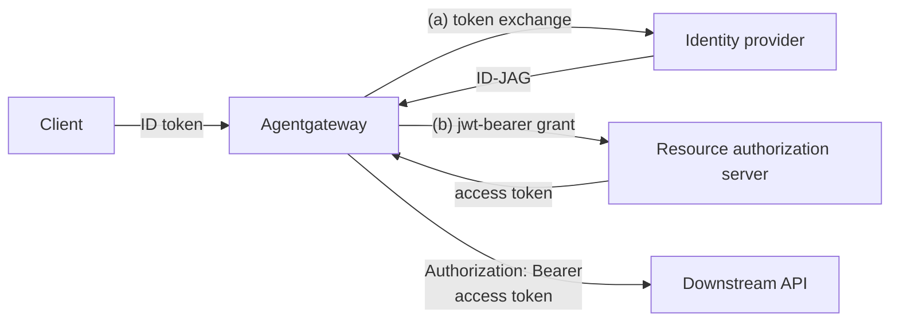

Attaches to: 

## About

The `crossAppAccess` backend authentication method implements the [OAuth Identity Assertion Authorization Grant](https://datatracker.ietf.org/doc/draft-ietf-oauth-identity-assertion-authz-grant/), also called "ID-JAG" or "Cross App Access" (XAA). With this method, agentgateway calls a downstream API as the authenticated end user, without requiring the user to interactively log in to that downstream app. This pattern is common in agentic scenarios where an agent calls other apps' APIs on behalf of the user, such as per-user access to MCP servers ([MCP enterprise-managed authorization](https://modelcontextprotocol.io/extensions/auth/enterprise-managed-authorization)).

The gateway acts as a confidential OAuth client and performs a two-leg exchange on each backend call:

1. **Authenticate the user.** The inbound request carries the user's OIDC ID token, validated by the [`jwtAuth` policy](). The validated token is the subject of the exchange. The `jwtAuth` policy must validate an OIDC ID token, not an arbitrary access token, because the identity provider expects an ID token as the subject.
2. **Exchange the token.** The gateway performs two sequential exchanges:
   1. **RFC 8693 token exchange.** The gateway calls the user's identity provider (IdP) authorization server with an [RFC 8693](https://datatracker.ietf.org/doc/html/rfc8693) token exchange and receives an ID-JAG assertion that is bound to the resource authorization server.
   2. **RFC 7523 JWT-bearer grant.** The gateway presents the ID-JAG to the resource's authorization server with an [RFC 7523](https://datatracker.ietf.org/doc/html/rfc7523) JWT-bearer grant and receives a Bearer access token that is scoped to the downstream API.
3. **Attach and cache.** The Bearer token is added as `Authorization: Bearer <token>` to the upstream request and cached until shortly before it expires.



Cross App Access differs from [OAuth token exchange]() in that it crosses a trust boundary: the IdP and the resource's authorization server are separate parties, so the gateway performs two exchanges and holds two client registrations, one at each token endpoint. For a single-leg exchange at one authorization server, use `oauthTokenExchange` instead.

## Before you begin

The following walkthrough runs a complete Cross App Access flow locally, with a Keycloak container that acts as both the IdP and the resource authorization server.

1. Make sure that you have the following tools installed.

   - [agentgateway binary]()
   - [Docker](https://docs.docker.com/get-docker/)
   - `python3` and `curl`

2. Clone the [agentgateway repository](https://github.com/agentgateway/agentgateway) and navigate to the example setup scripts.

   ```sh
   git clone https://github.com/agentgateway/agentgateway.git
   cd agentgateway/examples/traffic-cross-app-access/keycloak
   ```

## Local example

In this example, you deploy Keycloak to act as the IdP that authenticates the user as well as the authorization server for the token exchange.

### Set up Keycloak as the IdP

Run and configure a local Keycloak that supports ID-JAG issuance. The demo uses a Keycloak build with the experimental `identity-assertion-jwt` feature, packaged as the `ceposta/keycloak:id-jag` container image.

1. Start Keycloak on port `8480`. The same port is mapped inside and outside the container so that the token issuer URL is consistent everywhere, which the self-referential demo setup requires.

   ```sh
   docker run --name kc-idjag --rm -d -p 8480:8480 \
     -e KC_BOOTSTRAP_ADMIN_USERNAME=admin -e KC_BOOTSTRAP_ADMIN_PASSWORD=admin \
     ceposta/keycloak:id-jag start-dev --http-port=8480
   ```

2. Wait for Keycloak to be ready. Startup can take a few minutes, such as when the image platform does not match your machine and runs emulated.

   ```sh
   until [ "$(curl -s -o /dev/null -w "%{http_code}" http://localhost:8480/realms/master)" = "200" ]; do sleep 5; done; echo "Keycloak ready"
   ```

3. Configure Keycloak with the demo realm. The script creates the `idjag-demo` realm, the `alice`/`alice` user, an `agent-client` (the gateway's requesting client, which mints the ID-JAG through token exchange), and a `resource-client` (the resource authorization server client, which consumes the ID-JAG through the JWT-bearer grant).

   ```sh
   KCADM="$PWD/docker/kcadm.sh" ./configure-keycloak.sh
   ```

   Example output:

   ```
   Keycloak configured:
     realm         : idjag-demo
     user          : alice / alice
     agent-client  : agent-secret     (requesting app; mints ID-JAG via token exchange)
     resource-client: resource-secret (resource AS; consumes ID-JAG via jwt-bearer)
     IdP           : self-idjag       (self-referential JWT_AUTHORIZATION_GRANT)
   ```

4. Allow HTTP access to the realm. When Keycloak runs in Docker, requests that arrive through the port mapping can be treated as external, and Keycloak then rejects them with an `HTTPS required` error.

   ```sh
   ./docker/kcadm.sh update realms/idjag-demo -s sslRequired=NONE
   ```

5. Start the echo backend, which acts as the downstream API and reflects the request headers that it receives, so that you can inspect the token the gateway forwards.

   ```sh
   python3 echo-backend.py &
   ```

### Configure the gateway

Run agentgateway with the Cross App Access policy.

1. Review the gateway configuration.
   
   - `jwtAuth` validates the inbound OIDC ID token.
   - `crossAppAccess` configures the two token endpoints: 
     - `identityProvider` authenticates as `agent-client`.
     - `resourceAuthorizationServer` authenticates as `resource-client`. 
   - `audience` must equal the resource identifier that the resource client is registered with.

   {}

2. Export the client secrets that the configuration reads as environment variables, and start the gateway. The gateway fetches the realm's JWKS at startup, so configure Keycloak before you start the gateway.

   ```sh
   export KC_AGENT_SECRET=agent-secret KC_RESOURCE_SECRET=resource-secret
   agentgateway -f ./gateway.yaml
   ```

### Verify the exchange

Send a request through the gateway as the demo user and confirm that the downstream API receives a different, backend-scoped access token.

1. In another terminal, mint alice's OIDC ID token from Keycloak. This token is the inbound credential and the subject of the exchange.

   ```sh
   ID_TOKEN=$(curl -s -X POST "http://localhost:8480/realms/idjag-demo/protocol/openid-connect/token" \
     -d grant_type=password -d client_id=agent-client -d client_secret=agent-secret \
     -d username=alice -d password=alice -d scope=openid \
     | python3 -c 'import sys,json;print(json.load(sys.stdin)["id_token"])')
   echo "${ID_TOKEN:0:40}..."
   ```

2. Send a request to the gateway with the ID token. The gateway validates the token, performs the two-leg exchange at Keycloak, and forwards the request to the echo backend with the resulting access token. The command decodes the token that the backend received.

   ```sh
   curl -s http://localhost:3030/todos -H "Authorization: Bearer $ID_TOKEN" | python3 -c '
   import sys,json,base64
   d=json.load(sys.stdin)
   tok=(d["headers"].get("authorization") or d["headers"].get("Authorization")).split()[1]
   p=json.loads(base64.urlsafe_b64decode(tok.split(".")[1]+"=="))
   print("backend received a", p["typ"], "token for", p["preferred_username"],
         "| azp:", p["azp"], "| scope:", p["scope"])'
   ```

   In the example output, the backend received a Bearer access token for `alice` that is authorized for the `resource-client` party with the `todos.read` scope. The inbound ID token was stripped and never reached the backend.

   ```
   backend received a Bearer token for alice | azp: resource-client | scope: email todos.read profile
   ```

3. Confirm that the gateway rejects requests without a valid ID token before any exchange happens.

   ```sh
   curl -s -o /dev/null -w "no token   -> %{http_code}\n" http://localhost:3030/todos
   curl -s -o /dev/null -w "bad token  -> %{http_code}\n" http://localhost:3030/todos -H "Authorization: Bearer not.a.jwt"
   ```

   Example output:

   ```
   no token   -> 400
   bad token  -> 401
   ```

4. Clean up the demo when you are done. The `lsof` command stops the echo backend that runs in the background on port `9000` and the gateway on port `3030`.

   ```sh
   docker rm -f kc-idjag
   lsof -ti tcp:9000,3030 | xargs kill
   ```

## Try it against hosted providers

The [`traffic-cross-app-access` examples](https://github.com/agentgateway/agentgateway/tree/main/examples/traffic-cross-app-access) in the agentgateway repository include two more demos of the same policy against real, separate trust domains.

### xaa.dev

The [`xaa-dev`](https://github.com/agentgateway/agentgateway/tree/main/examples/traffic-cross-app-access/xaa-dev) example uses the public [xaa.dev](https://xaa.dev) playground, with the hosted IdenX IdP issuing the ID-JAG and a hosted resource authorization server protecting a Todo API. Registration is free, and the interactive login mints the inbound ID token. Note that the exchange endpoints use the `https://` host form, while the route backend uses `host:port` with an explicit `backendTLS` policy.

### Okta and Auth0

The [`okta-auth0`](https://github.com/agentgateway/agentgateway/tree/main/examples/traffic-cross-app-access/okta-auth0) example uses an enterprise topology with Okta as the IdP (Cross App Access early access) and Auth0 as the resource authorization server (XAA beta).

## Configuration reference

The following table describes the most common `crossAppAccess` fields. For the full set of fields, see the [configuration reference]().

| Field | Description |
| -- | -- |
| `identityProvider` | The user's IdP authorization server token endpoint. Agentgateway sends the authenticated ID token as the RFC 8693 `subject_token`. Set the endpoint as a `host` in `host:port` form, or in `https://host` form to automatically enable TLS, and set the token endpoint `path`, which defaults to `/`. Optional connection `policies` such as `backendTLS` can be attached. |
| `resourceAuthorizationServer` | The resource authorization server token endpoint, in the same shape as `identityProvider`. This leg uses the RFC 7523 JWT-bearer grant, with the ID-JAG from the IdP leg sent as the assertion. This is a separate client registration from the IdP one. |
| `clientAuth` | Client authentication for each token endpoint. Supported methods are `clientSecretBasic`, `clientSecretPost`, and `privateKeyJwt`. |
| `audience` | Required identifier of the resource authorization server. The issued ID-JAG is bound to this value. |
| `resources` | Optional protected resource or API identifiers ([RFC 8707](https://datatracker.ietf.org/doc/html/rfc8707)), sent on the token exchange leg. Configure these explicitly when the authorization server expects them. |
| `scopes` | Optional scopes to request. The authorization server might grant a subset. |
| `cache` | Optional token cache configuration. Defaults to an in-memory cache with 8192 entries. Set `cache.defaultTtl` as a fallback for when the token response omits `expires_in` (defaults to `300s`), and `cache.maxEntries: 0` to disable caching. The cache duration is capped by the subject token's JWT `exp` claim when present. |

## Private key JWT client authentication

Enterprise IdPs such as Okta commonly require the `privateKeyJwt` client authentication method, in which the gateway authenticates with a signed JWT assertion instead of a client secret. Because token endpoints are configured as backend references rather than raw URLs, `privateKeyJwt` requires an explicit `assertionAudience`.

```yaml
clientAuth:
  clientId: gateway-at-chat
  method: privateKeyJwt
  signingKey:
    file: /path/to/signing-key.pem
  alg: RS256  # one of RS256/RS384/RS512/ES256/ES384
  kid: my-signing-key  # optional `kid` header
  assertionAudience: https://chat.example.com/oauth2/token
```

## Limitations

The following parts of the Identity Assertion Authorization Grant draft are not yet supported:

- DPoP sender-constrained tokens (RFC 9449).
- `.well-known` endpoint discovery (RFC 8414, endpoints must be configured explicitly).
- SAML or refresh-token subject types (only OIDC ID tokens are used as the subject).

## Next steps

- Exchange the incoming credential for a per-backend token at a single authorization server with [OAuth token exchange]().
- Validate incoming JWTs with the [JWT authentication]() policy.
