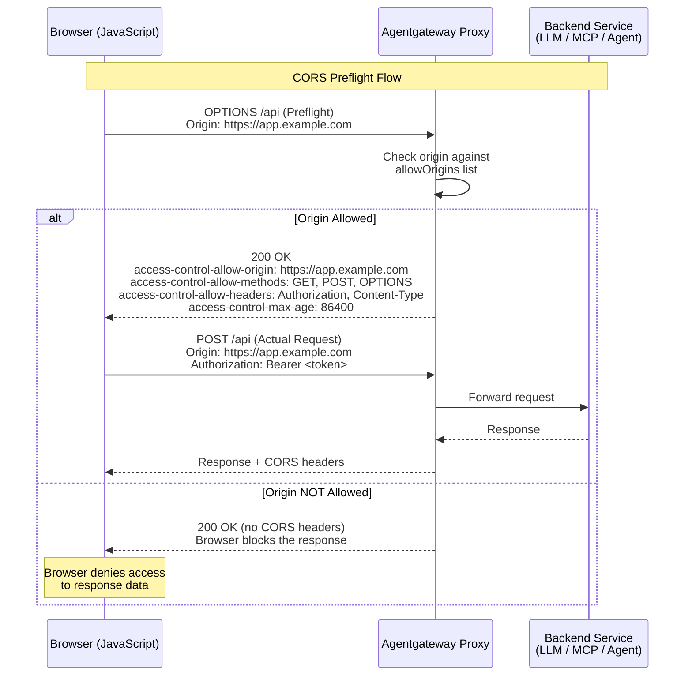

Attach to:


## About CORS

Cross-origin resource sharing (CORS) is a browser security mechanism which allows a server to control which origins can request and interact with resources that are hosted on a different domain. By default, web browsers only allow requests to resources that are hosted on the same domain as the web page that served the original request. Access to web pages or resources that are hosted on a different domain is restricted to prevent potential security vulnerabilities, such as cross-site request forgery (CRSF).

When CORS is enabled in a web browser and a request for a different domain comes in, the web browser checks whether this request is allowed or not. To do that, it typically sends a preflight request (HTTP `OPTIONS` method) to the server or service that serves the requested resource. The service returns the methods that are permitted to send the actual cross-origin request, such as GET, POST, etc. If the request to the different domain is allowed, the response includes CORS-specific headers that instruct the web browser how to make the cross-origin request. For example, the CORS headers typically include the origin that is allowed to access the resource, and the credentials or headers that must be included in the cross-origin request.

Review the following diagram to see an example CORS request flow: 


Note that the preflight request is optional. Web browsers can also be configured to send the cross-origin directly. However, access to the request resource is granted only if CORS headers were returned in the response. If no headers are returned during the preflight request, the web browser denies access to the resource in the other domain.

CORS policies are typically implemented to limit access to server resources for JavaScripts that are embedded in a web page, such as:

* A JavaScript on a web page at `example.com` tries to access a different domain, such as `api.com`.
* A JavaScript on a web page at `example.com` tries to access a different subdomain, such as `api.example.com`.
* A JavaScript on a web page at `example.com` tries to access a different port, such as `example.com:3001`.
* A JavaScript on a web page at `https://example.com` tries to access the resources by using a different protocol, such as `http://example.com`.

> [!TIP]
> Requests that violate the CORS policy will still have responses returned, but the browser will reject them. As such, usage of tools like `curl` with `cors` can be confusing, as `curl` does not respect CORS headers.

Example:

```yaml
cors:
  allowOrigins:
  - "*"
  allowHeaders:
  - mcp-protocol-version
  - content-type
  allowCredentials: true
  exposeHeaders:
  - x-my-header
  maxAge: 100s
```