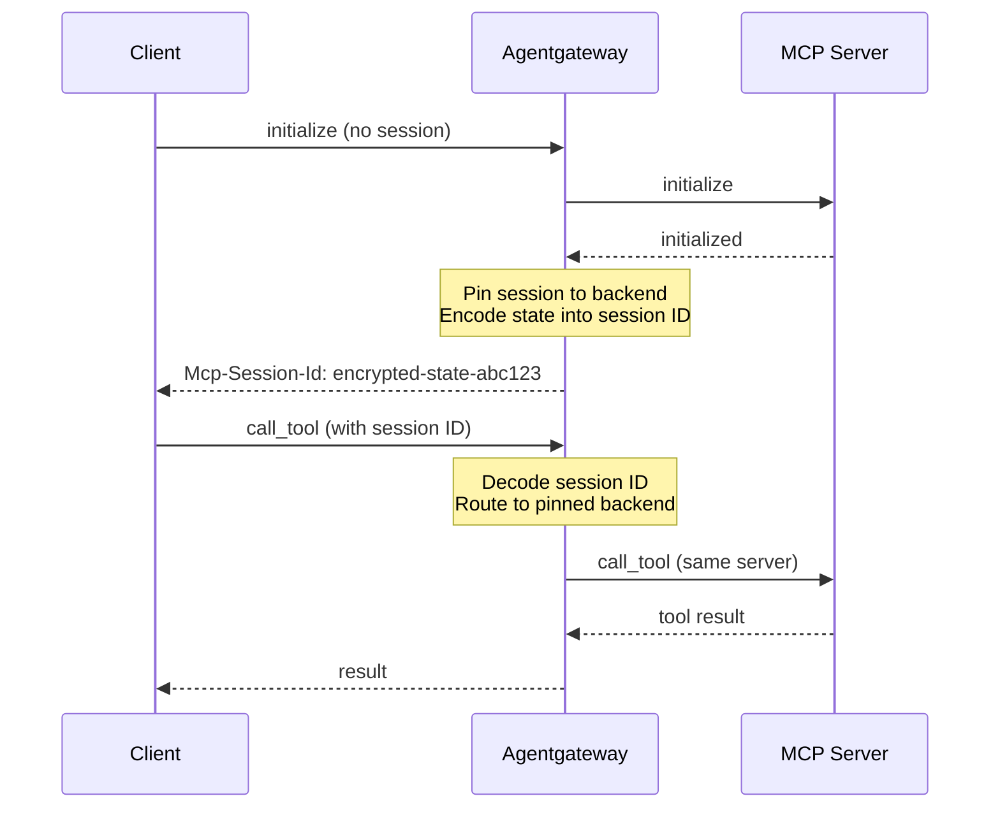

Connect to an MCP server via streamable HTTP. 



## About streamable HTTP

Agentgateway automatically manages stateful MCP sessions when using HTTP-based transports. The session state (including backend pinning) is encoded in the session ID and persisted across requests, ensuring that subsequent tool calls in the same session are routed to the same backend server.



1. **Session initialization**: When a client sends an `initialize` request, agentgateway creates a session and returns a session ID
2. **Backend pinning**: The session is pinned to a specific backend server (important when using multiple targets)
3. **State encoding**: The session state is encoded into the session ID using AES-256-GCM encryption
4. **Session resumption**: Subsequent requests with the same session ID are automatically routed to the same backend

## Before you begin



## Configure the agentgateway

1. Spin up an MCP server that uses streamable HTTP.
   ```sh
   PORT=3005 npx -y @modelcontextprotocol/server-everything streamableHttp
   ```

2. Create a configuration for your agentgateway to connect to your MCP server. Make sure to expose the `Mcp-Session-Id` header in the CORS configuration for session persistence.
   ```yaml
   cat <<EOF > config.yaml
   # yaml-language-server: $schema=https://agentgateway.dev/schema/config
   binds:
   - port: 3000
     listeners:
     - routes:
       - policies:
           cors:
             allowOrigins:
               - "*"
             allowHeaders:
               - "*"
             exposeHeaders:
               - "Mcp-Session-Id"
         backends:
         - mcp:
             targets:
             - name: mcp
               mcp:
                 host: http://localhost:3005/mcp/
   EOF
   ```

3. Run the agentgateway. 
   ```sh
   agentgateway -f config.yaml
   ```

## Verify access to tools

1. Open the [agentgateway UI](http://localhost:15000/ui/) to view your listener and backend configuration.

2. Connect to the MCP test server with the agentgateway UI playground. 
   
   1. From the navigation menu, click [**Playground**](http://localhost:15000/ui/playground/).
      
      

   2. In the **Testing** card, review your **Connection** details and click **Connect**. The agentgateway UI connects to the target that you configured and retrieves the tools that are exposed on the target. 
   
   3. Verify that you see a list of **Available Tools**. 
   
      

3. Verify access to a tool. 
   1. From the **Available Tools** list, select the `echo` tool. 
   2. In the **message** field, enter any string, such as `This is my first agentgateway setup.`, and click **Run Tool**. 
   3. Verify that you see your message echoed in the **Response** card. 
   
      
